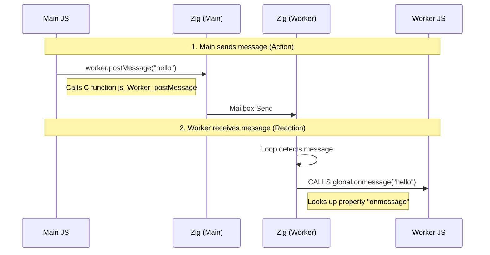
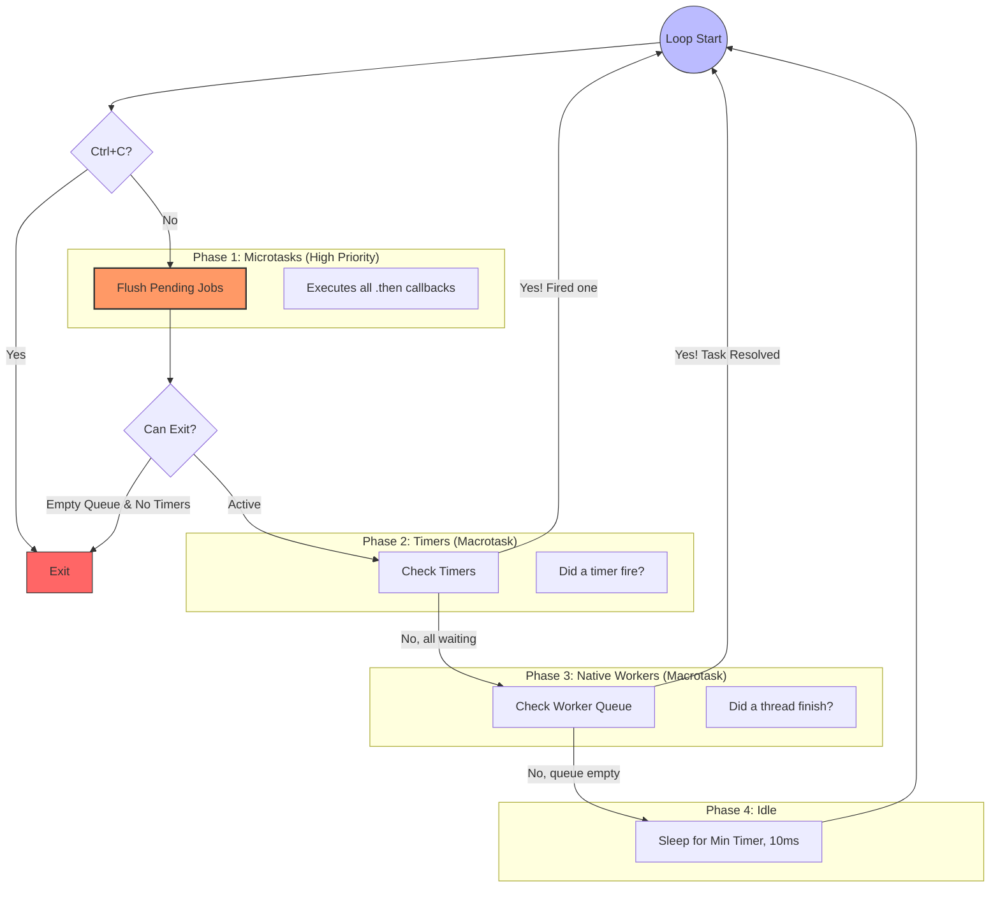

# zexplorer: a JavaScript programmable HTML processor on steroids


[WIP]

An opinionated  `Zig` based HTML processor that lets you write JavaScript and executes at native speed on a server.

Based on [lexbor](https://lexbor.com/) and [quickJS-ng](https://quickjs-ng.github.io/quickjs/).

## Project description

What it has:

- runs most DOM primitives and executes ES6 JavaScript
- sandboxed file system (upload directory only),
- `fetch` API (via Curl Multi HTTP requests),
- `Workers`(OS threads for parallel processing),
- DOM/CSS native sanitizer (based on H5SC testing suite),
- can inject native Zig primitives (statistics, CSV parsing...),
- integrated Web API classes: `Worker`, `URL`, `ULRSearchParams`, `Headers`, `Event`, `DocumentFragment`, `DOMParser`, `Blob`, `FormData`, `File`, `FileReaderSync`, `FileReader`, `Fetch`.

It can be compared to [JSDOM](https://github.com/jsdom/jsdom) with [DOMPurify](https://github.com/cure53/DOMPurify) included a native speed.

What it does not have (yet): async I/O

This is not:

- a headless browser,
- not `Node.js` nor `bun`,
- not for streaming/async I/O workloads.

**Security**:

- Runtime limits (memory, stack size, interruptible) for DoS.
- Downloads limited to HTTPS and declared in _import_map.json_,
- sandboxed File system limited to current directory and beyond, and no loading if symlink for LFI.
- Load sanitized and sandboxed HTML, CSS and scripts
  - The `Zanitizer` module is 5 to 50 times faster than DOMPurify integrated in the `Sanitizerconfig`.
  - It is based on a declarative security policy (_html_specs.zig_) and is "context aware": it is executed in a virtual _DomFragment_ before being merged into the active _Document_.
  - it is tested against the HTML5 Security Cheatsheet  Test  (<https://github.com/cure53/H5SC>) with _ZERO_ exploitable vulnerabilities among the 139 tests, and against the DOMPurify  test (<https://cure53.de/purify>).

It is performant:

- 24kB of the DOMPurify HTML test is processed in 1ms and the H5SC is processed (in debug/test mode) in 1.3ms.
- It runs the js-framework  vanilla JavaScript benchmark tests much faster than `jsdom`.

This program can be used for:

## Use cases

- Email sanitization if you need zero XSS and maximum speed
- SSR with untrusted templates with sandbox processing
- HTML transformation pipelines: inject `Zig` code for hot paths (CSV parsing, crypto...)
- Testing frameworks - Fast and sandboxed
- Templating & Static Site Generation - (can use template components): no async needed, pure speed.
- Web scraping on steroids.

## Tests

The goal is to review the [DOM examples repo](https://github.com/mdn/dom-examples).

### zexplorer running js-framework-benchmark VanillaJS code

To ensure the Web primitives are correctly implemented in `zexplorer`, we run VanillaJS code from the [js-vanilla-benchframework tests](https://github.com/krausest/js-framework-benchmark).

The engine runs all tests below 80ms.

The examples can be built and run with the commands:

```sh
zig build example -Dname=js-bench-1 -Doptimize=ReleaseFast
zig build example -Dname=js-bench-2 -Doptimize=ReleaseFast
zig build example -Dname=js-bench-3 -Doptimize=ReleaseFast
```

| test                 | t1    | t2    | t3    |
| -------------------- | ----- | ----- | ----- |
| Create 1k            | 2.68  | 1.90  | 1.75  |
| Replace 1k           | 2.56  | 2.34  | 1.81  |
| Partial Update (10k) | 2.92  | 1.64  | 6.73  |
| Select Row           | 0.05  | 0.01  | 0.02  |
| Swap Rows            | 0.06  | 0.10  | 0.14  |
| Remove Row           | 0.01  | 0.05  | 0.05  |
| Create 10k           | 27.66 | 20.84 | 16.54 |
| Append 1k            | 2.76  | 7.41  | 4.02  |
| Clear                | 4.11  | 7.72  | 5.94  |
| --                   | --    | --    | --    |
| Total Engine         | 76    | 70    | 75    |

[TODO]: a CLI ? to run:

```sh
zxp loc/index.html loc/bench.js loc/test-runner.js
```

### zexplorer vs jsdom

<details><summary>HTML with embedded benchmark Script</summary>

```html
<!DOCTYPE html>
<html>
  <body>
    <div id="root"></div>
    <script>
      const nb = 10_000;
      const root = document.getElementById("root");
      for (let i = 0; i < nb; i++) {
        const span = document.createElement("span");
        span.textContent = "Item " + i;
        root.appendChild(span);
      }
      const all = document.querySelectorAll("span");
      let total = 0;
      for (let i = 0; i < all.length; i++) {
        total += all[i].textContent.length;
      }
      console.log("Total chars: " + total);
    </script>
  </body>
</html>
```

</details>

<details><summary>jsdom runner script:</summary>

```js
console.time("Total");
const jsdom = require("jsdom");
const { JSDOM } = jsdom;
const fs = require("fs");

const html = fs.readFileSync("bench.html", "utf8");
const dom = new JSDOM(html, { runScripts: "dangerously" });
console.timeEnd("Total");
```

</details>

<details><summary>Zexplorer script:</summary>

```zig
fn bench(allocator: std.mem.Allocator, sandbox_root: []const u8) !void {
    var engine = try ScriptEngine.init(allocator, sandbox_root);
    defer engine.deinit();

    const start = std.time.nanoTimestamp();

    const html = @embedFile("bench.html")
    try engine.loadHTML(html);

    try engine.executeScripts(allocator, ".");
    try engine.run();


    const end = std.time.nanoTimestamp();
    const ms = @divFloor(end - start, 1_000_000);
    std.debug.print("⚡️ Zexplorer Engine Total Time: {d}ms\n", .{ms});
}
```

</details>

**Results**

| #rows     | Zexplorer | jsdom  |
| --------- | --------- | ------ |
| 100       | 0.13ms    | 241ms  |
| 1_000     | 0.7ms     | 251ms  |
| 10_000    | 52ms      | 331ms  |
| 20_000    | 115ms     | 421ms  |
| 50_000    | 279ms     | 662ms  |
| 100_000   | 633ms     | 1062ms |
| 500_000   | 4323ms    | 4213ms |
| 1_000_000 | 15165ms   | 9216ms |

---

### Tests Zaniter module

Th module is faster than DOMPurify but probably not as complete. It is based on DOM parsing into a documentFragment, applying whitelisting and html_specs rules before injecting back into the DOM.

- DOMPurify test suite: <https://github.com/cure53/DOMPurify/tree/main/test>
- OWASP XSS Filter Evasion Cheat Sheet: <https://cheatsheetseries.owasp.org/cheatsheets/XSS_Filter_Evasion_Cheat_Sheet.html>
- PortSwigger XSS cheat sheet: <https://portswigger.net/web-security/cross-site-scripting/cheat-sheet>
- DOMPurify CVEs: Especially CVE-2024-47875 (mXSS via nesting) <https://github.com/cure53/DOMPurify>

#### H5SC Quality test

139 real-world XSS attack vectors from [html5sec.org](https://html5sec.org/)

Results:

#### Speed test

```sh
zig build example -Dname=dom_purify -Doptimize=ReleaseFast
```

The test is to process _src/examples/dom_purify.html_:

```txt
=== DOMPurify Benchmark -------

Input size: 36526 bytes
Output size: 16501 bytes
Total Engine time: 1.052 ms

DOMPurify reference: ~11 ms
(without JSDom overhead)
```

---

## A few examples

The folder _src/examples_  (will!) contains all the test cases.

Run the file name with:  `zig build example -Dname=test_solidjs -Doptimize=ReleaseFast`

**TODO**: migrate from _main.zig_ to /examples

### Reactive framework : SolidJS (no JSX)

```html
<html>
  <body>
    <h1>Testing CDN import: SolidJS</h1>
    <div id="root"></div>
    <script type="module">
      import { createSignal, createEffect, onCleanup } from "solid-js";
      import { render } from "solid-js/web";
      // Skip html template tag - it has regex issues in QuickJS
      // import html from "solid-js/html";

      console.log("[JS] SolidJS loaded");
      console.log("[JS] createSignal:", typeof createSignal);
      console.log("[JS] render:", typeof render);

      // Basic reactivity test
      const [count, setCount] = createSignal(1);

      // Component using manual DOM (works with QuickJS)
      const Counter = () => {
        const [localCount, setLocalCount] = createSignal(0);

        // Create DOM elements manually
        const container = document.createElement("div");
        const p = document.createElement("p");
        const button = document.createElement("button");
        button.textContent = "Add +1";

        // Reactive effect updates the DOM when signal changes
        createEffect(() => {
          console.log(`[JS] Rendered! Count: ${localCount()}`);
          p.textContent = `Count: ${localCount()}`;
        });

        // Button click handler
        button.onclick = () => setLocalCount((c) => c + 1);

        // Auto-increment every 500ms, stop after 3 iterations
        let iterations = 0;
        const interval = setInterval(() => {
          iterations++;
          setLocalCount((c) => c + 1);
          if (iterations >= 3) {
            clearInterval(interval);
            console.log("[JS] Auto-increment stopped after 3 iterations");
          }
        }, 500);
        onCleanup(() => clearInterval(interval));

        container.appendChild(p);
        container.appendChild(button);
        return container;
      };

      try {
        render(Counter, document.getElementById("root"));
        console.log("[JS] SolidJS render success!");
      } catch (e) {
        console.log("[JS] SolidJS Error:", e.message);
        if (e.stack)
          console.log(
            "[JS] Stack:",
            e.stack.split("\n").slice(0, 3).join("\n"),
          );
      }
    </script>
  </body>
</html>
```

```zig
fn run_test(gpa: std.mem.Allocator, sandbox_root: []const u8) !void {
    var engine = try ScriptEngine.init(gpa, sandbox_root);
    defer engine.deinit();

    const html = @embedFile("test_solidjs.html");
    try engine.loadHTML(html);
    try engine.executeScripts(gpa, ".");
    engine.run() catch |err| {
        z.print("Run error: {}\n", .{err});
        return err;
    };
    const root = z.getElementById(engine.dom.doc, "root");
    try z.prettyPrint(gpa, z.elementToNode(root.?));
}
```

`zig build example -Dname=test_solidjs`

```txt
[Zig] Import map: solid-js -> https://unpkg.com/solid-js@1.8.0/dist/solid.js
[Zig] Import map: solid-js/web -> https://unpkg.com/solid-js@1.8.0/web/dist/web.js
[Zig] Import map: solid-js -> https://unpkg.com/solid-js@1.8.0/dist/solid.js

[JS] SolidJS loaded
[JS] createSignal: function
[JS] render: function
[JS] Rendered! Count: 0
[JS] SolidJS render success!
[JS] Rendered! Count: 1
[JS] Rendered! Count: 2
[JS] Rendered! Count: 3
[JS] Auto-increment stopped after 3 iterations

<div id="root">
  <div>
    <p>
      "Count: 3"
    </p>
    <button>
      "Add +1"
    </button>
  </div>
</div>
```

### Upload a file

Create a filetext blob and append it to a formData object and upload to the test endpoint `httpbin` (it returns the data it received).

```js
const formData = new FormData();
const blob = new Blob(["Hello form data!"], { type: "text/plain" });
formData.append("file", blob, "hello.txt");

console.log("Sending POST...");

fetch('https://httpbin.org/post', {
    method: 'POST',
   body: formData
})
.then(res => res.json())
.then(data => {
    console.log("🟢 Server received:", data);
})
.catch(err => console.log("🔴 Error:", err));
```

```zig
fn uploadFile(allocator: std.mem.Allocator, sbx: []const u8) !void {
    var engine = try ScriptEngine.init(allocator, sbx);
    defer engine.deinit();

    cosnt script = readFile("js/test_send_post.js");
    defer allocator.free(script);

    const res = try engine.eval(script, "<fetch>", .module);
    engine.ctx.freeValue(res);
    try engine.run();
}
```

The output in the terminal is:

```txt
🟢 Server received: {
  "args": {},
  "data": "",
  "files": {
    "file": "Hello form data!"
  },
  "form": {},
  "headers": {
    "Accept": "*/*",
    "Content-Length": "205",
    "Content-Type": "multipart/form-data; boundary=----ZigQuickJSBoundary1769609637330069000",
    "Host": "httpbin.org",
    "User-Agent": "zig-curl/0.3.2",
    "X-Amzn-Trace-Id": "Root=1-697a19a5-3c4d5687799f935028ffcfeb"
  },
  "json": null,
  "origin": "90.93.234.63",
  "url": "https://httpbin.org/post"
}
```

### CSS and JS executed (using file sources)

File: _/js/js-and-css/style.css_

```css

#pid {
  color: green;
  font-size: 20px;
}
```

File: _/js/js-and-css/main.js_

```js
const changeText = () =>{
  const p = document.getElementById("pid");
  p.textContent = "New text";
}

const btn = document.querySelector("button");
btn.addEventListener("click", () => {
  changeText();
  const p = document.getElementById("pid");
  const p_color = p.style.getProperyValue("color");
  const p_font_size = window.getComputedStyle(p).getPropertyValue("font-size");
  console.log("[JS] 'p' properties: ", p_color, p_font_size);
  console.log("[JS] 'p' textContent: ", p.textContent);
});

btn.dispatchEvent(new Event("click")  );
```

File: _/js/js-and-css/index.html_

```html
<!-- js/js-and-css/index.html -->
<html>
  <head>
    <link rel="stylesheet" href="style.css">
  </head>
 <body>
  <p id="pid">Some text</p>
  <form>
    <button type="button">Change text</button>
  </form>
  <script type="module" src="main.js"></script>
</body>
</html>
```

The following `Zig` code runs successfully:

```zig
fn css_js_external_file(allocator: std.mem.Allocator, sandbox_root: []const u8) !void {
  const engine = try ScriptEngine.init(allocator, sandbox_root);
  defer engine.deinit();

  try engine.loadHTML(html);
  try engine.loadExternalStylesheets("js/js-and-css/");
  try engine.executeScripts(allocator, "js/js-and-css");
  try engine.run();

  const p_el = z.getElementById(bridge.doc, "pid").?;
  const computed_color = try z.getComputedStyle(allocator, p_el, "color");
  const computed_font_size = try z.getComputedStyle(allocator, p_el, "font-size");
  defer if (computed_color) |c| allocator.free(c);
  defer if (computed_font_size) |c| allocator.free(c);


  z.print("[Zig] p_color: {s}, p_font_size: {s}\n", .{ computed_color.?, computed_font_size.? });

  try z.printDOM(allocator, engine.dom.doc, "link-stylesheet and Script with 'external' file");
}
```

In the terminal:

```txt
[JS] 'p' properties: green, 20px
[JS] 'p' textContent: New text
[Zig] p_color: green, p_font_size: 20px

<html>
  <head>
    <link rel="stylesheet" href="style.css">
    <title>
      "link-stylesheet and Script with 'external' file"
    </title>
  </head>
  <body>
    <p id="pid">
      "New text"
    </p>
    <form>
      <button type="button">
        "Change text"
      </button>
    </form>
    <script type="module" src="main.js">
    </script>
  </body>
</html>
```

## Zig to JS intercomm and native function injection in JS

TODO

You can send p from Zig to JS and receive typed data from JS to Zig.

You can use native Zig functions in JS


## DOM API integration
  
- **Event Loop**. Native Zig thread-safe loop handling Timers (microtasks) and  Promises (macrotasks).
- **Worker pool**: OS-threaded with message passing and library import support for CPU-intensive tasks (eg CSV parsing); inject Zig functions into JS code.
- **EventListeners** (add, remove, dispatch) and _bubbling_ supported.
- **ES6 Module System**: Load external, third-party libraries (es-toolkit) from disk, resolving paths, handling extensions, and executing them natively.
- **CCSOM**: _inline_ CSS-inJS and _StyleSheet_ support. [WIP] The 500+ CSS properties (`Object.keys(document.body.style).filter(k => !k.startsWith('webkit'))`). Currently,  functional accessors: `Element.getPropertyValue()` and `Element.setProperty()` and `getComputedStyles()`.
- Templating support.
- **DOM Sanitizer**. Handles templates. To become closer to `DOMPurify`, [TODO] Missing full support of SVG sanitization and only basic CSS sanitization.
- `fetch` API (via libCurl Multi).
- Binary Interop: Zero-copy passing of ArrayBuffers and efficient Tuples.
- **Security: RCE**. Sandboxing.

**Expectations**:

- instant start, low footprint
- No JIT Compilation: QuickJS compiles JS to bytecode. Very performant for one-shot, short-lived scripts, cold starts.
- For long-lived scripts, CPU intensive, loop heavy ➡ Move hot paths to `Zig`: embed native Zig functions for this! (data processing, CSV parsing, batch and send to Zig...)

## Limitations

No AsyncIO, no WebSocket, no planned WASM support.
  
## Examples

**Import CSS**

```zig
fn additional_stylesheet_style_tag(allocator: std.mem.Allocator) !void {
    const html =
        \\<html>
        \\  <head>
        \\    <style>
        \\      #pid {  color: green;  font-size: 20px; }
        \\    </style>
        \\  </head>
        \\  <body>
        \\      <p id="pid">Some text</p>
        \\      <form>
        \\          <button type="button">Change text</button>
        \\      </form>
        \\  </body>
        \\</html>
    ;

    const css =
        \\#pid {
        \\  color: red;
        \\  font-size: 30px;
        \\}
    ;

    const js =
        \\function changeText() {
        \\  const p = document.getElementById("pid")
        \\  p.textContent = "New text"
        \\}
        \\const btn = document.querySelector("button");
        \\btn.addEventListener("click", () => {
        \\  changeText();
        \\});
        \\
        \\ btn.dispatchEvent(new Event('click'), (e) => {
        \\  console.log("Button clicked");
        \\});
    ;

    const engine = try ScriptEngine.init(allocator);
    defer engine.deinit();

    const bridge = engine.dom;

    try engine.loadHTML(html);
    try z.parseStylesheet(bridge.stylesheet, bridge.css_style_parser, css);
    try z.attachStylesheet(bridge.doc, bridge.stylesheet);

    const val = try engine.eval(js, "style_test.js");
    defer engine.ctx.freeValue(val);

    const p_el = z.getElementById(bridge.doc, "pid").?;

    const computed_color = try z.getComputedStyle(allocator, p_el, "color");
    const computed_font_size = try z.getComputedStyle(allocator, p_el, "font-size");
    defer if (computed_color) |c| allocator.free(c);
    defer if (computed_font_size) |c| allocator.free(c);

    try std.testing.expectEqualStrings("red", computed_color.?);
    try std.testing.expectEqualStrings("30px", computed_font_size.?);
    try std.testing.expectEqualStrings("New text", z.textContent_zc(z.elementToNode(p_el)));

    try z.prettyPrint(allocator, z.bodyNode(engine.dom.doc).?);
}
```

**Use Reactive DOM primitives in async JavaScript code executed by `Zig`**

```js
const btn = document.createElement("button");
const form = document.createElement("form");
form.appendChild(btn);
document.body.appendChild(form);

const mylist = document.createElement("ul");
for (let i = 1; i < 3; i++) {
  const item = document.createElement("li");
  item.setContentAsText("Item " + i * 10);
  item.setAttribute("id", i);
  mylist.appendChild(item);
}
document.body.appendChild(mylist);
console.log("[JS] Initial document", document.body.innerHTML);

// --------------------------------------------------------------------
// DOM Event Listener with Delayed action with Timer
// --------------------------------------------------------------------

form.addEventListener("submit", (e) => {
  e.preventDefault(); // Prevent actual form submission
  console.log("[JS] ⌛️ 📝 Form Submitted! Event Type:", e.type);
});

console.log("[JS] Submit the form! ⏳");
setTimeout(() => {
  form.dispatchEvent("submit");
  console.log("[JS] Final HTML: ", document.body.innerHTML);
}, 1000);

// --------------------------------------------------------------------
// Simple reactive object
// --------------------------------------------------------------------

function createReactiveObject(target, callback) {
  return new Proxy(target, {
    set(obj, prop, value) {
      const oldValue = obj[prop];
      obj[prop] = value;

      // Trigger callback on change
      if (oldValue !== value) {
        const prop_id = prop === "name" ? "#1" : prop === "age" ? "#2" : null;
        document.querySelector(prop_id).setContentAsText(value); // Normal DOM update
        callback(prop, oldValue, value);
      }

      return true;
    },

    get(obj, prop) {
      return obj[prop];
    },
  });
}

// Instantiate the data and update the DOM
const data = { name: "John", age: 30 };
document.querySelector("#1").setContentAsText(data.name);
document.querySelector("#2").setContentAsText(data.age);
console.log("[JS] Direct DOM update: ", document.body.innerHTML);

// Reactive function
const reactiveData = createReactiveObject(data, (prop, oldVal, newVal) => {
  console.log("[JS] reaction:", document.body.innerHTML);
});

// 1. First reaction via property change
reactiveData.name = "Jane";

// Second reaction trigger via Event Listener to change age
btn.addEventListener("click", (e) => {
  console.log("[JS] ⚡️ Button Clicked! Event Type:", e.type);
  reactiveData.age *= 2;
});

console.log("[JS] Click the button! ✅");
btn.dispatchEvent("click");
```

The output:

```txt
[JS] Initial document <form><button></button></form><ul><li id="1">Item 10</li><li id="2">Item 20</li></ul>

[JS] Direct DOM injection:  <form><button></button></form><ul><li id="1">John</li><li id="2">30</li></ul>

[JS] Reaction: change 'name' <form><button></button></form><ul><li id="1">Jane</li><li id="2">30</li></ul>

[JS] Click the button! ✅
[JS] ⚡️ Button Clicked! Event Type: click
[JS] Reaction: change 'age' <form><button></button></form><ul><li id="1">Jane</li><li id="2">60</li></ul>

[JS] Submit the form! ⏳
[JS] ⌛️ 📝 Form Submitted! Event Type: submit
[JS] Final HTML:  <form><button></button></form><ul><li id="1">Jane</li><li id="2">60</li></ul>

[Zig-serialized-DOM-string]
<html>
  <head>
  </head>
  <body>
    <form>
      <button>
      </button>
    </form>
    <ul>
      <li id="1">
        "Jane"
      </li>
      <li id="2">
        "60"
      </li>
    </ul>
  </body>
</html>
```

And the Zig code to run this snippet:

```zig
    const engine = try ScriptEngine.init(allocator);
    defer engine.deinit();

    const source = try std.fs.cwd().readFileAlloc(allocator, "js/dom_event_listener.js", 1024);
    defer allocator.free(source);

    const c_source = try allocator.dupeZ(u8, source);
    defer allocator.free(c_source);

    const val = try engine.evalModule(c_source, "dom_event_listener.js");

    engine.ctx.freeValue(val);

    // Run Main Loop (Handles Events)
    try engine.run();

    const body_node = z.documentRoot(engine.dom.doc);
    try z.prettyPrint(allocator, body_node.?);
```

**Import JavaScript libraries**: `es-toolkit`

Download the `es-toolikt` library:

```sh
 curl -L https://cdn.jsdelivr.net/npm/es-toolkit@1.43.0/+esm  -o es-toolkit.min.js
```

The JavaScript module _js/import_test.js_:

```js
import * as Module from "js/vendor/es-toolkit.min.js";

console.log("\n[JS] 🚀 Testing external library: es-toolkit\n");
console.log(
  "\nimport ESM module: https://cdn.jsdelivr.net/npm/es-toolkit@1.43.0/+esm \n"
);
console.log(Object.keys(Module).join(", "));
console.log("\n");

// 1. Test 'mean' function
const numbers = [10, 50, 5, 100, 2];
const m = Module.mean(numbers);
console.log(`[JS] ✅ Mean value is: ${m}\n`);

// 2. Test 'chunk' function
const list = [1, 2, 3, 4, 5, 6];
const chunks = Module.chunk(list, 2);
console.log(`[JS] ✅ Chunked array: ${JSON.stringify(chunks)}`);
// Should be [[1,2], [3,4], [5,6]]
```

The output is:

```txt
[JS] 🚀 Testing external library: es-toolkit


import ESM module: https://cdn.jsdelivr.net/npm/es-toolkit@1.43.0/+esm

AbortError, Mutex, Semaphore, TimeoutError, after, ary, ... zip, zipObject, zipWith


[JS] ✅ Mean value is: 33.4

[JS] ✅ Chunked array: [[1,2],[3,4],[5,6]]
-----------------------------------------
```

The Zig code ot run this:

```zig
fn importModule(allocator: std.mem.Allocator) !void {
    const engine = try ScriptEngine.init(allocator);
    defer engine.deinit();

    const source = std.fs.cwd().readFileAlloc(
        allocator,
        "js/import_test.js",
        1024 * 1024,
    ) catch |err| {
        z.print("Error: Could not  find 'js/import_test.js'\n", .{});
        return err;
    };

    defer allocator.free(source);

    const c_source = try allocator.dupeZ(u8, source);
    defer allocator.free(c_source);

    // 2. Evaluate as Module
    // Our loader will see 'import ... from "js/vendor/es-toolkit.min.js"'
    // and automatically load that file too.
    const val = try engine.evalModule(c_source, "import_test.js");
    defer engine.ctx.freeValue(val);

    // Imports are resolved asynchronously
    try engine.run();
}
```

**Worker**



### DOM API integration

This project exposes a significant / essential subset of all available `lexbor` functions:

- DOM parser engine (document or fragment context-aware)
- CSS cascade stylesheet(s) and inline CSS (CSS-in-JS)
- streaming and chunk processing
- Serialization
- Sanitization
- CSS selectors search with cached CSS selectors parsing
- Support of `<template>` elements.
- Attribute search
- DOM manipulation
- DOM / HTML-string normalization with options (remove comments, whitespace, empty nodes)
- Pretty printing

### `lexbor` DOM memory management: Document Ownership and zero-copy functions

In `lexbor`, nodes belong to documents, and the document acts as the memory manager.

When a node is attached to a document (either directly or through a fragment that gets appended), the document owns it.

Every time you create a document, you need to call `destroyDocument()`: it automatically destroys ALL nodes that belong to it.

When a node is NOT attached to any document, you must manually destroy it.

Some functions borrow memory from `lexbor` for zero-copy operations: their result is consumed immediately.

We opted for the following convention: add `_zc` (for _zero_copy_) to the **non allocated** version of a function. For example, you can get the qualifiedName of an HTMLElement with the allocated version `qualifiedName(allocator, node)` or by mapping to `lexbor` memory with `qualifiedName_zc(node)`. The non-allocated must be consumed immediately whilst the allocated result can outlive the calling function.

### **The Event Loop**



---

## Install

[](http://github.com/ndrean/z-html)

```sh
zig fetch --save https://github.com/ndrean/zexplorer/archive/main.tar.gz
```

In your _build.zig_:

```zig
const zexplorer = b.dependency("zexplorer", .{
    .target = target,
    .optimize = optimize,
});

exe.root_module.addImport("zexplorer", zexplorer.module("zexplorer"));
```

## Example: Create document and parse

You have a few methods available.

1. You  create a document with `createDocument()` and populate it with `inserHTML(doc, html)`
2. The `parseHTML(allocator, "")` creates a `<head>` and a `<body>` element and replaces BODY innerContent with the nodes created by the parsing of the given string.
3. The engine `doc  = DOMParser.parseFromString()`

```zig
const z = @import("zexplorer");
const allocator = std.testing.allocator;

const doc: *HTMLDocument = try z.createDocument();
defer z.destroyDocument(doc);

try z.insertHTML(doc, "<div></div>");
const body: *DomNode = z.bodyNode(doc).?;

// you can create programmatically and append elements to a node
const p: *HTMLElement = try z.createElement(doc, "p");
z.appendChild(body, z.elementToNode(p));
```

Your document now contains this HTML:

```html
<head></head>
<body>
  <div></div>
  <p></p>
</body>
```

[TODO] Ref in examples

---

## Example: scrap the web and explore a page

```zig
test "scrap example.com" {
  const allocator = std.testing.allocator;

  const page = try z.get(allocator, "https://example.com");
  defer allocator.free(page);

  const doc = try z.parseHTML(allocator, page);
  defer z.destroyDocument(doc);

  const html = z.documentRoot(doc).?;
  try z.prettyPrint(allocator, html); // see image below

  var css_engine = try z.createCssEngine(allocator);
  defer css_engine.deinit();

  const a_link = try css_engine.querySelector(html, "a[href]");

  const href_value = z.getAttribute_zc(z.nodeToElement(a_link.?).?, "href").?;
  std.debug.z.print("\n{s}\n", .{href_value}); // result below

  var css_content: []const u8 = undefined;
  const style_by_css = try css_engine.querySelector(html, "style");

  if (style_by_css) |style| {
      css_content = z.textContent_zc(style);
      z.print("\n{s}\n", .{css_content}); // see below
  }

  // alternative search by DOM traverse
  const style_by_walker = z.getElementByTag(html, .style);
  if (style_by_walker) |style| {
      const css_content_walker = z.textContent_zc(z.elementToNode(style));
      std.debug.assert(std.mem.eql(u8, css_content, css_content_walker));
  }
}
```

---

You will get a colourful print in your terminal, where the attributes, values, html elements get coloured.

<details><summary> HTML content of example.com</summary>


</details>

You will also see the value of the `href` attribute of a the first `<a>` link:

```txt
 https://www.iana.org/domains/example
 ```

<details>
<summary>You will then see the text content of the STYLE element (no CSS parsing):</summary>

```css
body {
    background-color: #f0f0f2;
    margin: 0;
    padding: 0;
    font-family: -apple-system, system-ui, BlinkMacSystemFont, "Segoe UI", "Open Sans", "Helvetica Neue", Helvetica, Arial, sans-serif;
    
}
div {
    width: 600px;
    margin: 5em auto;
    padding: 2em;
    background-color: #fdfdff;
    border-radius: 0.5em;
    box-shadow: 2px 3px 7px 2px rgba(0,0,0,0.02);
}
a:link, a:visited {
    color: #38488f;
    text-decoration: none;
}
@media (max-width: 700px) {
    div {
        margin: 0 auto;
        width: auto;
    }
}
```

</details>

---

## HTMX Server-Side Rendering with Template Interpolation

This example demonstrates high-performance server-side rendering with `HTMX` integration and template interpolation, achieving 280K+ operations per second.

The rendering is _stateless_. The state is server-side driven, maintained in a database.

There is no need for a templating langugage: using multiline strings and loops or conditionals is largely enough to build HTML strings, and faster.

<details><summary>Fake HTML page</summary>

```zig
const blog_html =
    \\<!DOCTYPE html>
    \\<html lang="en">
    \\  <head>
    \\    <meta charset="UTF-8"/>
    \\    <title>HTMX Blog - High Performance Server Rendering</title>
    \\    <meta name="viewport" content="width=device-width, initial-scale=1"/>
    \\    <script src="https://unpkg.com/htmx.org@1.9.6"></script>
    \\    <style>
    \\      .blog-post { margin: 2rem 0; padding: 1.5rem; border: 1px solid #ddd; 
}
    \\      .post-title { color: #333; font-size: 1.5rem; cursor: pointer; }
    \\      .post-title:hover { color: #0066cc; }
    \\      .post-meta { color: #666; font-size: 0.9rem; margin: 0.5rem 0; }
    \\      .post-actions { margin-top: 1rem; }
    \\      .post-actions button { margin-right: 0.5rem; padding: 0.25rem 0.5rem; 
}
    \\    </style>
    \\  </head>
    \\  <body>
    \\    <main class="content">
    \\      <article class="blog-post" data-post-id="{post_id}">
    \\        <header class="post-header">
    \\          <h2 class="post-title" hx-get="/posts/{post_id}/edit" 
hx-target="#edit-modal">
    \\            {title_template}
    \\          </h2>
    \\          <div class="post-meta">
    \\            <span class="author">{author_name}</span>
    \\            <time datetime="2024-01-01">{publish_date}</time>
    \\            <span class="views" hx-get="/posts/{post_id}/views"
hx-trigger="revealed">
    \\              {view_count} views
    \\            </span>
    \\          </div>
    \\        </header>
    \\
    \\        <div class="post-content">
    \\          <p>Welcome {user_name}! This demonstrates high-performance HTMX
server-side rendering with Zig.</p>
    \\          <p>Current user: <strong>{user_name}</strong>, Post ID:
<strong>{post_id}</strong></p>
    \\        </div>
    \\
    \\        <footer class="post-actions">
    \\          <button hx-post="/posts/{post_id}/like" hx-swap="innerHTML">
    \\            ❤️ {like_count}
    \\          </button>
    \\          <button hx-get="/posts/{post_id}/comments"
hx-target="#comments-{post_id}">
    \\            💬 {comment_count}
    \\          </button>
    \\          <button hx-delete="/posts/{post_id}" hx-confirm="Delete this
post?" hx-target="closest .blog-post">
    \\            🗑️ Delete
    \\          </button>
    \\        </footer>
    \\      </article>
    \\    </main>
    \\  </body>
    \\</html>
;
```

</details>

---

The code below parses the whole HTML delivered when the client connects, and starts the parser and css engine.

When the webserver receives an HTMX request, the server returns a serialized updated HTML string.

```zig
const std = @import("std");
const z = @import("zexplorer");

pub fn main() !void {
    const gpa = std.heap.c_allocator;

    // One-time setup (server startup)
    const doc = try z.parseHTML(gpa, blog_html);
    defer z.destroyDocument(doc);

    var css_engine = try z.createCssEngine(allocator);
    defer css_engine.deinit();

    var parser = try z.Parser.init(allocator);
    defer parser.deinit();

    // 1. start the webserver: not implemented
    // 2. Simulate handling requests received by the webserver
    try requestHandler(gpa, doc, &css_engine, &parser);
}

// an example: tailored for each request
fn requestHandler(
    allocator: std.mem.Allocator,
    doc: *z.HTMLDocument,
    css_engine: *z.CssSelectorEngine,
    parser: *z.Parser,
) !void {

    // 1. Target elements with CSS selectors
    const title_elements = try css_engine.querySelectorAll(allocator, doc, ".post-title");
    defer allocator.free(title_elements);

    if (title_elements.len > 0) {
        // 2. Clone element for modification (original DOM stays pristine)
        const cloned_title = z.cloneNode(z.elementToNode(title_elements[0])).?;
        defer z.destroyNode(cloned_title);

        // 3. Template interpolation with curly brackets after reading the db or kv store
        const template = "{user_name}'s Blog Post #{post_id}: {title}";
        var content = try interpolateTemplate(allocator, template, "user_name",
"Mr Magoo");
        defer allocator.free(content);

        const post_id_str = try std.fmt.allocPrint(allocator, "{}", .{42});
        defer allocator.free(post_id_str);

        const temp = try interpolateTemplate(allocator, content, "post_id",
post_id_str);
        defer allocator.free(temp);

        const final_content = try interpolateTemplate(allocator, temp, "title",
"HTMX Performance");
        defer allocator.free(final_content);

        // 4. Update element content and HTMX attributes
        _ = try z.setInnerHTML(z.nodeToElement(cloned_title).?, final_content);

        // Interpolate HTMX attributes dynamically
        const hx_get_value = try interpolateTemplate(allocator,
"/posts/{post_id}/edit", "post_id", post_id_str);
        defer allocator.free(hx_get_value);
        _ = z.setAttribute(z.nodeToElement(cloned_title).?, "hx-get",
hx_get_value);

        // 5. Serialize modified element (ready to send to client)
        const response_html = try z.outerHTML(allocator,
z.nodeToElement(cloned_title).?);
        defer allocator.free(response_html);

        // POST back to the client
        std.debug.print("HTMX Response: {s}\n", .{response_html});
        // Output: <h2 class="post-title" hx-get="/posts/42/edit">M. Magoo's Blog
Post #42: HTMX Performance</h2>
    }
}

// Template interpolation helper - replaces {key} with values
fn interpolateTemplate(
    allocator: std.mem.Allocator, 
    template: []const u8, 
    key: []const u8, 
    value: []const u8) ![]u8 {
    const placeholder = try std.fmt.allocPrint(allocator, "{{{s}}}", .{key});
    defer allocator.free(placeholder);

    // Count occurrences for efficient pre-allocation
    var count: usize = 0;
    var pos: usize = 0;
    while (std.mem.indexOf(u8, template[pos..], placeholder)) |found| {
        count += 1;
        pos += found + placeholder.len;
    }

    if (count == 0) return try allocator.dupe(u8, template);

    // Pre-allocate and replace all occurrences
    const new_size = template.len + (value.len * count) - (placeholder.len *
count);
    var result = try std.ArrayList(u8).initCapacity(allocator, new_size);

    pos = 0;
    while (std.mem.indexOf(u8, template[pos..], placeholder)) |found| {
        const actual_pos = pos + found;
        try result.appendSlice(allocator, template[pos..actual_pos]);
        try result.appendSlice(allocator, value);
        pos = actual_pos + placeholder.len;
    }
    try result.appendSlice(allocator, template[pos..]);

    return result.toOwnedSlice(allocator);
}
```

---

## Example: scan a page for potential malicious content

The intent is to highlight potential XSS threats. It works by parsing the string into a fragment. When a HTMLElement gets an unknown attribute, its colour is white and the attribute value is highlighted in RED.

Let's parse and print the following HTML string:

```html
const html_string = 
    <div>
    <!-- a comment -->
    <button disabled hidden onclick="alert('XSS')" phx-click="increment" data-invalid="bad" scope="invalid">Dangerous button</button>
    
    <a href="javascript:alert('XSS')" target="_self" role="invalid">Dangerous link</a>
    <p id="valid" class="good" aria-label="ok" style="bad" onload="bad()">Mixed attributes</p>
    <custom-elt><p>Hi there</p></custom-elt>
    <template><span>Reuse me</span></template>
    </div>
```

You parse this HTML string:

```zig
const doc = try z.parseHTML(allocator, html_string);
defer z.destroyDocument(doc);

const body = z.bodyNode(doc).?;
try z.prettyPrint(allocator, body);
```

You get the following output in your terminal.

---


---

We can then run a _sanitization_ process against the DOM, so you get a context where the attributes are whitelisted.

```zig
try z.sanitizeNode(allocator, body, .permissive);
try z.prettyPrint(allocator, body);
```

The result is shown below.


---

## Example: using the parser with sanitization option

You can create a sanitized document with the parser (a ready-to-use parsing engine).

```c
var parser = try z.DOMParser.init(testing.allocator);
defer parser.deinit();

const doc = try parser.parseFromString(html, .none);
defer z.destroyDocument(doc);
```

---

## Example: Processing streams

You receive chunks and build a document.

```zig
const z = @import("zexplorer");
const print = std.debug.print;

fn demoStreamParser(allocator: std.mem.Allocator) !void {

    var streamer = try z.Stream.init(allocator);
    defer streamer.deinit();

    try streamer.beginParsing();

    const streams = [_][]const u8{
        "<!DOCTYPE html><html><head><title>Large",
        " Document</title></head><body>",
        "<table id=\"producttable\">",
        "<caption>Company data</caption><thead>",
        "<tr><th scope=\"col\">",
        "Code</th><th>Product_Name</th>",
        "</tr></thead><tbody>",
    };
    for (streams) |chunk| {
        z.print("chunk:  {s}\n", .{chunk});
        try streamer.processChunk(chunk);
    }

    for (0..2) |i| {
        const li = try std.fmt.allocPrint(
            allocator,
            "<tr id={}><th >Code: {}</th><td>Name: {}</td></tr>",
            .{ i, i, i },
        );
        defer allocator.free(li);
        z.print("chunk:  {s}\n", .{li});

        try streamer.processChunk(li);
    }
    const end_chunk = "</tbody></table></body></html>";
    z.print("chunk:  {s}\n", .{end_chunk});
    try streamer.processChunk(end_chunk);
    try streamer.endParsing();

    const html_doc = streamer.getDocument();
    defer z.destroyDocument(html_doc);
    const html_node = z.documentRoot(html_doc).?;

    z.print("\n\n", .{});
    try z.prettyPrint(allocator, html_node);
    z.print("\n", .{});
    try z.printDocStruct(html_doc);
}
```

You get the output:

```txt
chunk:  <!DOCTYPE html><html><head><title>Large
chunk:   Document</title></head><body>
chunk:  <table id="producttable">
chunk:  <caption>Company data</caption><thead>
chunk:  <tr><th scope="col">Items</th><th>
chunk:  Code</th><th>Product_Name</th>
chunk:  </tr></thead><tbody>
chunk:  <tr id=0><th >Code: 0</th><td>Name: 0</td></tr>
chunk:  <tr id=1><th >Code: 1</th><td>Name: 1</td></tr>
chunk:  </tbody></table></body></html>;
```

<p align="center">
  
  
</p>

---

## Example: Search examples and attributes and classList DOMTOkenList like

We have two types of search available, each with different behaviors and use cases:

```html
const html = 
    <div class="main-container">
        <h1 class="title main">Main Title</h1>
        <section class="content">
        <p class="text main-text">First paragraph</p>
        <div class="box main-box">Box content</div>
        <article class="post main-post">Article content</article>
        </section>
        <aside class="sidebar">
            <h2 class="subtitle">Sidebar Title</h2>
            <p class="text sidebar-text">Sidebar paragraph</p>
            <div class="widget">Widget content</div>
        </aside>
        <footer class="main-footer" aria-label="foot">
        <p class="copyright">© 2024</p>
        </footer>
    </div>
```

A CSS Selector search and some walker search and attributes:

```zig
const doc = try z.createDocFromString(html);
defer z.destroyDocument(doc);
const body = z.bodyNode(doc).?;

var css_engine = try z.createCssEngine(allocator);
defer css_engine.deinit();

const divs = try css_engine.querySelectorAll(body, "div");
std.debug.assert(divs.len == 3);

const p1 = try css_engine.querySelector(body, "p.text");
const p_elt = z.nodeToElement(p1.?).?;
const cl_p1 = z.classList_zc(p_elt);

std.debug.assert(std.mem.eql(u8, "text main-text", cl_p1));

const p2 = z.getElementByClass(body, "text").?;
const cl_p2 = z.classList_zc(p2);
std.debug.assert(std.mem.eql(u8, cl_p1, cl_p2));

const footer = z.getElementByAttribute(body, "aria-label").?;
const aria_value = z.getAttribute_zc(footer, "aria-label").?;
std.debug.assert(std.mem.eql(u8, "foot", aria_value));
```

Working the `classList` like a DOMTokenList

```zig
var footer_token_list = try z.ClassList.init(allocator, footer);
defer footer_token_list.deinit();

try footer_token_list.add("new-footer");
std.debug.assert(footer_token_list.contains("new-footer"));

_ = try footer_token_list.toggle("new-footer");
std.debug.assert(!footer_token_list.contains("new-footer"));
```

## Other examples in _main.zig_

The file _main.zig_ shows more use cases with parsing and serialization as well as the tests  (`setInnerHTML`, `setInnerSafeHTML`, `insertAdjacentElement` or `insertAdjacentHTML`...)

---

## Building the lib

- `lexbor` is built with static linking

```sh
LEXBOR_VERSION=2.7 LEXBOR_DIR=vendor/lexbor_master  make -f Makefile.lexbor
```

- tests: The _build.zig_ file runs all the tests from _root.zig_. It imports all the submodules and runs the tests.

```sh
zig build test --summary all
```

- run the demo in the __main.zig_ demo with:

```sh
zig build run -Doptimize=ReleaseFast
```

- Use the library: check _LIBRARY.md_.

---

### Notes

#### url hash

Example:

```sh
curl -s https://cdn.jsdelivr.net/npm/animate.css@4.1.1/animate.min.css | openssl dgst -sha384 -binary | base64 
```

#### on search in `lexbor` source/examples

<https://github.com/lexbor/lexbor/tree/master/examples/lexbor>

Once you build `lexbor`, you have the static object located at _/lexbor_src_master/build/liblexbor_static.a_.

To check which primitives are exported, you can use:

```sh
nm vendor/lexbor_src_master/build/liblexbor_static.a | grep " T " | grep -i "serialize"
```

Directly in the source code:

```sh
find vendor/lexbor_src_master/source -name "*.h" | xargs grep -l "lxb_html_seralize_tree_cb"

grep -r "lxb_html_serialize_tree_cb" vendor/lexbor_src_master/source/lexbor/
```

## License

- `lexbor` [License Apache 2.0](https://github.com/lexbor/lexbor/blob/master/LICENSE)
- `quickjs` [License MIT](https://github.com/quickjs-ng/quickjs/blob/master/LICENSE)
- `zig-quickjs` [License MIT](https://github.com/nDimensional/zig-quickjs/blob/main/LICENSE)
- `zig-curl` [License MIT](https://github.com/jiacai2050/zig-curl/blob/main/LICENSE)

---

## COCOMO analysis

<https://github.com/boyter/scc>

```txt
───────────────────────────────────────────────────────────────────────────────
Language            Files       Lines    Blanks  Comments       Code Complexity
───────────────────────────────────────────────────────────────────────────────
Zig                   120      64,448     5,480     6,105     52,863      9,450
JavaScript             23       2,459       253       165      2,041        205
HTML                   20       5,190       494       152      4,544          0
Markdown                5       2,662       647         0      2,015          0
JSON                    3          32         0         0         32          0
C                       1         210        34        39        137         29
License                 1          21         4         0         17          0
Plain Text              1         332        57         0        275          0
───────────────────────────────────────────────────────────────────────────────
Total                 174      75,354     6,969     6,461     61,924      9,684
───────────────────────────────────────────────────────────────────────────────
Estimated Cost to Develop (organic) $2,056,114
Estimated Schedule Effort (organic) 18.09 months
Estimated People Required (organic) 10.10
───────────────────────────────────────────────────────────────────────────────
Processed 3039412 bytes, 3.039 megabytes (SI)
───────────────────────────────────────────────────────────────────────────────
```
