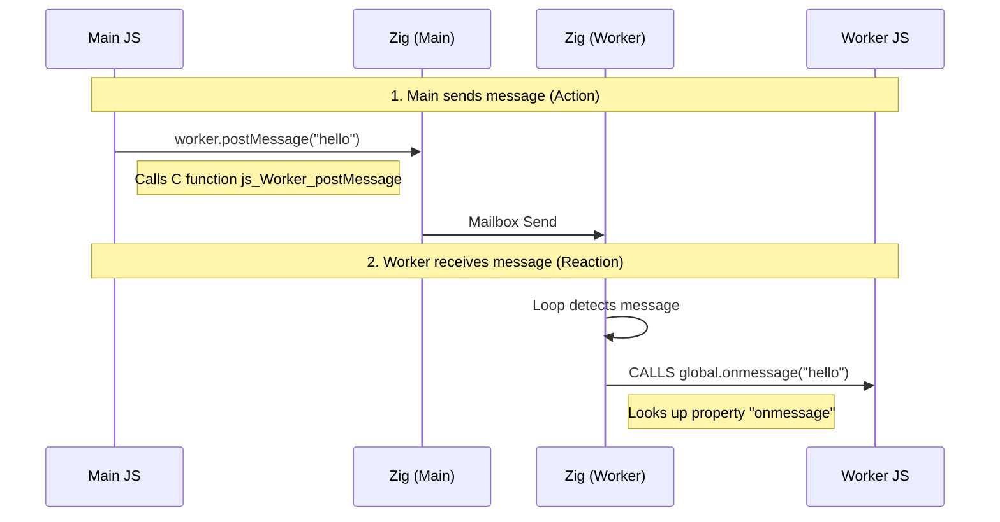
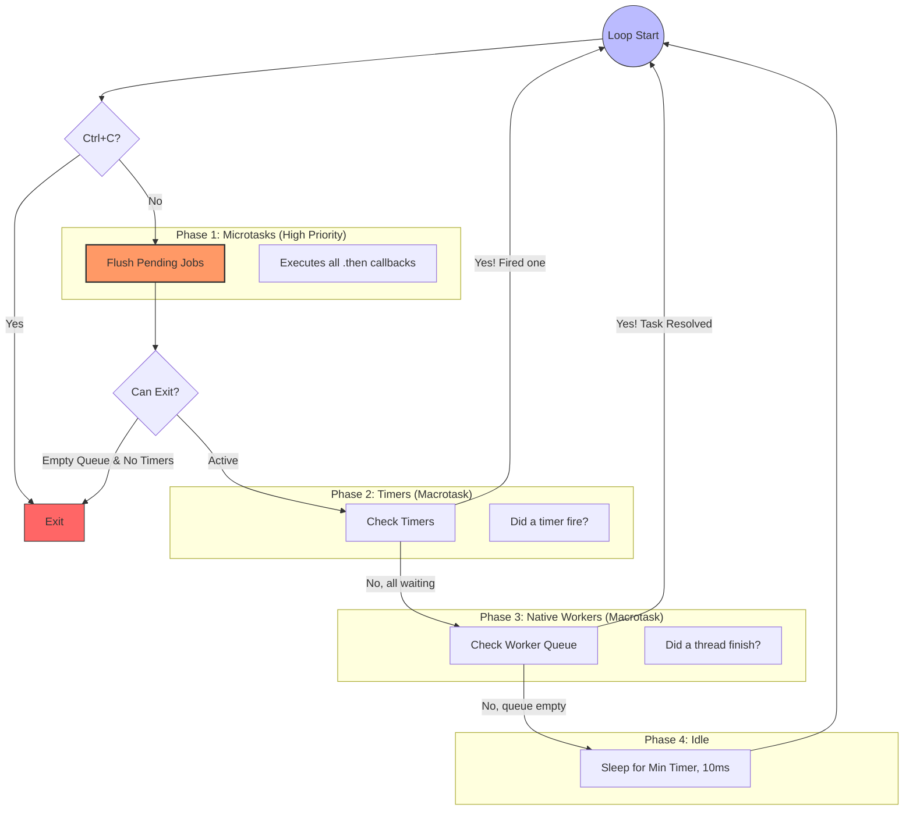

# zexplorer: native lightweight serverless DOM & JS execution engine with builtin  sanitization pipeline


[WIP]
`zexplorer`  is designed for content pipelines, not general-purpose application runtimes: a mini Swiss Army knife that runs fast, delivers, and dies.

The engine includes an ES6 JavaScript runtime. It embeds enough Web API surface to run framework code: it is tested successfully against some [js-framework-benchmark repos](https://github.com/krausest/js-framework-benchmark) in particular `React`, `Preact`, `SolidJS`, `Vue` and `Svelte`.
It is also tested against the `Vercel` demo site for scrapping it.

It can also render images (PNG, JPEG, WEBP) and return PDF. Check the examples of rendering `ChartJS`, `D3` and `Leaflet` map embedded in an SVG template as a PDF.

- You can compose JavaScript snippets and submit them to the engine. You don't need to know or use advanced Zig to use it, but you may need to install Zig to compile your implementation.
- You can also submit an HTML file: the engine will parse the HTML and CSS into a real DOM and execute ES6 code in JavaScript against it—with an event loop, timers, fetch, and workers—without a browser.
- It includes a built-in DOM+CSS sanitizer (optional).
- It can run custom native Zig computations alongside JS.
- It has image processing capabilities via the Canvas API: it takes an SVG, PNG, or JPEG, and can add text via the Canvas API to deliver OG images (in PNG, JPEG) or deliver PDF.

It outputs cleaned structured HTML or extracted data, without a browser, either to the file system or to stdout.

Built on the shoulders of giants: [lexbor](https://lexbor.com/) for blazing-fast DOM and CSS parsing, [quickJS-ng](https://quickjs-ng.github.io/quickjs/) for full ES6 execution, [stb_image](https://github.com/nothings/stb) for PNG/JPEG decoding, [libwebp](https://github.com/webmproject/libwebp) for WebP decoding and encoding, `stb_image_writer` for PNG/JPEG encoding and `stb_truetype` for text, [thorvg](https://github.com/thorvg/thorvg) for full SVG rasterizing, [libharu](https://github.com/libharu/libharu) for PDF encoding and [libcurl bindings](https://github.com/jiacai2050/zig-curl).

By providing a minimal DOM environment for running JS outside of a browser, it can be loosely compared to [JSDOM](https://github.com/jsdom/jsdom) with [DOMPurify](https://github.com/cure53/DOMPurify) built-in, or `dom-canvas` or `Vercel/Satori` - but running at native speed with fast cold boot and sandboxed filesystem, at the cost of much thinner Web API coverage.

## What Problem Does This Solve?

This engine aims to be lightweight and fast. Use it when you need to:

- **Sanitize untrusted HTML & CSS** at scale (emails, user content)
- **Render web components** server-side without a browser
- **Test client frameworks** (React, Vue, Solid) in milliseconds
- **Templating & Static Site Generation** - no async needed, pure speed.
- **Process HTML pipelines** with native Zig performance
- **render _static_ Images** (`PNG`, `JPEG`, `WEBP`, `SVG`) and compose or layer via the Canvas API to render PNG, JEPG, WEB or PDF. It uses the preloaded default `Roboto`font.

## What about Security?

If you plan to use your own code, you can happily by-pass the sanitization. This also removes the Network safety runtime checks. You are in control.

❗️ Note that the filesystem access (files) is always sandboxed to the root folder you declare, and HTTPS is enforced for remote module loading sources (eg CDN imorts or JavaScript chunks).

> [!IMPORTANT]
> If you plan to use untrusted code, consider the following:
> 
> Care has been taken to make this engine safe.  However, `zexplorer` does not provide a secure execution boundary for untrusted tenants; it **assumes process-level isolation** by running inside an already-isolated environment such as a  disposable microVM or container with no shared state between runs.

> [!NOTE]
>
> All layers below are _best-effort_ — see [SECURITY.md]([SECURITY.md](https://github.com/ndrean/zexplorer/blob/main/SECURITY.md)) for full details.
>
> - **Content sanitization** — DOM+CSS-aware: stylesheets, inline styles, iframes, SVG/MathML, DOM clobbering, URI schemas, XSS/mXSS. Tested against [H5SC](https://github.com/cure53/H5SC), [OWASP](https://cheatsheetseries.owasp.org/cheatsheets/DOM_based_XSS_Prevention_Cheat_Sheet.html), [PortSwigger](https://portswigger.net/web-security/cross-site-scripting/cheat-sheet), and [DOMPurify](https://github.com/cure53/DOMPurify). It is optional: trusted code can skip it.
> - **Filesystem sandbox** — kernel-enforced `openat()` with symlink blocking, traversal rejection, cross-device check, 16-level depth limit.
> - **Network hardening** — timeouts, redirect/size limits, protocol restrictions, SSRF pre-flight filtering (enforced in sanitize mode; dev can access localhost if sanitization is off).
> - **Module loading** — HTTPS-only remote imports, sandboxed local paths, SRI integrity checks, 5 MB size cap.
> - **Resource limits** — worker fan-out caps, busy-loop interrupts, max stack/GC/memory, wall-clock deadlines, max DOM-tree walking.

**TL;DR**:
It is designed to safely parse, transform, and sanitize untrusted HTML & CSS and short-lived JavaScript inside an isolated environment.

## What it does not have or is not

- no persistent event I/O (has event loop, fetch, timers, but short-lived)
- not a `Node.js` or `bun` alternative,
- not a streaming or long-running async runtime,
- a full Web API implementation,
- a secure multi-tenant execution platform.
- a headless browser replacement: not a real browser automation tool.
  
## How it compares?

| Feature           | zexplorer                | JSDOM           | Puppeteer       |
| ----------------- | ------------------------ | --------------- | --------------- |
| Startup time      | 2ms                      | ~30ms           | ~500ms          |
| DOM sanitization  | Built-in, DOM & CSSaware | Needs DOMPurify | Browser context |
| Memory footprint  | 8MB                      | ~50MB           | ~200MB          |
| Web API coverage  | ~40% (essential)         | ~90%            | 100%            |
| JavaScript engine | QuickJS (bytecode)       | Node.js V8      | Chrome V8       |
| Security model    | OS process               | Node.js process | OS process      |

## Quick start

How to use `zexplorer` ?

- as a Zig library to run JS code
- via the CLI: WIP
  - `zxp sanitize -dhtml=index.html -dss=stylesheet.css -djs=index.js -dfile=index_cleaned.html`
  - `zxp to_svg -dtemp=index.js -dsource=example.svg -dfile=final.svg`
  - `zxp run -djs=index.js -dout=stdout`

### Hello world

**[Dual primitives]** When you use `zexplorer` as a `Zig` library, you have DOM primitives accessible in the Zig code. Since these primitives are ported into the JavaScript runtime, you can access them as well in the runtime.

**[First example]** You have a simple HTML file, _examples/hello_world.html_.

```html
<div>
  <p>Hello world</p>
</div>
```

We will parse it with `z.parseHTML()` and print the DOM into the console with `prettyPrint()`. We will build and execute the following _src/ex1.zig_ file where we respect the careful and explicit Zig memory allocation ceremony:

```zig
var debug_allocator: std.heap.DebugAllocator(.{}) = .init;

pub fn main() !void {
  const gpa = debug_allocator.allocator();
  defer { 
    _= .ok == debug_allocator.deinit();
  }

  const html = @embedFile("examples/hello_world.html");

  const doc = try z.parseHTML(allocator, html);
  defer z.destroyDocument(doc);

  try z.prettyPrint(gpa, z.documentRoot(doc).?);
}

const std = @import("std");
const z = @import("zexplorer");
```

The executable is named "zxp-ex". We build the _main.zig_ file (defined for you in _build.zig_ asa the "run" step), and execute it by using its name:

```sh
$> zig build run
$> ./zig-out/bin/zxp-ex
```

In the terminal, you see:

```txt
<div>
  <p>
    "Hello world"
  </p>
</div>
```

---

**[Example of dual primitives]** We create a DOM and query it in pur Zig and then using embedded JavaScript:

In this example, we first parse the HTML file with `DOMParser.parseFromString()` and then we can query the "VDOM" in Zig with `z.querySelector()` and get the content with `textContent_zc()`.

```zig
var debug_allocator: std.heap.DebugAllocator(.{}) = .init;

pub fn main() !void {
  const gpa = debug_allocator.allocator();
  defer {
    _ =  .ok == debug_allocator.deinit();
  }

  // alternative: using DOMParser alternative instead of `parseHTML()`
  var parser = try z.DOMParser.init(gpa);
  defer parser.deinit();

  const html = @embedFile("examples/hello_world.html");
  const doc = try parser.parseFromString(html);
  defer z.destroyDocument(doc);

  const p_elt = try z.querySelector(gpa, z.bodyNode(doc).?, "p");
  const p_node = z.elementToNode(p_elt.?);
  const inner_text = z.textContent_zc(p_node); // no allocation

  std.debug.print("[Zig] {s}\n", .{inner_text});
}

const std = @import("std");
const z = @import("zexplorer");
```

Then, we run a JavaScript snippet that knows about the "vDOM". Indeed, zexplorer brings in a default `document` to which the JavaScript code accesses via a globalThis `document`. We use the engine `z.ScriptEngine`  and the `loadHTML()` and `evalModule()` methods.

```zig
var debug_allocator: std.heap.DebugAllocator(.{}) = .init;

pub fn main() !void {
  const gpa = debug_allocator.allocator();
  defer _ = debug_allocator.deinit();

  const sandbox_root = try std.fs.cwd().realpathAlloc(gpa, ".");
  defer gpa.free(sandbox_root);

  var engine = try z.ScriptEngine.init(gpa, sandbox_root);
  defer engine.deinit();

  const js = 
    \\const innerText = document.querySelector("p").textContent;
    \\console.log("[JS]", innerText);
    ;
  const html = @embedFile("examples/hello_world.html");

  try engine.loadHTML(html);
  try engine.evalModule(js, "<script>");
}

const std = @import("std");
const z = @import("zexplorer");
```

You build and execute the _main.zig_ file via the "run" step:

```sh
$> zig build run
$> ./zig-out/bin/zxp-ex
```

and get in the terminal:

```txt
[Zig] Hello world
[JS] Hello world
```

---

**[Run JavaScript]** Let's run a JavaScript snippet that builds the same DOM programmatically and adds a `<script>` to it:

```js
// src/examples/hello_world.js
const div = document.createElement("div");
const p = document.createElement("p");
p.textContent = "Hello zexplorer";
div.appendChild(p);
document.body.appendChild(div);

const script = document.createElement("script");
script.textContent = "const hello = document.querySelector('p').textContent; console.log("[JS]", hello);";
document.head.appendChild(script);
```

In the _main.zig_ file, we use the `z.ScriptEngine` to load the JS code `engine.evalModule()` and then execute it with `engine.executeScripts()`. We take care of all the memory allocations:

```zig
var debug_allocator: std.heap.DebugAllocator(.{}) = .init;

pub fn main() !void {
    const gpa = debug_allocator.allocator();
    defer _ = debug_allocator.deinit();
    const sandbox_root = try std.fs.cwd().realpathAlloc(gpa, ".");
    defer gpa.free(sandbox_root);

    var engine = try z.ScriptEngine.init(gpa, sandbox_root);
    defer engine.deinit();

    const script = @embedFile("examples/hello_world.js");

    const val = try engine.evalModule(script, "<my-script>");
    defer engine.ctx.freeValue(val);

    try engine.executeScripts(gpa, ".");

    // Print the DOM to stdout
    try z.prettyPrint(gpa, z.documentRoot(engine.dom.doc).?);
}

const std = @import("std");
const z = @import("zexplorer");
```

You build and execute the _main.zig_ file via the "run" step:


```sh
$> zig build run
$> ./zig-out/bin/zxp-ex
```

The output in the terminal:

```txt
[JS] Hello zexplorer  <-- zexplorer executed the script

<html>                <-- zexplorer "pretty-printed" the DOM to stdout
  <head>
    <script>
      "const hello = document.querySelector('p').textContent; console.log('[JS]', hello);"
    </script>
  </head>
  <body>
    <div>
      <p>
        "Hello zexplorer"
      </p>
    </div>
  </body>
</html>
```

---

**[HTML with script]** You have an HTML file (_examples/html-script.html_) with a script. We use the `z.ScriptEngine` and use a higher level primitive `loadPage()` that parses the HTML and CSS and syncs it, and reads and evaluates the found `<script>`'s elements.

```html
<body>
  <p>Hello Zig</p>
  <script>
    const p = document.querySelector("p");
    console.log(p.textContent);
  </script>
</body>
```

Your _main.zig_  file contains:

```zig
var debug_allocator: std.heap.DebugAllocator(.{}) = .init;

pub fn main() !void {
    const gpa = debug_allocator.allocator();
    defer _ = debug_allocator.deinit();
    const sandbox_root = try std.fs.cwd().realpathAlloc(gpa, ".");
    defer gpa.free(sandbox_root);

    var engine = try z.ScriptEngine.init(gpa, sandbox_root);
    defer engine.deinit();

    const html = @embedFile("html-script.html");
    try engine.loadPage(html, .{});

    try z.prettyPrint(gpa, z.documentRoot(engine.dom.doc).?);
}

const std = @import("std");
const z = @import("zexplorer");
```

You build and execute _main.zig_:

```sh
$> zig build run
$> ./zig-out/bin/zxp-ex
```

The output is as expected:

```txt
[JS] Hello Zig

<html>
  <head>
    ...
```

### Scrap a Vercel site

We scrap <https://demo.vercel.store>. It makes 12 HTTP requests and runs 42 scripts in order to hydrate the first SSR rendered page.

<details><summary>Preview demo.vercel.store</summary>


</details>

You can scrap the Vercel website with this JavaScript snippet that mimics `Puppeteer`'s API.

```js
// vercel.js

async function testVercel() {
  try {
    await zexplorer.goto("https://demo.vercel.store");

    await zexplorer.waitForSelector("a[href^='/product/']");

    const links = document.querySelectorAll("a[href^='/product/']");
    const unique = [...new Set(Array.from(links).map(el => el.getAttribute('href')))];
    const items = unique.map(href => {
      const el = document.querySelector(`a[href='${href}']`);
      return el.textContent.trim();
    });

    console.log(items);
    return items; // <-- return to the engine to marshall the array
  } catch (err) {
    console.error(err);
  }
}
```

You pass it to the engine:

```zig
var debug_allocator: std.heap.DebugAllocator(.{}) = .init;

pub fn main() !void {
    const gpa = debug_allocator.allocator();
    defer _ = debug_allocator.deinit();
    const sandbox_root = try std.fs.cwd().realpathAlloc(gpa, ".");
    defer gpa.free(sandbox_root);

    var engine = try z.ScriptEngine.init(gpa, sandbox_root);
    defer engine.deinit();

    const script = @embedFile("vercel.js");
    const val = try engine.eval(script, "test_vercel.js", .global);
    defer engine.ctx.freeValue(val);
    
    // output is an Array of strings
    const items = try engine.evalAsyncAs(
        allocator,
        []const []const u8,
        "testVercel()",
        "<vercel>",
    );
    defer {
        for (items) |item| allocator.free(item);
        allocator.free(items);
    }

    // output : toOwnedSlice or file
    var buf: std.ArrayList(u8) = .empty;
    defer buf.deinit(allocator);
    for (items) |item| {
        try buf.appendSlice(allocator, item);
        try buf.append(allocator, '\n');
    }

    try std.fs.cwd().writeFile(
        .{
            .sub_path = "vercel_data.txt",
            .data = buf.items,
        },
    );
}
```

and you get your data back in 1s:

```txt
0.17s user 0.14s system 37% cpu 0.835 total

[
  "Acme Circles T-Shirt$20.00USD",
  "Acme Drawstring Bag$12.00USD",
  "Acme Cup$15.00USD",
  "Acme Mug$15.00USD",
  "Acme Hoodie$50.00USD",
  "Acme Baby Onesie$10.00USD",
  "Acme Baby Cap$10.00USD"
]
```

TODO

```sh
.zxp --js=vercel.js --async=true --fmt=array --out=vercel_data.txt 
# or --out=array if piping
```

---

### Sanitize HTML & CSS

We want to sanitize the following untrusted HTML that loads an external stylesheet, defines a `<style>` element, and injects via a `<script>` new HTMLElements with some inline styles. All three CSS vectors are sanitized and properly synchronized.

<details><summary>HTML code</summary>

```html
<!-- src/examples/test_examples.html -->
<html>
  <head>
    <link rel="stylesheet" href="test_example.css" />
    <style>
      body {
        margin: 10px;
        padding: 5px;
        background: url(javascript:alert("xss"));
      }
    </style>
    <script src="test_example.js"></script>
  </head>
  <body>
    <div class="untrusted" onclick="alert(1)" style="font-size: 16px">
      Click me
    </div>
    <p class="untrusted" style="font-size: 12px">Follow me</p>
  </body>
</html>
```
</details>

with the following stylesheet:

<details><summary>Stylesheet</summary>

```css
/* src/examples/test_example.css */
body {
.untrusted {
  color: red;
  background-image: url("evil.com");
}
```

</details>

and the script:

<details><summary>JS code</summary>

```js
// src/examples/test_example.js
const html1 = `<p id="js1" class="untrusted" style="padding: 8px; behavior: url(evil.htc);">insertAdjacentHTML</p>`;
document.body.insertAdjacentHTML("beforeend", html1);
```

</details>

We run the following `Zig` code to to sanitize the HTML and output the new DOM.

<details><summary>Zig runner</summary>

```zig
// src/examples/test_example.zig

const std = @import("std");
const z = @import("zexplorer");
var debug_allocator: std.heap.DebugAllocator(.{}) = .init;

pub fn main() !void {
  const gpa = debug_allocator.allocator();
  defer _ = debug_allocator.deinit();

  const sbr = try std.fs.cwd().realpathAlloc(gpa, ".");
  defer gpa.free(sbr);
    
  var engine = try ScriptEngine.init(gpa,sbr);
  defer engine.deinit();

  const cfg = z.LoadPageOptions{
      .sanitize = sanitize,
      .base_dir = "src/examples",
      .execute_scripts = true,
      .load_stylesheets = true,
      .sanitizer_options = .{ .remove_scripts = false },
      .run_loop = false, // no async code
  };

  // parse the HTML, load the external stylesheet, run the script, parse and sync the CSS styles to the DOM

  try engine.loadPage(@embedFile("test_example.html"), cfg);

  // print DOM to terminal

  if (z.bodyElement(engine.dom.doc)) |body| {
    const html = try z.outerHTML(c_alloc, body);
    defer c_alloc.free(html);
    std.debug.print("{s}\n\n", .{ html });
  }
    
  //=== CSS test 

  // test to see if P has the color "red" coming the class
  if (z.getElementById(doc, "js1")) |p| {
      const color = try z.getComputedStyle(ta, p, "color");
      defer if (color) |c| ta.free(c);
      std.debug.print("[Test] Confirm style set by class .untrusted on #js1: color={s} \n", .{color orelse "(none)"});
  }

  // save into a file
  try printDOM(c_alloc, "example_cleaned.html")
}
```

</details>

The output confirms that the whole page is sanitized:

<details><summary>Result</summary>

```txt
<body>
  <div class="untrusted" style="font-size: 16px">
    Click me
  </div>
  <p id="js1" class="untrusted" style="padding: 8px">insertAdjacentHTML</p>
</body>

[Test] Confirm style set by class .untrusted on #js1: color= red
```

</details>

---

### Generate OG images from SVG templates

We display two examples shows that `zexplorer` overlaps partially [node-canvas](https://github.com/Automattic/node-canvas) and [Vercel/satori](https://github.com/vercel/satori)  (no JSX but `React` can be loaded) but is very lightweight and limited.

Given this SVG (designed in Figma):

<details><summary>SVG template</summary>

```html
<svg width="1200" height="630" viewBox="0 0 1200 630" xmlns="http://www.w3.org/2000/svg">
  <defs>
    <mask id="hole">
        <rect width="1200" height="630" fill="white" />
        <circle cx="175" cy="175" r="75" fill="black" />
    </mask>
  </defs>
  <rect width="1200" height="630" fill="#0f172a" mask="url(#hole)"/>
        
  <text x="100" y="380" font-family="Arial" font-size="80" fill="#ffffff" font-weight="bold">
    {{TITLE}}
  </text>
        
  <text x="100" y="480" font-family="Arial" font-size="40" fill="#94a3b8">
    Written by {{AUTHOR}}
  </text>
 </svg>
```

</details>

The following "standard" JavaScript snippet makes a layered composition of a "fetched" image and the interpolated SVG template inside a Canvas.

You extract the data and return an ArrayBuffer that Zig will marshall.

<details><summary>JS code</summary>

```js
async function loadImage(url) {
  return await new Promise((resolve, reject) => {
    try {
      const img = new Image();
      img.onload = () => resolve(img);
      img.onerror = (e) => reject(new Error(`Image failed to load: ${url}`));
      img.src = url;
    } catch (e) {
      reject(new Error(`Failed to fetch image: ${e.message}`));
    }
  });
}

async function generateOGImage({ title, author, avatarUrl }) {
  console.log(`Generating OG Image for:  ${title}`);
  const avatarImg = await loadImage(avatarUrl);

  const templ_res = await fetch(
    "file://src/examples/test_og_generator_template_v2.svg",
  );

  const rawSvgTemplate = await templ_res.text();
  const finalSvgText = rawSvgTemplate
    .replace("{{TITLE}}", title)
    .replace("{{AUTHOR}}", author);
  const svgBlob = new Blob([finalSvgText], { type: "image/svg+xml" });
  const imgSVG = await createImageBitmap(svgBlob);

  const canvas = document.createElement("canvas");
  canvas.width = 1200;
  canvas.height = 630;
  const ctx = canvas.getContext("2d");
  ctx.drawImage(avatarImg, 100, 100, 150, 150); // in the hole
  ctx.drawImage(imgSVG, 0, 0);

  const pngBlob = await canvas.toBlob();
  return await pngBlob.arrayBuffer();
}

async function renderTemplate() {
  try {
    console.log("Called");
    const pngBytes = await generateOGImage({
      title: "Headless Browser in Zig",
      author: "N. Drean",
      avatarUrl: "https://github.com/torvalds.png",
    });

    return pngBytes; // return data to Zig to save in a file
  } catch (e) {
    console.error("Failed to generate OG image:", e);
  }
}
```

</details>

The Zig code to run this is quite simple:


<details><summary>Zig runner</summary>

```zig
pub fn main() !void {
    const allocator = std.testing.allocator;

    const sandbox_root = try std.fs.cwd().realpathAlloc(gpa, ".");
    defer gpa.free(sandbox_root);

    try run_test(gpa, sandbox_root);
}

fn run_test(allocator: std.mem.Allocator, sbx: []const u8) !void {
    var engine = try ScriptEngine.init(allocator, sbx);
    defer engine.deinit();
    const script = @embedFile("test_og_generator.js");

    const val = try engine.eval(script, "<script>", .global);
    defer engine.ctx.freeValue(val);

    const png_bytes = try engine.evalAsyncAs(allocator, []const u8, "renderTemplate()", "<svg-template>");
    defer allocator.free(png_bytes);

    try std.fs.cwd().writeFile(.{.sub_path = "templated.png", .data = png_bytes});
}

const std = @import("std");
const z = @import("zexplorer");
const ScriptEngine = z.ScriptEngine;
const js_canvas = z.js_canvas;
```

</details>

The result is:


2) 
[TODO] CLI...

---

### Embed Leaflet geoJSON path map in an SVG and output a PDF

<details><summary>The HTML file that draws a Leaflet map into an SVG template and renders a PDF</summary>

```html
<!doctype html>
<html>
  <head>
    <link
      rel="stylesheet"
      href="https://unpkg.com/leaflet@1.9.4/dist/leaflet.css"
    />
    <script src="https://unpkg.com/leaflet@1.9.4/dist/leaflet.js"></script>
  </head>
  <body>
    <div id="map" style="width: 800px; height: 600px"></div>

    <script>
      async function runDrawGeoJSONRoute(deliveryData) {
        console.log("[Test] Booting Leaflet GeoJSON Engine...");

        const map = L.map("map", {
          zoomControl: false,
          attributionControl: false,
        }).setView([51.505, -0.09], 13);

        L.tileLayer("https://tile.openstreetmap.org/{z}/{x}/{y}.png").addTo(
          map,
        );

        // Draw a path from Hyde Park to the Tower of London!
        const route = {
          type: "LineString",
          coordinates: [
            [-0.15, 51.505],
            [-0.12, 51.51],
            [-0.076, 51.508],
          ],
        };
        L.geoJSON(route, {
          style: { color: "red", weight: 6, opacity: 0.8 },
        }).addTo(map);

        // 1. Extract the Tiles
        const tiles = Array.from(
          document.querySelectorAll("img.leaflet-tile"),
        ).map((img) => ({
          url: img.src,
          x: parseInt(img.style.left || 0, 10),
          y: parseInt(img.style.top || 0, 10),
        }));

        // 2. Extract the SVG Vector Data!
        const svgElement = document.querySelector(".leaflet-overlay-pane svg");
        const svgString = svgElement ? svgElement.outerHTML : "";

        console.log(`✅ Extracted ${tiles.length} tiles and SVG overlay!`);

        const readyTiles = [];
        for (const t of tiles) {
          try {
            const res = await fetch(t.url);
            const buffer = await res.arrayBuffer();
            readyTiles.push({
              buffer: buffer,
              x: t.x,
              y: t.y,
              w: t.w,
              h: t.h,
            });
            console.log(`  + Fetched tile at (${t.x}, ${t.y})`);
          } catch (e) {
            console.log(`  - Failed to fetch ${t.url}`);
          }
        }

        // 3. Send to Zig Compositor
        // CRITICAL: Dimensions must match the CSS width/height of the map div!
        const mapBuffer = zexplorer.generateRoutePng(
          readyTiles,
          svgString,
          null, // No file output, keep in memory
          800, // Map DOM width
          600, // Map DOM height
        );
        console.log("Composited Map loaded:", mapBuffer.byteLength, "bytes");

        // 4. Load the UI Background Template
        const templateRes = await fetch(
          "file://src/examples/test_route_report_template.svg",
        );
        const svgText = await templateRes.text();
        const svgBlob = new Blob([svgText], { type: "image/svg+xml" });
        const bgBitmap = await createImageBitmap(svgBlob);

        // 5. Assemble the PDF Layout (Top-to-Bottom)
        const pdf = new PDFDocument();
        pdf.addPage(); // Zig backend handles A4 sizing natively

        // Layer 1: Background
        pdf.drawImage(bgBitmap, 0, 0, 595, 842);

        // Calculate responsive dimensions
        const margin = 40;
        const pdfPageWidth = 595;
        const maxImageWidth = pdfPageWidth - margin * 2;
        const imgWidth = maxImageWidth;
        const imgHeight = (600 / 800) * imgWidth; // 4:3 Aspect Ratio scaling
        const mapStartY = 160;

        // Layer 2: Title Text at the top
        pdf.fillStyle = "#0f172a";
        pdf.setFont("Roboto-Bold", 24);
        pdf.fillText("Delivery Route Summary", margin, margin + 20);

        // Layer 3: The Map (Placed below the title)
        pdf.drawImageFromBuffer(
          mapBuffer,
          margin,
          mapStartY,
          imgWidth,
          imgHeight,
        );

        // Layer 4: Report Data (Placed dynamically below the map)
        const textStartY = mapStartY + imgHeight + 40; // Properly declared and calculated
        pdf.setFont("Roboto", 12);
        pdf.fillStyle = "#475569";

        // Left Column
        pdf.fillText(`Date: ${deliveryData.date}`, margin + 15, textStartY);
        pdf.fillText(
          `Driver: ${deliveryData.driverName}`,
          margin + 15,
          textStartY + 25,
        );

        // Right Column
        const rightColX = pdfPageWidth - margin - 180;
        pdf.fillText(`Est Time: ${deliveryData.eta}`, rightColX, textStartY);
        pdf.fillText(
          `Total Distance: ${deliveryData.distance}`,
          rightColX,
          textStartY + 25,
        );

        // Layer 5: Decorative Border around the text
        pdf.setLineWidth(2);
        pdf.setDrawColor("#cbd5e1");
        pdf.strokeRect(margin, textStartY - 25, maxImageWidth, 65);

        pdf.save(`RouteReport_${deliveryData.id}.pdf`);
        console.log("🟢 Route Report generated");
      }

      runDrawGeoJSONRoute({
        id: "LDN-8492",
        driverName: "Auto-Pilot",
        date: "Feb 18, 2026",
        distance: "6.4 km",
        eta: "18 mins",
      }).catch((e) => console.error("Error:", e.message, e.stack));
    </script>
  </body>
</html>
```

</details>


<details><summary>Zig runner</summary>

```zig
var debug_allocator: std.heap.DebugAllocator(.{}) = .init;

pub fn main() !void {
    const gpa = debug_allocator.allocator(),
    defer {
      _ = .ok == debug_allocator.deinit();
    };

    const sandbox_root = try std.fs.cwd().realpathAlloc(gpa, ".");
    defer gpa.free(sandbox_root);

    var engine = try ScriptEngine.init(allocator, sbx);
    defer engine.deinit();

    const html = @embedFile("test_route_report.html");
    try engine.loadPage(html, .{});
    try engine.run();
}

const std = @import("std");
const builtin = @import("builtin");
const z = @import("zexplorer");
const ScriptEngine = z.ScriptEngine;
```

</details>

The result is:

<https://github.com/ndrean/zexplorer/blob/main/images/RouteReport.pdf>

---

### Render D3.js to PNG

<details><summary>HTML & JavaScript snippet to render a pie chart</summary>

```html
<!doctype html>
<html>
  <head>
    <script src="https://d3js.org/d3.v7.min.js"></script>
  </head>
  <body>
    <div id="chart" style="width: 800px; height: 600px"></div>

    <script>
      // D3 strictly requires createElementNS. TODO?
      if (!document.createElementNS) {
        document.createElementNS = function (ns, name) {
          return document.createElement(name);
        };
      }

      if (!globalThis.Element.prototype.setAttributeNS) {
        globalThis.Element.prototype.setAttributeNS = function (
          namespace,
          name,
          value,
        ) {
          // ignore the namespace URI and just set the attribute name/value
          this.setAttribute(name, value);
        };
      }

      if (!globalThis.Element.prototype.getAttributeNS) {
        globalThis.Element.prototype.getAttributeNS = function (
          namespace,
          name,
        ) {
          return this.getAttribute(name);
        };
      }

      async function runDrawD3Chart() {
        console.log("[Test] Booting D3.js Engine...");

        const width = 800;
        const height = 600;
        const margin = 40;
        const radius = Math.min(width, height) / 2 - margin;

        // Setup the SVG canvas
        const svg = d3
          .select("#chart")
          .append("svg")
          .attr("width", width)
          .attr("height", height)
          // Crucial for ThorVG!
          .attr("xmlns", "http://www.w3.org/2000/svg")
          .append("g")
          .attr("transform", `translate(${width / 2},${height / 2})`);

        const data = {
          "In Transit": 45,
          Delivered: 120,
          Delayed: 15,
          Maintenance: 5,
        };

        // Color scale
        const color = d3
          .scaleOrdinal()
          .domain(Object.keys(data))
          .range(["#3b82f6", "#22c55e", "#ef4444", "#f59e0b"]);

        // the pie slices
        const pie = d3.pie().value((d) => d[1]);
        const data_ready = pie(Object.entries(data));

        // Shape generator for the arcs (Donut chart)
        const arcGenerator = d3
          .arc()
          .innerRadius(radius * 0.5) // This makes it a donut!
          .outerRadius(radius);

        // Build the SVG DOM elements!
        svg
          .selectAll("path")
          .data(data_ready)
          .join("path")
          .attr("d", arcGenerator)
          .attr("fill", (d) => color(d.data[0]))
          .attr("stroke", "white")
          .style("stroke-width", "4px");

        // text labels
        svg
          .selectAll("text")
          .data(data_ready)
          .join("text")
          .text((d) => d.data[0])
          .attr("transform", (d) => `translate(${arcGenerator.centroid(d)})`)
          .style("text-anchor", "middle")
          .style("font-family", "sans-serif")
          .style("font-size", "16px")
          .style("fill", "#ffffff")
          .style("font-weight", "bold");

        // Extract the SVG string
        const svgElement = document.querySelector("#chart svg");
        const svgString = svgElement ? svgElement.outerHTML : "";

        // Send to Zig Compositor (just the SVG saved as PNG)
        zexplorer.generateRoutePng(
          [], // Empty tiles array
          svgString,
          "D3_Chart_report.png",
          width,
          height,
        );

        console.log("🟢 Chart Report generated");
      }

      runDrawD3Chart().catch((e) =>
        console.error("Error:", e.message, e.stack),
      );
    </script>
  </body>
</html>
```

</details>


---

### Render Chart.js to PNG

You can run [Chart.js](https://www.chartjs.org/) server-side and export the result as a PNG file. 

❗️ The Chart.js bundle is _pre-built_ with `Bun` and embedded at compile time.

<details><summary>ChartJS example</summary>

```sh
cd src/examples/zexp-frams && bun run build_chartjs.js
zig build example -Dname=test_canvas -Doptimize=ReleaseFast
```

The HTML file defines the chart configuration and uses the `Chart` constructor:

```html
<!-- src/examples/test_canvas.html -->
<html>
  <body>
    <script>
      globalThis.window = globalThis;
      if (typeof Intl === "undefined") {
        globalThis.Intl = {
          NumberFormat: function(locale, opts) {
            return { format: function(n) { return String(n); } };
          }
        };
      }
      window.devicePixelRatio = 1;
      window.requestAnimationFrame = (cb) => setTimeout(cb, 0);

      const canvas = document.createElement("canvas");
      canvas.width = 800;
      canvas.height = 600;
      document.body.insertAdjacentElement("afterbegin", canvas);

      async function render() {
        const config = {
          type: "bar",
          data: {
            labels: ["Zig", "Rust", "C++", "Go", "Python"],
            datasets: [{
              label: "Performance (Imaginary Units)",
              data: [150, 145, 140, 120, 80],
              backgroundColor: [
                "rgba(255, 99, 132, 0.8)", "rgba(54, 162, 235, 0.8)",
                "rgba(255, 206, 86, 0.8)", "rgba(75, 192, 192, 0.8)",
                "rgba(153, 102, 255, 0.8)",
              ],
              borderColor: "black",
              borderWidth: 2,
            }],
          },
          options: {
            animation: false,  // CRITICAL: disable animation for SSR
            responsive: false,
            plugins: {
              title: { display: true, text: "Language Speed Test", font: { size: 30 } },
            },
          },
        };

        new globalThis.Chart(canvas, config);

        // Since animation is false, it renders synchronously!
        const blob = await canvas.toBlob();
        return await blob.arrayBuffer();
      }
      render();
    </script>
  </body>
</html>
```

The Zig runner loads the `Chart.js` bundle, then evaluates the HTML with its inline script:

```zig
fn chartJS(allocator: std.mem.Allocator, sbx: []const u8) !void {
    var engine = try ScriptEngine.init(allocator, sbx);
    defer engine.deinit();

    // Load Chart.js bundle (pre-built IIFE, embedded at compile time)

    const chartjs = @embedFile("vendor/chart.js");
    const chartjs_val = try engine.eval(chartjs, "<chartjs>", .global);
    engine.ctx.freeValue(chartjs_val);

    // Load the HTML with chart config, extract and run the <script>

    const html = @embedFile("test_canvas.html");
    try engine.loadHTML(html);

    // access the DOM with Zig

    const body = z.bodyNode(engine.dom.doc);
    const script_elt = z.getElementByTag(body.?, .script).?;
    const script = z.textContent_zc(z.elementToNode(script_elt));

    const png_bytes = try engine.evalAsyncAs(allocator, []const u8, script, "<chart>");
    defer allocator.free(png_bytes);

    try std.fs.cwd().writeFile(.{ .sub_path = "canvas_chartjs.png", .data = png_bytes });
}
```

</details>


---

### Run React bundled code

You can run bundled JSX code in zexplorer. It is a two-step process.

<details><summary>React code + test</summary>

```sh
bun run build_react.js   # produces dist/app.js
zig build example -Dname=test_react -Doptimize=ReleaseFast
```

The test simulates clicks via `dispatchEvent` and verifies that `useMemo` works correctly: filtering triggers a recalculation, but a force re-render does not.

</details>

### Preact with `html` template strings

```sh
zig build example -Dname=test_htm -Doptimize=ReleaseFast
```

<details><summary>Preact/htm imports via CDN, compiled to bytecode at startup</summary>

Uses `htm/preact/standalone` with `useState` and `dispatchEvent` for click simulation. The engine pre-compiles CDN imports to bytecode.

</details>

### SolidJS templated with `html`

```sh
zig build example -Dname=test_solidjs --release=fast
```

<details><summary>SolidJS with createSignal, createEffect, and setInterval</summary>

Imports `solid-js` and `solid-js/web` from CDN. Uses `createSignal` for reactive state and `setInterval` to simulate periodic clicks. The signal-triggered DOM updates are verified in the output.

</details>

### Vue with template strings

```sh
zig build example -Dname=test_vue --release=fast
```

<details><summary>Vue 3 with ref, template compiler, and dispatchEvent</summary>

Uses Vue 3's template compiler with `ref()` for reactive state. Simulates clicks via `setInterval` + `dispatchEvent`. Requires `SVGElement` and `Element` polyfills for Vue's mount detection.

</details>

---

## Tests & performance

| Operation            | zexplorer | JSDOM+DOMPurify |
| -------------------- | --------- | --------------- |
| Cold start           | 1.5ms     | 30ms            |
| Sanitize 36kB HTML   | 2.1ms     | 11ms            |
| Create 10k DOM nodes | 26ms      | 191ms           |

### zexplorer running js-framework-benchmark code

To ensure the Web primitives are correctly implemented in `zexplorer`, we run code from the [js-vanilla-bench-framework tests](https://github.com/krausest/js-framework-benchmark).

The examples can be built and run with the commands:

```sh
cd src/examples
zig build example -Dname=js-bench-* -Doptimize=ReleaseFast
```

Source:

- [Vanilla-1-keyed](https://github.com/krausest/js-framework-benchmark/blob/master/frameworks/non-keyed/vanillajs-1/src/Main.js)
- [Vanilla-2-non-keyd](https://github.com/krausest/js-framework-benchmark/blob/master/frameworks/non-keyed/vanillajs-3/src/Main.js)
- [Vanilla-3-k](https://github.com/krausest/js-framework-benchmark/blob/master/frameworks/keyed/vanillajs-3/src/Main.js)
- [bau](https://github.com/krausest/js-framework-benchmark/blob/master/frameworks/non-keyed/bau/main.js)
- [Comp(*) Solid](https://github.com/krausest/js-framework-benchmark/blob/master/frameworks/keyed/solid/src/main.jsx)
- [Temp(**) Solid](https://github.com/ndrean/zexplorer/src/examples/js-bench-solid.js)
- [Svelte5](https://github.com/krausest/js-framework-benchmark/blob/master/frameworks/keyed/svelte/src/App.svelte) (compiled with `svelte/compiler`, bundled with Bun)
- [React19](https://github.com/krausest/js-framework-benchmark/blob/master/frameworks/keyed/react-hooks/src/main.jsx)
- [Preact](https://github.com/krausest/js-framework-benchmark/blob/master/frameworks/keyed/react-hooks/src/main.jsx) (same source, built with preact/compat)
- [Vue3](https://github.com/ndrean/zexplorer/src/examples/js-bench-vue3.js)

Ref: browser Vanilla

| Test             | Ref  | [V1-keyd] | [V2-nonKeyd] | [V3-keyd] | [bau] | [Comp(*) Solid] | [Temp(**) Solid] | [Svelte5] | [React19^] | [Preact^^] | Vue3(***) |
| ---------------- | ---- | --------- | ------------ | --------- | ----- | --------------- | ---------------- | --------- | ---------- | ---------- | --------- |
| Create 1k        | 22.0 | 3.08      | 1.65         | 1.67      | 1.97  | 18.5            | 16.7             | 26.0      | 105.0      | 157.8      | 54.7      |
| Replace 1k       | 24.4 | 3.03      | 2.46         | 2.73      | 1.94  | 17.0            | 17.6             | 26.9      | 106.2      | 159.1      | 55.2      |
| Partial Up (10k) | 9.5  | 2.82      | 8.86         | 7.92      | 5.40  | 7.0             | 138.4            | 8.7       | 128.6      | 166.0      | 205.2     |
| Select Row       | 2.2  | 0.02      | 0.02         | 0.01      | 0.01  | 3.7             | 127.9            | 3.0       | 47.2       | 5.9        | 199.2     |
| Swap Rows        | 11.7 | 0.05      | 0.09         | 0.11      | 0.01  | 1.2             | 10.3             | 1.1       | 37.1       | 4.9        | 21.7      |
| Remove Row       | 9.2  | 0.01      | 0.05         | 0.05      | 0.00  | 0.5             | 10.8             | 0.7       | 5.1        | 4.9        | 20.5      |
| Create 10k       | 229  | 28.71     | 16.06        | 16.15     | 19.03 | 143.5           | 142.0            | 422.1     | 3601.9     | 5670.4     | 473.2     |
| Append 1k        | 25.6 | 3.48      | 4.28         | 4.10      | 2.06  | 16.5            | 173.7            | 22.8      | 154.9      | 121.4      | 245.8     |
| Clear            | 9.0  | 4.21      | 6.08         | 5.66      | 0.01  | 32.8            | 23.7             | 9.1       | 92.7       | 10.3       | 37.8      |
| --               | --   | --        | --           | --        | --    | --              | --               | --        | --         | --         | --        |
| Total Engine     | --   | 78        | 84           | 82        | 57    | 486             | 1087             | 954       | 8715       | 8255       | 2086      |

(*) compiled JSX->JS with `bun`

(^) React production build (`process.env.NODE_ENV = "production"`)

(^^) Preact/compat production build (same JSX source as React, aliased via build plugin)

(**) templated with `html` and using `map` instead of `For`

(***) templated

Svelte 5's compiled approach generates direct imperative DOM operations (no VDOM), making it the fastest compiled framework on QuickJS — on par with Compiled Solid for 1k operations and significantly faster than React/Preact/Vue. Preact is lighter than React (3KB vs 45KB) but its microtask-scheduled rendering creates more GC pressure at scale. React's fiber architecture pays off for partial updates where its diffing skips unchanged subtrees more efficiently.

### zexplorer vs jsdom

While JSDOM emulates more of the many web standards, zexplorer can run Vanilla code, Preact/React code (no JSX, via templating or compiled), Vue (via templating), SolidJS (via templating or compiled), or Svelte 5 (compiled). Check the examples below.

We present a comparison in performance between `JSDOM` and `zexplorer` on a Vanilla example where build a simple DOM and run querySelectors and populate elements.

<details><summary>JSDOM script</summary>

```js
const { JSDOM } = require("jsdom");
const { performance } = require("perf_hooks");

const values = [100, 1000, 10_000, 20_000, 50_000];

console.log("\n=== JSDOM Benchmark --------------------------------\n");

for (const nb of values) {
  const globalStart = performance.now();

  // We enable runScripts so we can execute the test logic inside the context
  const dom = new JSDOM(`<!DOCTYPE html><body></body>`, {
    runScripts: "dangerously",
    resources: "usable",
  });

  const { window } = dom;

  window.NB = nb;

  // Benchmark Script

  const scriptContent = `
    let start = performance.now();
    const NB = window.NB; // Access injected global
    console.log(\`[Internal] Starting DOM creation test with \${NB} elements\`);
    
    const btn = document.createElement("button");
    const form = document.createElement("form");
    form.appendChild(btn);
    document.body.appendChild(form);

    const mylist = document.createElement("ul");

    for (let i = 1; i <= NB; i++) {
      const item = document.createElement("li");
      item.textContent = "Item " + i * 10;
      item.setAttribute("id", i.toString());
      mylist.appendChild(item);
    }
    document.body.appendChild(mylist);

    const lis = document.querySelectorAll("li");
    
    let clickCount = 0;
        
    btn.addEventListener("click", () => {
      clickCount++;
      btn.textContent = \`Clicked \${clickCount}\`;
    });

    const clickEvent = new window.Event("click");
    for (let i = 0; i < NB; i++) {
      btn.dispatchEvent(clickEvent);
    }

    let time = performance.now() - start;

    console.log(
      JSON.stringify({
        time: time.toFixed(2),
        elementCount: lis.length,
        last_li_id: lis[lis.length - 1].getAttribute("id"),
        last_li_text: lis[lis.length - 1].textContent,
        success: clickCount === NB,
      })
    );
  `;

  console.log(`[Node] Running with NB=${nb}`);
  window.eval(scriptContent);

  const globalEnd = performance.now();
  const totalMs = (globalEnd - globalStart).toFixed(2);

  console.log(`⚡️ JSDOM Total Time: ${totalMs}ms\n`);

  window.close();
}
```

</details>

<details><summary>Zexplorer script:</summary>

```zig
const std = @import("std");
const z = @import("zexplorer");
const ScriptEngine = z.ScriptEngine;

pub fn main() !void {
    var debug_allocator: std.heap.DebugAllocator(.{}) = .init;
    const gpa, const is_debug = gpa: {
        break :gpa switch (builtin.mode) {
            .Debug, .ReleaseSafe => .{ debug_allocator.allocator(), true },
            .ReleaseFast, .ReleaseSmall => .{ std.heap.c_allocator, false },
        };
    };
    defer if (is_debug) {
        _ = debug_allocator.deinit();
    };

    const sandbox_root = try std.fs.cwd().realpathAlloc(gpa, ".");
    defer gpa.free(sandbox_root);

    try bench(gpa, sandbox_root);
}

fn bench(allocator: std.mem.Allocator, sbx: []const u8) !void {
    z.print("\n=== JS-simple-bench --------------------------------\n\n", .{});

    const values = [_]u32{ 100, 1000, 10000, 20000, 50000 };

    for (values) |v| {
        z.print("[Zig]-> Running with NB={d}\n", .{v});
        const start = std.time.nanoTimestamp();
        var engine = try ScriptEngine.init(allocator, sbx);

        const js =
            \\ let start = performance.now();
            \\ console.log(`Starting DOM creation test with {d} elements`);
            \\ const btn = document.createElement("button");
            \\ const form = document.createElement("form");
            \\ form.appendChild(btn);
            \\ document.body.appendChild(form);
            \\ const mylist = document.createElement("ul");
            \\ for (let i = 1; i <= parseInt({d}); i++) {{
            \\   const item = document.createElement("li");
            \\   item.textContent = "Item " + i * 10;
            \\   item.setAttribute("id", i.toString());
            \\   mylist.appendChild(item);
            \\ }}
            \\ document.body.appendChild(mylist);
            \\
            // \\ let time = performance.now() - start;
            \\
            \\ const lis = document.querySelectorAll("li");
            \\ console.log(lis.length);
            \\
            // \\ start = performance.now();
            \\ let clickCount = 0;
            \\ btn.addEventListener("click", () => {{
            \\  clickCount++;
            \\  btn.textContent = `Clicked ${{clickCount}}`;
            \\ }});
            \\
            \\ // Simulate clicks
            \\ for (let i = 0; i < parseInt({d}); i++) {{
            \\   btn.dispatchEvent("click");
            \\ }}
            \\
            \\ const time = performance.now() - start;
            \\
            \\ console.log(
            \\   JSON.stringify({{
            \\     time: time.toFixed(2),
            \\     elementCount: lis.length,
            \\     last_li_id: lis[lis.length - 1].getAttribute("id"),
            \\     last_li_text: lis[lis.length - 1].textContent,
            \\     success: clickCount === parseInt({d}),
            \\   }}),
            \\ );
        ;

        const script = try std.fmt.allocPrint(allocator, js, .{ v, v, v, v });
        defer allocator.free(script);
        const body = try std.fmt.allocPrint(allocator, "<body><script>{s}</script></body>", .{script});
        // z.print("{s}\n", .{body});
        defer allocator.free(body);
        try engine.loadHTML(body);

        try engine.executeScripts(allocator, ".");

        const end = std.time.nanoTimestamp();
        const ms = @as(f64, @floatFromInt(end - start)) / 1_000_000.0;
        std.debug.print("\n⚡️ Zexplorer Engine Total Time: {d:.2}ms\n\n", .{ms});

        engine.deinit();
    }
}
```

</details>

**Results**

The start time of the engine is approx 1.5ms (difference between the engine setup & loop execution and the JavaScript execution, as measured by `performance()` ).

| #rows  | JS/Zexplorer | Total/Zexplorer | JS/JSDom | Total/JSDom |
| ------ | ------------ | --------------- | -------- | ----------- |
| 100    | 0.29 ms      | 1.86 ms         | 9.81 ms  | 36.72 ms    |
| 1_000  | 2.42 ms      | 3.77 ms         | 27.9 ms  | 32.90 ms    |
| 10_000 | 24.83 ms     | 26.24 ms        | 191.1 ms | 197.9 ms    |
| 20_000 | 49.11 ms     | 50.50 ms        | 315.4 ms | 318.9 ms    |
| 50_000 | 125.28 ms    | 126.58 ms       | 741.4 ms | 745.5 ms    |

The DOM operations are externalized from the JavaScript runtime and these results demonstrate this clearly.

---

### Tests Zaniter module

The goal is to be as performant as [DOMPurify](https://github.com/cure53/DOMPurify) in terms of sanitization. It's a DOM-level sanitizer, not a string filter. It performs the sanitization in context, meaning  DOM and CSS aware, so retains the structure. It can allow framework attributes.

This is a two phase process. We firstly parse the input into a real DocumentFragment. It walks the tree DOM and attributes, URIs and CSS (parsed & sanitized). It applies whitelist and [html_specs rules](https://github.com/ndrean/zexplorer/blob/main/src/modules/html_specs.zig) marks the node or attributes for removal or update (sanitized attributes) and processes templates separately. It then applies the collected changes once the walk completes.

There are settings for the sanitizer (remove comments, remove/keep <script>, <style>, custom elements, allow framework attributes, embedded media with attributes in context...). Preset built-in modes are proposed but can be customized per run 

**TODO**: CL-args to run sanitization only with args

#### Quality test

It is tested against collected tests from:

- DOMPurify test suite: <https://github.com/cure53/DOMPurify/tree/main/test>
- OWASP XSS Filter Evasion Cheat Sheet: <https://cheatsheetseries.owasp.org/cheatsheets/XSS_Filter_Evasion_Cheat_Sheet.html>
- PortSwigger XSS cheat sheet: <https://portswigger.net/web-security/cross-site-scripting/cheat-sheet>
- DOMPurify CVEs: Especially CVE-2024-47875 (mXSS via nesting) <https://github.com/cure53/DOMPurify>

Tests:

- 139 real-world XSS attack vectors from [html5sec.org](https://html5sec.org/) with output in <https://github.com/ndrean/zexplorer/blob/main/src/examples/h5sc-test_output.html>
- sanitization of the "dirty" HTML:  <https://cure53.de/purify> in <https://github.com/ndrean/zexplorer/blob/main/src/examples/dom_purify.zig>
- tests in [Zanitizer module](https://github.com/ndrean/zexplorer/blob/main/src/modules/sanitizer.zig) and [Zanitizer-css module](https://github.com/ndrean/zexplorer/blob/main/src/modules/sanitizer_css.zig)

```sh
zig build test
zig build example -Dname=h5sc-test -Doptimize=ReleaseFast
zig build example -Dname=dom_purify -Doptimize=ReleaseFast
```

#### Speed test against JSDOM

```sh
zig build example -Dname=dom_purify -Doptimize=ReleaseFast
```

```txt
=== DOMPurify Benchmark -------

Input size: 36526 bytes
Output size: 16501 bytes
Total Engine time: 1.052 ms

DOMPurify reference: ~11 ms
(without JSDom overhead)
```

---

## Features by example

**TODO**: link each to a src/example/*.

List of implemented server and Web API and examples

- async Timers: `setTimeout`, `setInterval`
- EventLoop.
- `Event`: with bubbling
- `Worker` (OS thread). With `onmessage` (`data`) , `postMessage`, `terminate`,  
- `URL`, `URLPattern`, `URLSearchParams`. With `url.createObjectURL(blob)` and `url.revokeObjectURL`. TODO: check what is missing. `
- `Blob`: `arrayBuffer`, `text`. With `size` and `type`. TODO `slice`, `bytes` (promise -> Unit8Array)
- `HTMLCanvasElement`  with `width`, `height`, `canvas`, `fillStyle` and `font`. Drawing methods `drawImage`, `beginPath`, `closePath`, `moveTo`, `stroke`, `strokeStyle`, `lineWidth`, `fillText`, `fillRect`, `scale`, `translate`, `measureText`, `save`, `restore`, `arc`. Methods `getContext`, `getPngData`, `getJpegData`, `toDataURL()`, `toBlob()` (promise based but support for callback based), support image PNG/JPEG via `stb_image_write`.
- `HTMLImageElement` : via `createImageBitmap`, to add property `src` to be able to do : `image.src = URL.createObjectURL(blob)`
- `File`, inherits from `Blob`,with `size`, `path`, `lastModified`, `name`; `fromPath()`.
- `FileList` with `length` and `item()`.
- `FormData` with `append`, `serializeFormData` for Fetch/multi-part. TODO (?) `delete`, `entries`,
- `fetch` API (async `CurlMulti`), with `Headers` and `body` (-> `ReadableStream` via OS thread), `status`, `url`. `Response` methods `text()`, `json()`, `arrayBuffer()`, `blob()`. TODO ? `Request`.
- `fs`: sandboxed file system with: `readFile`, `readFileBuffer`, `writeFile`, `appendFile`, `stat`, `exists`, `readDir`, `mkdir`, `rm`, `copyFile`, `rename`, `fileFromPath`, `createReadStream`, `createWriteStream`.
- `ReadableStream` (via `fs` and Worker thread, not event I/O): `read`, `releaseLock`, `cancel`.
- `WritableStream` (via `fs` and Worker thread, not event I/O): 
- async `FileReader` (Worker based): `readAsText`, `readAsArrayBuffer`, `'readAsDataURL`
- `FileReaderSync`: `readAsArrayBuffer`,  `readAsText`,  `readAsDataURL`,
- `DocumentFragment` and `Template`.
- `CSSStyleDeclaration`, with `style`, `window.getComputedStyle`, `setProperty`, `getPropertyValue`
- `Classlist` and `DomTokenList` with `add`, `remove`, `contains`, `toggle`, `replace`, `item`, `toString`.
- `Dataset` and `DOMStringMap`.
- `console`
- `Range` with `setStartBefore`, `setEndAfter`, `deleteContents`. **TODO**  `window.getSelection()`, `selection.addRange()`
- `DOMParser` with `parseFromString()`.
- `Canvas` and `Image`
- `addEventListener`, `dispatchEventListener`, `removeEventListener`, `reportResult` (helper->Zig)
- `querySelector(All)`, `matches`, `getElementById`, `getElementByTagName`, `childNodes`, `children`, `append`, `prepend`, `before`, `after`, `insertAdjacentHTML`, `insertAdjacentElement`, `replaceWith`, `replaceChildren`,
- `TreeWalker`,
- DOM: `document` with createElement|comment|header|TextNode, `parseHTML`, siblings, etc
- `Sanitizer`. (`setHTML` or parseHTMLUnsafe to be aliased?)
- log and printing helpers: `prettyPrint`, `printDoc`, `printDocStruct`, `saveDOM` (to file).

- TODO: `alert`, `prompt`, `confirm` : implement dumb versions
- TODO: `crypto` via Zig
- TODO: Storage (simple HashMap)


> [!IMPORTANT] 
 > Use `ReleaseFast` as debug mode causes Maximum call stack size exceeded

### Other examples

#### Canvas layering

1) We use a canvas compositor process: we load a static base image (PNG/JPEG/WEBP/SVG) into a Canvas, and programmatically draw text over using `fillText()`, `measureText()`... functions powered by `stb_truetype`. It comes with the `Arial` font preloaded. The ouput is printed into a file.
The use this [SVG source](https://github.com/ndrean/zexplorer/blob/main/test_opengraph_me.svg).

<details><summary>JS script and Zig runner</summary>

```js
// src/examples/test_svg_read_render.js

async function renderTemplate(svgText, data) {
  const blob = new Blob([svgText], { type: "image/svg+xml" });
  const img = await createImageBitmap(blob);

  const w = data.width || 1200;
  const h = data.height || 630;

  const canvas = document.createElement("canvas");
  canvas.width = w;
  canvas.height = h;
  const ctx = canvas.getContext("2d");

  // White background fallback
  ctx.fillStyle = "white";
  ctx.fillRect(0, 0, w, h);

  // Draw the SVG template as background (scaled to fill)
  ctx.drawImage(img, 0, 0, img.width, img.height, 0, 0, w, h);

  // -- Overlay dynamic text --

  // Title (large, prominent)
  if (data.title) {
    ctx.fillStyle = data.titleColor || "blue";
    ctx.font = data.titleFont || "bold 48px";
    ctx.fillText(data.title, 60, 60);
  }

  // Footer (bottom-left)
  if (data.footer) {
    ctx.fillStyle = data.footerColor || "#f11c75";
    ctx.font = data.footerFont || "18px";
    ctx.fillText(data.footer, 60, h - 40);
  }

  // -- return data to Zig --

  const result = await canvas.toBlob();
  return await result.arrayBuffer();
}
```

```zig
// src/examples/test_svg_raseter.zig

fn testSvgTemplateFromJS(allocator: std.mem.Allocator, sbr: []const u8) !void {
    var engine = try ScriptEngine.init(allocator, sbr);
    defer engine.deinit();

    const js = @embedFile("test_svg_template_render.js");

    const val = try engine.eval(js, "<template-init>", .global);
    defer engine.ctx.freeValue(val);

    const scope = z.wrapper.Context.GlobalScope.init(engine.ctx);
    defer scope.deinit();

    try scope.setString("TEMPLATE_SVG", opengraph_svg);

    // Build and inject the data object
    const data = scope.newObject();
    try engine.ctx.setPropertyStr(data, "title", scope.newString("Built by Zexplorer"));

    try engine.ctx.setPropertyStr(data, "footer", scope.newString("Built with Zig, nanosvg, stb_truetype & QuickJS"));
    try scope.set("TEMPLATE_DATA", data);

    const png_bytes = try engine.evalAsyncAs(
        allocator,
        []const u8,
        "renderTemplate(TEMPLATE_SVG, TEMPLATE_DATA)",
        "<svg-template>",
    );
    defer allocator.free(png_bytes);

    try js_canvas.verifyPngStructure(png_bytes);
    try std.fs.cwd().writeFile(
        .{
            .sub_path = "svg_template_opengraph.png",
            .data = png_bytes,
        },
    );
    std.debug.print("  [8] Saved 'svg_template_opengraph.png' ({d} bytes) — SVG template + dynamic text\n", .{png_bytes.len});
}
```

</details>

The result is:


---


<details><summary>uppload a file: POST a Blob</summary>

Create a filetext blob and append it to a formData object and upload to the test endpoint `httpbin` (it returns the data it received).

```js
const formData = new FormData();
const blob = new Blob(["Hello form data!"], { type: "text/plain" });
formData.append("file", blob, "hello.txt");

console.log("Sending POST...");

fetch('https://httpbin.org/post', {
    method: 'POST',
   body: formData
})
.then(res => res.json())
.then(data => {
    console.log("🟢 Server received:", data);
})
.catch(err => console.log("🔴 Error:", err));
```

```zig
fn uploadFile(allocator: std.mem.Allocator, sbx: []const u8) !void {
    var engine = try ScriptEngine.init(allocator, sbx);
    defer engine.deinit();

    const script = readFile("js/test_send_post.js");
    defer allocator.free(script);

    const res = try engine.eval(script, "<fetch>", .module);
    engine.ctx.freeValue(res);
    try engine.run();
}
```

The output in the terminal is:

```txt
🟢 Server received: {
  "args": {},
  "data": "",
  "files": {
    "file": "Hello form data!"
  },
  "form": {},
  "headers": {
    "Accept": "*/*",
    "Content-Length": "205",
    "Content-Type": "multipart/form-data; boundary=----ZigQuickJSBoundary1769609637330069000",
    "Host": "httpbin.org",
    "User-Agent": "zig-curl/0.3.2",
    "X-Amzn-Trace-Id": "Root=1-697a19a5-3c4d5687799f935028ffcfeb"
  },
  "json": null,
  "origin": "90.93.234.63",
  "url": "https://httpbin.org/post"
}
```

</details>

---

<details><summary>CSS in JS using source files</summary>

File: _/js/js-and-css/style.css_

```css

#pid {
  color: green;
  font-size: 20px;
}
```

File: _/js/js-and-css/main.js_

```js
const changeText = () =>{
  const p = document.getElementById("pid");
  p.textContent = "New text";
}

const btn = document.querySelector("button");
btn.addEventListener("click", () => {
  changeText();
  const p = document.getElementById("pid");
  const p_color = p.style.getProperyValue("color");
  const p_font_size = window.getComputedStyle(p).getPropertyValue("font-size");
  console.log("[JS] 'p' properties: ", p_color, p_font_size);
  console.log("[JS] 'p' textContent: ", p.textContent);
});

btn.dispatchEvent(new Event("click")  );
```

File: _/js/js-and-css/index.html_

```html
<!-- js/js-and-css/index.html -->
<html>
  <head>
    <link rel="stylesheet" href="style.css">
  </head>
 <body>
  <p id="pid">Some text</p>
  <form>
    <button type="button">Change text</button>
  </form>
  <script type="module" src="main.js"></script>
</body>
</html>
```

The following `Zig` code runs successfully:

```zig
fn css_js_external_file(allocator: std.mem.Allocator, sandbox_root: []const u8) !void {
  const engine = try ScriptEngine.init(allocator, sandbox_root);
  defer engine.deinit();

  try engine.loadHTML(html);
  try engine.loadExternalStylesheets("js/js-and-css/");
  try engine.executeScripts(allocator, "js/js-and-css");
  try engine.run();

  const p_el = z.getElementById(bridge.doc, "pid").?;
  const computed_color = try z.getComputedStyle(allocator, p_el, "color");
  const computed_font_size = try z.getComputedStyle(allocator, p_el, "font-size");
  defer if (computed_color) |c| allocator.free(c);
  defer if (computed_font_size) |c| allocator.free(c);


  z.print("[Zig] p_color: {s}, p_font_size: {s}\n", .{ computed_color.?, computed_font_size.? });

  try z.printDoc(allocator, engine.dom.doc, "link-stylesheet and Script with 'external' file");
}
```

In the terminal:

```txt
[JS] 'p' properties: green, 20px
[JS] 'p' textContent: New text
[Zig] p_color: green, p_font_size: 20px

<html>
  <head>
    <link rel="stylesheet" href="style.css">
    <title>
      "link-stylesheet and Script with 'external' file"
    </title>
  </head>
  <body>
    <p id="pid">
      "New text"
    </p>
    <form>
      <button type="button">
        "Change text"
      </button>
    </form>
    <script type="module" src="main.js">
    </script>
  </body>
</html>
```

</details>

---

## Zig to JS intercomm and native function injection in JS

TODO

You can send p from Zig to JS and receive typed data from JS to Zig.

You can use native Zig functions in JS

## State of the DOM API integration
  
- **Event Loop**. Native Zig thread-safe loop handling Timers (microtasks) and  Promises (macrotasks).
- **Worker pool**: OS-threaded with message passing and library import support for CPU-intensive tasks (eg CSV parsing); inject Zig functions into JS code.
- **EventListeners** (add, remove, dispatch) and _bubbling_ supported.
- **ES6 Module System**: Load external, third-party libraries (es-toolkit) from disk, resolving paths, handling extensions, and executing them natively.
- **CSSOM**: _inline_ CSS-inJS and _StyleSheet_ support. [WIP] The 500+ CSS properties (`Object.keys(document.body.style).filter(k => !k.startsWith('webkit'))`). Currently,  functional accessors: `Element.getPropertyValue()` and `Element.setProperty()` and `getComputedStyles()`.
- Templating support.
- **DOM Sanitizer**. Handles templates. To become closer to `DOMPurify`, [TODO] Missing full support of SVG sanitization and only basic CSS sanitization.
- `fetch` API (via libCurl Multi).
- Binary Interop: Zero-copy passing of ArrayBuffers and efficient Tuples.
- **Security: RCE**. Sandboxing.

**Expectations**:

- instant start, low footprint
- No JIT Compilation: QuickJS compiles JS to bytecode. Very performant for one-shot, short-lived scripts, cold starts.
- For long-lived scripts, CPU intensive, loop heavy ➡ Move hot paths to `Zig`: embed native Zig functions for this! (data processing, CSV parsing, batch and send to Zig...)

## Limitations

No AsyncIO, no WebSocket, no planned WASM support.
  
## A few JS examples

<details><summary>Import CSS</summary>

```zig
fn additional_stylesheet_style_tag(allocator: std.mem.Allocator) !void {
    const html =
        \\<html>
        \\  <head>
        \\    <style>
        \\      #pid {  color: green;  font-size: 20px; }
        \\    </style>
        \\  </head>
        \\  <body>
        \\      <p id="pid">Some text</p>
        \\      <form>
        \\          <button type="button">Change text</button>
        \\      </form>
        \\  </body>
        \\</html>
    ;

    const css =
        \\#pid {
        \\  color: red;
        \\  font-size: 30px;
        \\}
    ;

    const js =
        \\function changeText() {
        \\  const p = document.getElementById("pid")
        \\  p.textContent = "New text"
        \\}
        \\const btn = document.querySelector("button");
        \\btn.addEventListener("click", () => {
        \\  changeText();
        \\});
        \\
        \\ btn.dispatchEvent(new Event('click'), (e) => {
        \\  console.log("Button clicked");
        \\});
    ;

    const engine = try ScriptEngine.init(allocator);
    defer engine.deinit();

    const bridge = engine.dom;

    try engine.loadHTML(html);
    try z.parseStylesheet(bridge.stylesheet, bridge.css_style_parser, css);
    try z.attachStylesheet(bridge.doc, bridge.stylesheet);

    const val = try engine.eval(js, "style_test.js");
    defer engine.ctx.freeValue(val);

    const p_el = z.getElementById(bridge.doc, "pid").?;

    const computed_color = try z.getComputedStyle(allocator, p_el, "color");
    const computed_font_size = try z.getComputedStyle(allocator, p_el, "font-size");
    defer if (computed_color) |c| allocator.free(c);
    defer if (computed_font_size) |c| allocator.free(c);

    try std.testing.expectEqualStrings("red", computed_color.?);
    try std.testing.expectEqualStrings("30px", computed_font_size.?);
    try std.testing.expectEqualStrings("New text", z.textContent_zc(z.elementToNode(p_el)));

    try z.prettyPrint(allocator, z.bodyNode(engine.dom.doc).?);
}
```

</details>

---

<details><summary>Use Reactive DOM primitives in async JavaScript code executed by Zig</summary>

```js
const btn = document.createElement("button");
const form = document.createElement("form");
form.appendChild(btn);
document.body.appendChild(form);

const mylist = document.createElement("ul");
for (let i = 1; i < 3; i++) {
  const item = document.createElement("li");
  item.setContentAsText("Item " + i * 10);
  item.setAttribute("id", i);
  mylist.appendChild(item);
}
document.body.appendChild(mylist);
console.log("[JS] Initial document", document.body.innerHTML);

// DOM Event Listener with Delayed action with Timer

form.addEventListener("submit", (e) => {
  e.preventDefault(); // Prevent actual form submission
  console.log("[JS] ⌛️ 📝 Form Submitted! Event Type:", e.type);
});

console.log("[JS] Submit the form! ⏳");
setTimeout(() => {
  form.dispatchEvent("submit");
  console.log("[JS] Final HTML: ", document.body.innerHTML);
}, 1000);

// Simple reactive object

function createReactiveObject(target, callback) {
  return new Proxy(target, {
    set(obj, prop, value) {
      const oldValue = obj[prop];
      obj[prop] = value;

      // Trigger callback on change
      if (oldValue !== value) {
        const prop_id = prop === "name" ? "#1" : prop === "age" ? "#2" : null;
        document.querySelector(prop_id).setContentAsText(value); // Normal DOM update
        callback(prop, oldValue, value);
      }

      return true;
    },

    get(obj, prop) {
      return obj[prop];
    },
  });
}

// Instantiate the data and update the DOM
const data = { name: "John", age: 30 };
document.querySelector("#1").setContentAsText(data.name);
document.querySelector("#2").setContentAsText(data.age);
console.log("[JS] Direct DOM update: ", document.body.innerHTML);

// Reactive function
const reactiveData = createReactiveObject(data, (prop, oldVal, newVal) => {
  console.log("[JS] reaction:", document.body.innerHTML);
});

// 1. First reaction via property change
reactiveData.name = "Jane";

// Second reaction trigger via Event Listener to change age
btn.addEventListener("click", (e) => {
  console.log("[JS] ⚡️ Button Clicked! Event Type:", e.type);
  reactiveData.age *= 2;
});

console.log("[JS] Click the button! ✅");
btn.dispatchEvent("click");
```

The output:

```txt
[JS] Initial document <form><button></button></form><ul><li id="1">Item 10</li><li id="2">Item 20</li></ul>

[JS] Direct DOM injection:  <form><button></button></form><ul><li id="1">John</li><li id="2">30</li></ul>

[JS] Reaction: change 'name' <form><button></button></form><ul><li id="1">Jane</li><li id="2">30</li></ul>

[JS] Click the button! ✅
[JS] ⚡️ Button Clicked! Event Type: click
[JS] Reaction: change 'age' <form><button></button></form><ul><li id="1">Jane</li><li id="2">60</li></ul>

[JS] Submit the form! ⏳
[JS] ⌛️ 📝 Form Submitted! Event Type: submit
[JS] Final HTML:  <form><button></button></form><ul><li id="1">Jane</li><li id="2">60</li></ul>

[Zig-serialized-DOM-string]
<html>
  <head>
  </head>
  <body>
    <form>
      <button>
      </button>
    </form>
    <ul>
      <li id="1">
        "Jane"
      </li>
      <li id="2">
        "60"
      </li>
    </ul>
  </body>
</html>
```

And the Zig code to run this snippet:

```zig
    const engine = try ScriptEngine.init(allocator);
    defer engine.deinit();

    const source = try std.fs.cwd().readFileAlloc(allocator, "js/dom_event_listener.js", 1024);
    defer allocator.free(source);

    const c_source = try allocator.dupeZ(u8, source);
    defer allocator.free(c_source);

    const val = try engine.evalModule(c_source, "dom_event_listener.js");

    engine.ctx.freeValue(val);

    // Run Main Loop (Handles Events)
    try engine.run();

    const body_node = z.documentRoot(engine.dom.doc);
    try z.prettyPrint(allocator, body_node.?);
```

</details>

<details><summary>Import JavaScript libraries: es-toolkit</summary>

Download the `es-toolikt` library:

```sh
 curl -L https://cdn.jsdelivr.net/npm/es-toolkit@1.43.0/+esm  -o es-toolkit.min.js
```

The JavaScript module _js/import_test.js_:

```js
import * as Module from "js/vendor/es-toolkit.min.js";

console.log("\n[JS] 🚀 Testing external library: es-toolkit\n");
console.log(
  "\nimport ESM module: https://cdn.jsdelivr.net/npm/es-toolkit@1.43.0/+esm \n"
);
console.log(Object.keys(Module).join(", "));
console.log("\n");

// 1. Test 'mean' function
const numbers = [10, 50, 5, 100, 2];
const m = Module.mean(numbers);
console.log(`[JS] ✅ Mean value is: ${m}\n`);

// 2. Test 'chunk' function
const list = [1, 2, 3, 4, 5, 6];
const chunks = Module.chunk(list, 2);
console.log(`[JS] ✅ Chunked array: ${JSON.stringify(chunks)}`);
// Should be [[1,2], [3,4], [5,6]]
```

The output is:

```txt
[JS] 🚀 Testing external library: es-toolkit


import ESM module: https://cdn.jsdelivr.net/npm/es-toolkit@1.43.0/+esm

AbortError, Mutex, Semaphore, TimeoutError, after, ary, ... zip, zipObject, zipWith


[JS] ✅ Mean value is: 33.4

[JS] ✅ Chunked array: [[1,2],[3,4],[5,6]]
-----------------------------------------
```

The Zig code ot run this:

```zig
fn importModule(allocator: std.mem.Allocator) !void {
    const engine = try ScriptEngine.init(allocator);
    defer engine.deinit();

    const source = std.fs.cwd().readFileAlloc(
        allocator,
        "js/import_test.js",
        1024 * 1024,
    ) catch |err| {
        z.print("Error: Could not  find 'js/import_test.js'\n", .{});
        return err;
    };

    defer allocator.free(source);

    const c_source = try allocator.dupeZ(u8, source);
    defer allocator.free(c_source);

    // 2. Evaluate as Module
    // Our loader will see 'import ... from "js/vendor/es-toolkit.min.js"'
    // and automatically load that file too.
    const val = try engine.evalModule(c_source, "import_test.js");
    defer engine.ctx.freeValue(val);

    // Imports are resolved asynchronously
    try engine.run();
}
```

</details>

<details><summary>Worker</summary>



</details>


### Examples using Zig

<details><summary>Example: Create document and parse</summary>

You have a few methods available.

1. You  create a document with `createDocument()` and populate it with `inserHTML(doc, html)`
2. The `parseHTML(allocator, "")` creates a `<head>` and a `<body>` element and replaces BODY innerContent with the nodes created by the parsing of the given string.
3. The engine `doc  = DOMParser.parseFromString()`

```zig
const z = @import("zexplorer");
const allocator = std.testing.allocator;

const doc: *HTMLDocument = try z.createDocument();
defer z.destroyDocument(doc);

try z.insertHTML(doc, "<div></div>");
const body: *DomNode = z.bodyNode(doc).?;

// you can create programmatically and append elements to a node
const p: *HTMLElement = try z.createElement(doc, "p");
z.appendChild(body, z.elementToNode(p));
```

Your document now contains this HTML:

```html
<head></head>
<body>
  <div></div>
  <p></p>
</body>
```

</details>

---

<details><summary>Example: scrap the web and explore a page</summary>

```zig
test "scrap example.com" {
  const allocator = std.testing.allocator;

  const page = try z.get(allocator, "https://example.com");
  defer allocator.free(page);

  const doc = try z.parseHTML(allocator, page);
  defer z.destroyDocument(doc);

  const html = z.documentRoot(doc).?;
  try z.prettyPrint(allocator, html); // see image below

  var css_engine = try z.createCssEngine(allocator);
  defer css_engine.deinit();

  const a_link = try css_engine.querySelector(html, "a[href]");

  const href_value = z.getAttribute_zc(z.nodeToElement(a_link.?).?, "href").?;
  std.debug.z.print("\n{s}\n", .{href_value}); // result below

  var css_content: []const u8 = undefined;
  const style_by_css = try css_engine.querySelector(html, "style");

  if (style_by_css) |style| {
      css_content = z.textContent_zc(style);
      z.print("\n{s}\n", .{css_content}); // see below
  }

  // alternative search by DOM traverse
  const style_by_walker = z.getElementByTag(html, .style);
  if (style_by_walker) |style| {
      const css_content_walker = z.textContent_zc(z.elementToNode(style));
      std.debug.assert(std.mem.eql(u8, css_content, css_content_walker));
  }
}
```

You will get a colourful print in your terminal, where the attributes, values, html elements get coloured.

HTML content of example.com


You will also see the value of the `href` attribute of a the first `<a>` link:

```txt
 https://www.iana.org/domains/example
 ```

```css
body {
    background-color: #f0f0f2;
    margin: 0;
    padding: 0;
    font-family: -apple-system, system-ui, BlinkMacSystemFont, "Segoe UI", "Open Sans", "Helvetica Neue", Helvetica, Arial, sans-serif;
    
}
div {
    width: 600px;
    margin: 5em auto;
    padding: 2em;
    background-color: #fdfdff;
    border-radius: 0.5em;
    box-shadow: 2px 3px 7px 2px rgba(0,0,0,0.02);
}
a:link, a:visited {
    color: #38488f;
    text-decoration: none;
}
@media (max-width: 700px) {
    div {
        margin: 0 auto;
        width: auto;
    }
}
```

</details>


<details><summary>Example: scan a page for potential malicious content</summary>

The intent is to highlight potential XSS threats. It works by parsing the string into a fragment. When a HTMLElement gets an unknown attribute, its colour is white and the attribute value is highlighted in RED.

Let's parse and print the following HTML string:

```html
const html_string = 
    <div>
    <!-- a comment -->
    <button disabled hidden onclick="alert('XSS')" phx-click="increment" data-invalid="bad" scope="invalid">Dangerous button</button>
    
    <a href="javascript:alert('XSS')" target="_self" role="invalid">Dangerous link</a>
    <p id="valid" class="good" aria-label="ok" style="bad" onload="bad()">Mixed attributes</p>
    <custom-elt><p>Hi there</p></custom-elt>
    <template><span>Reuse me</span></template>
    </div>
```

You parse this HTML string:

```zig
const doc = try z.parseHTML(allocator, html_string);
defer z.destroyDocument(doc);

const body = z.bodyNode(doc).?;
try z.prettyPrint(allocator, body);
```

You get the following output in your terminal.


We can then run a _sanitization_ process against the DOM, so you get a context where the attributes are whitelisted.

```zig
try z.sanitizeNode(allocator, body, .permissive);
try z.prettyPrint(allocator, body);
```

The result is shown below.


</details>

---

<details><summary>Example: using the parser with sanitization option</summary>

You can create a sanitized document with the parser (a ready-to-use parsing engine).

```zig
var parser = try z.DOMParser.init(testing.allocator);
defer parser.deinit();

const doc = try parser.parseFromString(html, .none);
defer z.destroyDocument(doc);
```

</details>

---

<details><summary>Example: Processing streams</summary>

You receive chunks and build a document.

```zig
const z = @import("zexplorer");
const print = std.debug.print;

fn demoStreamParser(allocator: std.mem.Allocator) !void {

    var streamer = try z.Stream.init(allocator);
    defer streamer.deinit();

    try streamer.beginParsing();

    const streams = [_][]const u8{
        "<!DOCTYPE html><html><head><title>Large",
        " Document</title></head><body>",
        "<table id=\"producttable\">",
        "<caption>Company data</caption><thead>",
        "<tr><th scope=\"col\">",
        "Code</th><th>Product_Name</th>",
        "</tr></thead><tbody>",
    };
    for (streams) |chunk| {
        z.print("chunk:  {s}\n", .{chunk});
        try streamer.processChunk(chunk);
    }

    for (0..2) |i| {
        const li = try std.fmt.allocPrint(
            allocator,
            "<tr id={}><th >Code: {}</th><td>Name: {}</td></tr>",
            .{ i, i, i },
        );
        defer allocator.free(li);
        z.print("chunk:  {s}\n", .{li});

        try streamer.processChunk(li);
    }
    const end_chunk = "</tbody></table></body></html>";
    z.print("chunk:  {s}\n", .{end_chunk});
    try streamer.processChunk(end_chunk);
    try streamer.endParsing();

    const html_doc = streamer.getDocument();
    defer z.destroyDocument(html_doc);
    const html_node = z.documentRoot(html_doc).?;

    z.print("\n\n", .{});
    try z.prettyPrint(allocator, html_node);
    z.print("\n", .{});
    try z.printDocStruct(html_doc);
}
```

You get the output:

```txt
chunk:  <!DOCTYPE html><html><head><title>Large
chunk:   Document</title></head><body>
chunk:  <table id="producttable">
chunk:  <caption>Company data</caption><thead>
chunk:  <tr><th scope="col">Items</th><th>
chunk:  Code</th><th>Product_Name</th>
chunk:  </tr></thead><tbody>
chunk:  <tr id=0><th >Code: 0</th><td>Name: 0</td></tr>
chunk:  <tr id=1><th >Code: 1</th><td>Name: 1</td></tr>
chunk:  </tbody></table></body></html>;
```

<p align="center">
  
  

</p>
</details>

---

<details><summary>Example: Search examples and attributes and classList DOMTOkenList like</summary>

We have two types of search available, each with different behaviors and use cases:

```html
const html = 
    <div class="main-container">
        <h1 class="title main">Main Title</h1>
        <section class="content">
        <p class="text main-text">First paragraph</p>
        <div class="box main-box">Box content</div>
        <article class="post main-post">Article content</article>
        </section>
        <aside class="sidebar">
            <h2 class="subtitle">Sidebar Title</h2>
            <p class="text sidebar-text">Sidebar paragraph</p>
            <div class="widget">Widget content</div>
        </aside>
        <footer class="main-footer" aria-label="foot">
        <p class="copyright">© 2024</p>
        </footer>
    </div>
```

A CSS Selector search and some walker search and attributes:

```zig
const doc = try z.parseHTML(allocator,html);
defer z.destroyDocument(doc);
const body = z.bodyNode(doc).?;

var css_engine = try CssSelectorEngine.init(allocator);
defer engine.deinit();

const divs = try css_engine.querySelectorAll(body, "div");
std.debug.assert(divs.len == 3);

const p1 = try css_engine.querySelector(body, "p.text");
const p_elt = z.nodeToElement(p1.?).?;
const cl_p1 = z.classList_zc(p_elt);

std.debug.assert(std.mem.eql(u8, "text main-text", cl_p1));

const p2 = z.getElementByClass(body, "text").?;
const cl_p2 = z.classList_zc(p2);
std.debug.assert(std.mem.eql(u8, cl_p1, cl_p2));

const footer = z.getElementByAttribute(body, "aria-label").?;
const aria_value = z.getAttribute_zc(footer, "aria-label").?;
std.debug.assert(std.mem.eql(u8, "foot", aria_value));
```

Working the `classList` like a DOMTokenList

```zig
var footer_token_list = try z.ClassList.init(allocator, footer);
defer footer_token_list.deinit();

try footer_token_list.add("new-footer");
std.debug.assert(footer_token_list.contains("new-footer"));

_ = try footer_token_list.toggle("new-footer");
std.debug.assert(!footer_token_list.contains("new-footer"));
```

</details>

---

### Provide other examples

Move main() to src/examples

---

## Notes

### Notes on `lexbor` DOM memory management: Document Ownership and zero-copy functions

In `lexbor`, nodes belong to documents, and the document acts as the memory manager.

When a node is attached to a document (either directly or through a fragment that gets appended), the document owns it.

Every time you create a document, you need to call `destroyDocument()`: it automatically destroys ALL nodes that belong to it.

When a node is NOT attached to any document, you must manually destroy it.

Some functions borrow memory from `lexbor` for zero-copy operations: their result is consumed immediately.

We opted for the following convention: add `_zc` (for _zero_copy_) to the **non allocated** version of a function. For example, you can get the qualifiedName of an HTMLElement with the allocated version `qualifiedName(allocator, node)` or by mapping to `lexbor` memory with `qualifiedName_zc(node)`. The non-allocated must be consumed immediately whilst the allocated result can outlive the calling function.

### **The Event Loop**

<details><summary>TO BE MOVED INTO TECH DOCS</summary>



</details>

---

## Install

[](http://github.com/ndrean/z-html)

TO BE REVIEWED

```sh
zig fetch --save https://github.com/ndrean/zexplorer/archive/main.tar.gz
```

In your _build.zig_:

```zig
const zexplorer = b.dependency("zexplorer", .{
    .target = target,
    .optimize = optimize,
});

exe.root_module.addImport("zexplorer", zexplorer.module("zexplorer"));
```

## Building the lib

- `lexbor` is built with static linking

```sh
LEXBOR_VERSION=2.7 LEXBOR_DIR=vendor/lexbor_master  make -f Makefile.lexbor
```

- tests: The _build.zig_ file runs all the tests from _root.zig_. It imports all the submodules and runs the tests.

```sh
zig build test --summary all
```

- run the demo in the __main.zig_ demo with:

```sh
zig build run -Doptimize=ReleaseFast
```

- Use the library: check _LIBRARY.md_.

---

### Special Notes

lexbor: Update vendored repo:

```sh
git submodule update --remote vendor/lexbor_src_master
```

miniz: use the release <https://github.com/richgel999/miniz/releases>

Debug JS in Zig

```sh
zig build example -Dname=js-bench-preact && ./zig-out/bin/example-js-bench-preact 2>&1 | tail -20
```

```sh
zig build example -Dname=js-bench-preact && dsymutil ./zig-out/bin/example-js-bench-preact && lldb -b -o "run" -o "bt 20" -- ./zig-out/bin/example-js-bench-preact
```

#### url hash

Example:

```sh
curl -s https://cdn.jsdelivr.net/npm/animate.css@4.1.1/animate.min.css | openssl dgst -sha384 -binary | base64 
```

#### on search in `lexbor` source/examples

<https://github.com/lexbor/lexbor/tree/master/examples/lexbor>

Once you build `lexbor`, you have the static object located at _/lexbor_src_master/build/liblexbor_static.a_.

To check which primitives are exported, you can use:

```sh
nm vendor/lexbor_src_master/build/liblexbor_static.a | grep " T " | grep -i "serialize"
```

Directly in the source code:

```sh
find vendor/lexbor_src_master/source -name "*.h" | xargs grep -l "lxb_html_seralize_tree_cb"

grep -r "lxb_html_serialize_tree_cb" vendor/lexbor_src_master/source/lexbor/
```

## Licenses

- `lexbor` [License Apache 2.0](https://github.com/lexbor/lexbor/blob/master/LICENSE)
- `quickjs` [License MIT](https://github.com/quickjs-ng/quickjs/blob/master/LICENSE)
- `libwebp` [License BSD3](https://github.com/webmproject/libwebp/blob/main/COPYING)
- `thorvg` [License MIT](https://github.com/thorvg/thorvg/blob/master/LICENSE)
- `stb_image` [License MIT](https://github.com/nothings/stb/blob/master/LICENSE)
- `zig-quickjs` [License MIT](https://github.com/nDimensional/zig-quickjs/blob/main/LICENSE)
- `zig-curl` [License MIT](https://github.com/jiacai2050/zig-curl/blob/main/LICENSE)

---

## COCOMO analysis

<https://github.com/boyter/scc>

```txt
───────────────────────────────────────────────────────────────────────────────
Language            Files       Lines    Blanks  Comments       Code Complexity
───────────────────────────────────────────────────────────────────────────────
Zig                   120      64,448     5,480     6,105     52,863      9,450
JavaScript             23       2,459       253       165      2,041        205
HTML                   20       5,190       494       152      4,544          0
Markdown                5       2,662       647         0      2,015          0
JSON                    3          32         0         0         32          0
C                       1         210        34        39        137         29
License                 1          21         4         0         17          0
Plain Text              1         332        57         0        275          0
───────────────────────────────────────────────────────────────────────────────
Total                 174      75,354     6,969     6,461     61,924      9,684
───────────────────────────────────────────────────────────────────────────────
Estimated Cost to Develop (organic) $2,056,114
Estimated Schedule Effort (organic) 18.09 months
Estimated People Required (organic) 10.10
───────────────────────────────────────────────────────────────────────────────
Processed 3039412 bytes, 3.039 megabytes (SI)
───────────────────────────────────────────────────────────────────────────────
```
