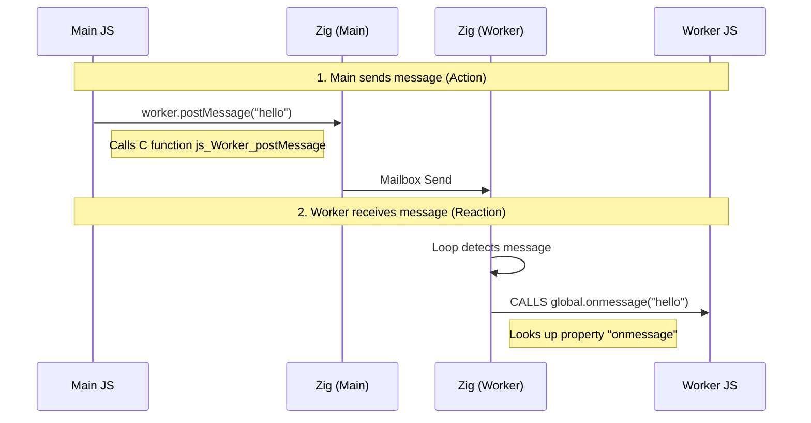
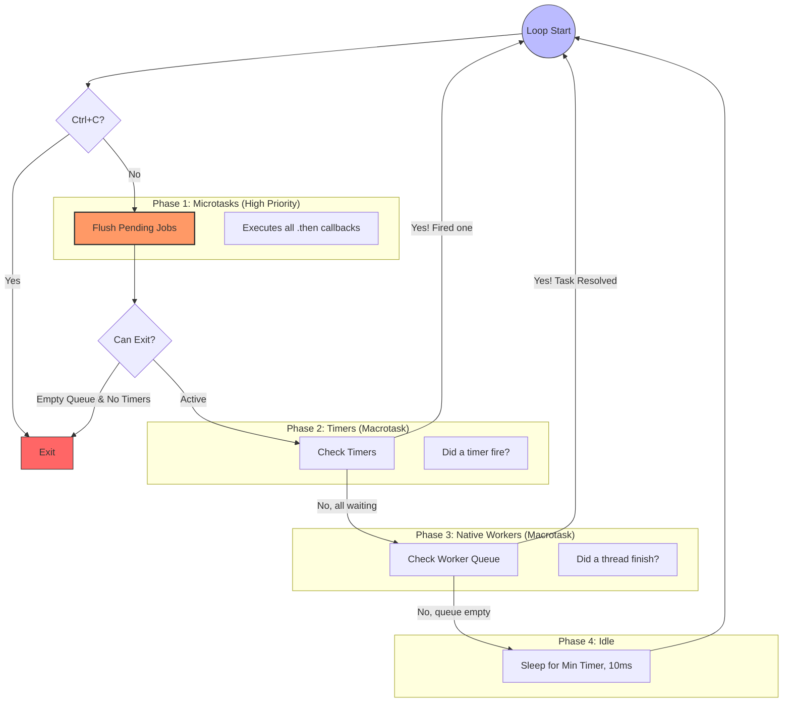

# zexplorer: Scriptable Headless Browser


HTML parser & JavaScript execution at native speed on a server

## WIP

A project to run a JavaScript runtime extended with (some)  DOM APIs.

Based on [lexbor](https://lexbor.com/) and [quickJS-ng](https://quickjs-ng.github.io/quickjs/).

This library can be used for:

- ➡ One-shot usage (examples in `main.zig`)
- ➡ long-running with event-loop/async

## Tests

### zeplorer vs JSDON first benchmark

<details><summary>Process this HTML file</summary>

```html
<!DOCTYPE html>
<html>
  <body>
    <div id="root"></div>
    <script>
      const nb = 10_000;
      const root = document.getElementById("root");
      for (let i = 0; i < nb; i++) {
        const span = document.createElement("span");
        span.textContent = "Item " + i;
        root.appendChild(span);
      }
      const all = document.querySelectorAll("span");
      let total = 0;
      for (let i = 0; i < all.length; i++) {
        total += all[i].textContent.length;
      }
      console.log("Total chars: " + total);
    </script>
  </body>
</html>
```
</details>


<details><summary>The `jsdom` runner script:</summary>

```js
console.time("Total");
const jsdom = require("jsdom");
const { JSDOM } = jsdom;
const fs = require("fs");

const html = fs.readFileSync("bench.html", "utf8");
const dom = new JSDOM(html, { runScripts: "dangerously" });
console.timeEnd("Total");
```

</details>

<details><summary>Zexplorer script:</summary>

```zig
fn bench(allocator: std.mem.Allocator) !void {
    var engine = try ScriptEngine.init(allocator);
    defer engine.deinit();

    const start = std.time.nanoTimestamp();

    const html = @embedFile("bench.html")
    try engine.loadHTML(html);

    const scripts = try engine.getScripts();
    defer allocator.free(scripts);

    for (scripts) |code| {
        // TODO: integrate the sentinel conversion in `getScripts()`
        const c_code = try allocator.dupeZ(u8, code);
        defer allocator.free(c_code);
        const val = engine.eval(c_code, "bench_script") catch |err| {
            std.debug.print("Script Error: {}\n", .{err});
            continue;
        };
        engine.ctx.freeValue(val);
    }

    const end = std.time.nanoTimestamp();
    const ms = @divFloor(end - start, 1_000_000);
    std.debug.print("⚡️ Zig Engine Time: {d}ms\n", .{ms});
}
```

</details>

**Results**


| #rows     | Zexplorer | jsdom  |
| --------- | --------- | ------ |
| 100       | 0.13ms    | 241ms  |
| 1_000     | 0.7ms     | 251ms  |
| 10_000    | 52ms      | 331ms  |
| 20_000    | 115ms     | 421ms  |
| 50_000    | 279ms     | 662ms  |
| 100_000   | 633ms     | 1062ms |
| 500_000   | 4323ms    | 4213ms |
| 1_000_000 | 15165ms   | 9216ms |

---

### zexplorer running (vanilla)-js-framework-1 benchmark Class

Source: <https://github.com/krausest/js-framework-benchmark/tree/master>

<details><summary>index1.html</summary>

```html
<!doctype html>
<html lang="en">
  <head>
    <meta charset="utf-8" />
    <title>VanillaJS</title>
    <link href="/css/currentStyle.css" rel="stylesheet" />
  </head>
  <body>
    <div id="main">
      <div class="container">
        <div class="jumbotron">
          <div class="row">
            <div class="col-md-6">
              <h1>VanillaJS</h1>
            </div>
            <div class="col-md-6">
              <div class="row">
                <div class="col-sm-6 smallpad">
                  <button
                    type="button"
                    class="btn btn-primary btn-block"
                    id="run"
                  >
                    Create 1,000 rows
                  </button>
                </div>
                <div class="col-sm-6 smallpad">
                  <button
                    type="button"
                    class="btn btn-primary btn-block"
                    id="runlots"
                  >
                    Create 10,000 rows
                  </button>
                </div>
                <div class="col-sm-6 smallpad">
                  <button
                    type="button"
                    class="btn btn-primary btn-block"
                    id="add"
                  >
                    Append 1,000 rows
                  </button>
                </div>
                <div class="col-sm-6 smallpad">
                  <button
                    type="button"
                    class="btn btn-primary btn-block"
                    id="update"
                  >
                    Update every 10th row
                  </button>
                </div>
                <div class="col-sm-6 smallpad">
                  <button
                    type="button"
                    class="btn btn-primary btn-block"
                    id="clear"
                  >
                    Clear
                  </button>
                </div>
                <div class="col-sm-6 smallpad">
                  <button
                    type="button"
                    class="btn btn-primary btn-block"
                    id="swaprows"
                  >
                    Swap Rows
                  </button>
                </div>
              </div>
            </div>
          </div>
        </div>
        <table class="table table-hover table-striped test-data">
          <tbody id="tbody"></tbody>
        </table>
        <span
          class="preloadicon glyphicon glyphicon-remove"
          aria-hidden="true"
        ></span>
      </div>
    </div>
    <script src="src/Main.js"></script>
  </body>
</html>
```

</details>

<details><summary>JS benchmark-1.js Class version</summary>

 ```js
 function _random(max) {
  return Math.round(Math.random() * 1000) % max;
}

const rowTemplate = document.createElement("tr");
rowTemplate.innerHTML =
  "<td class='col-md-1'></td><td class='col-md-4'><a class='lbl'></a></td><td class='col-md-1'><a class='remove'><span class='remove glyphicon glyphicon-remove' aria-hidden='true'></span></a></td><td class='col-md-6'></td>";

class Store {
  constructor() {
    this.data = [];
    this.backup = null;
    this.selected = null;
    this.id = 1;
  }
  buildData(count = 1000) {
    var adjectives = [
      "pretty",
      "large",
      "big",
      "small",
      "tall",
      "short",
      "long",
      "handsome",
      "plain",
      "quaint",
      "clean",
      "elegant",
      "easy",
      "angry",
      "crazy",
      "helpful",
      "mushy",
      "odd",
      "unsightly",
      "adorable",
      "important",
      "inexpensive",
      "cheap",
      "expensive",
      "fancy",
    ];
    var colours = [
      "red",
      "yellow",
      "blue",
      "green",
      "pink",
      "brown",
      "purple",
      "brown",
      "white",
      "black",
      "orange",
    ];
    var nouns = [
      "table",
      "chair",
      "house",
      "bbq",
      "desk",
      "car",
      "pony",
      "cookie",
      "sandwich",
      "burger",
      "pizza",
      "mouse",
      "keyboard",
    ];
    var data = [];
    for (var i = 0; i < count; i++)
      data.push({
        id: this.id++,
        label:
          adjectives[_random(adjectives.length)] +
          " " +
          colours[_random(colours.length)] +
          " " +
          nouns[_random(nouns.length)],
      });
    return data;
  }
  updateData(mod = 10) {
    for (let i = 0; i < this.data.length; i += 10) {
      this.data[i].label += " !!!";
      // this.data[i] = Object.assign({}, this.data[i], {label: this.data[i].label +' !!!'});
    }
  }
  delete(id) {
    const idx = this.data.findIndex((d) => d.id == id);
    this.data = this.data.filter((e, i) => i != idx);
    return this;
  }
  run() {
    console.log("running");
    this.data = this.buildData();
    this.selected = null;
  }
  add() {
    this.data = this.data.concat(this.buildData(1000));
    this.selected = null;
  }
  update() {
    this.updateData();
    this.selected = null;
  }
  select(id) {
    this.selected = id;
  }
  hideAll() {
    this.backup = this.data;
    this.data = [];
    this.selected = null;
  }
  showAll() {
    this.data = this.backup;
    this.backup = null;
    this.selected = null;
  }
  runLots() {
    this.data = this.buildData(10000);
    this.selected = null;
  }
  clear() {
    this.data = [];
    this.selected = null;
  }
  swapRows() {
    if (this.data.length > 998) {
      var a = this.data[1];
      this.data[1] = this.data[998];
      this.data[998] = a;
    }
  }
}

var getParentId = function (elem) {
  while (elem) {
    if (elem.tagName === "TR") {
      return elem.data_id;
    }
    elem = elem.parentNode;
  }
  return undefined;
};
class Main {
  constructor(props) {
    this.store = new Store();
    this.select = this.select.bind(this);
    this.delete = this.delete.bind(this);
    this.add = this.add.bind(this);
    this.run = this.run.bind(this);
    this.update = this.update.bind(this);
    this.start = 0;
    this.rows = [];
    this.data = [];
    this.selectedRow = undefined;

    console.log("Main started");
    document.getElementById("main").addEventListener("click", (e) => {
      console.log("listener", e.type, e.target.tagName);
      if (e.target.matches("#add")) {
        e.preventDefault();
        console.log("add");
        this.add();
      } else if (e.target.matches("#run")) {
        e.preventDefault();
        console.log("run");
        this.run();
      } else if (e.target.matches("#update")) {
        e.preventDefault();
        console.log("update");
        this.update();
      } else if (e.target.matches("#hideall")) {
        e.preventDefault();
        console.log("hideAll");
        this.hideAll();
      } else if (e.target.matches("#showall")) {
        e.preventDefault();
        console.log("showAll");
        this.showAll();
      } else if (e.target.matches("#runlots")) {
        e.preventDefault();
        console.log("runLots");
        this.runLots();
      } else if (e.target.matches("#clear")) {
        e.preventDefault();
        console.log("clear");
        this.clear();
      } else if (e.target.matches("#swaprows")) {
        e.preventDefault();
        console.log("swapRows");
        this.swapRows();
      } else if (e.target.matches(".remove")) {
        e.preventDefault();
        let id = getParentId(e.target);
        let idx = this.findIdx(id);
        console.log("delete", idx);
        this.delete(idx);
      } else if (e.target.matches(".lbl")) {
        e.preventDefault();
        let id = getParentId(e.target);
        let idx = this.findIdx(id);
        console.log("select", idx);
        this.select(idx);
      }
    });
    this.tbody = document.getElementById("tbody");
  }
  findIdx(id) {
    for (let i = 0; i < this.data.length; i++) {
      if (this.data[i].id === id) return i;
    }
    return undefined;
  }
  run() {
    this.store.run();
    this.updateRows();
    this.appendRows();
    this.unselect();
  }
  add() {
    this.store.add();
    this.appendRows();
  }
  update() {
    this.store.update();
    // this.updateRows();
    for (let i = 0; i < this.data.length; i += 10) {
      this.rows[i].childNodes[1].childNodes[0].innerText =
        this.store.data[i].label;
    }
  }
  unselect() {
    if (this.selectedRow !== undefined) {
      this.selectedRow.className = "";
      this.selectedRow = undefined;
    }
  }
  select(idx) {
    this.unselect();
    this.store.select(this.data[idx].id);
    this.selectedRow = this.rows[idx];
    this.selectedRow.className = "danger";
  }
  delete(idx) {
    // Remove that row from the DOM
    // this.store.delete(this.data[idx].id);
    // this.rows[idx].remove();
    // this.rows.splice(idx, 1);
    // this.data.splice(idx, 1);

    // Faster, shift all rows below the row that should be deleted rows one up and drop the last row
    for (let i = this.rows.length - 2; i >= idx; i--) {
      let tr = this.rows[i];
      let data = this.store.data[i + 1];
      tr.data_id = data.id;
      tr.childNodes[0].innerText = data.id;
      tr.childNodes[1].childNodes[0].innerText = data.label;
      this.data[i] = this.store.data[i];
    }
    this.store.delete(this.data[idx].id);
    this.data.splice(idx, 1);
    this.rows.pop().remove();
  }
  updateRows() {
    for (let i = 0; i < this.rows.length; i++) {
      if (this.data[i] !== this.store.data[i]) {
        let tr = this.rows[i];
        let data = this.store.data[i];
        tr.data_id = data.id;
        tr.childNodes[0].innerText = data.id;
        tr.childNodes[1].childNodes[0].innerText = data.label;
        this.data[i] = this.store.data[i];
      }
    }
  }
  removeAllRows() {
    // ~258 msecs
    // for(let i=this.rows.length-1;i>=0;i--) {
    //     tbody.removeChild(this.rows[i]);
    // }
    // ~251 msecs
    // for(let i=0;i<this.rows.length;i++) {
    //     tbody.removeChild(this.rows[i]);
    // }
    // ~216 msecs
    // var cNode = tbody.cloneNode(false);
    // tbody.parentNode.replaceChild(cNode ,tbody);
    // ~212 msecs
    this.tbody.textContent = "";

    // ~236 msecs
    // var rangeObj = new Range();
    // rangeObj.selectNodeContents(tbody);
    // rangeObj.deleteContents();
    // ~260 msecs
    // var last;
    // while (last = tbody.lastChild) tbody.removeChild(last);
  }
  runLots() {
    this.store.runLots();
    this.updateRows();
    this.appendRows();
    this.unselect();
  }
  clear() {
    this.store.clear();
    this.rows = [];
    this.data = [];
    // 165 to 175 msecs, but feels like cheating
    // requestAnimationFrame(() => {
    this.removeAllRows();
    this.unselect();
    // });
  }
  swapRows() {
    let old_selection = this.store.selected;
    this.store.swapRows();
    this.updateRows();
    this.unselect();
    if (old_selection >= 0) {
      let idx = this.store.data.findIndex((d) => d.id === old_selection);
      if (idx > 0) {
        this.store.select(this.data[idx].id);
        this.selectedRow = this.rows[idx];
        this.selectedRow.className = "danger";
      }
    }
  }
  appendRows() {
    // Using a document fragment is slower...
    // var docfrag = document.createDocumentFragment();
    // for(let i=this.rows.length;i<this.store.data.length; i++) {
    //     let tr = this.createRow(this.store.data[i]);
    //     this.rows[i] = tr;
    //     this.data[i] = this.store.data[i];
    //     docfrag.appendChild(tr);
    // }
    // this.tbody.appendChild(docfrag);

    // ... than adding directly
    var rows = this.rows,
      s_data = this.store.data,
      data = this.data,
      tbody = this.tbody;
    for (let i = rows.length; i < s_data.length; i++) {
      let tr = this.createRow(s_data[i]);
      rows[i] = tr;
      data[i] = s_data[i];
      tbody.appendChild(tr);
    }
  }
  createRow(data) {
    const tr = rowTemplate.cloneNode(true),
      td1 = tr.firstChild,
      a2 = td1.nextSibling.firstChild;
    tr.data_id = data.id;
    td1.textContent = data.id;
    a2.textContent = data.label;
    return tr;
  }
}

new Main();

```

</details>

<details><summary>JS code runner interpretated by Zexplorer:</summary>

```js
// driver.js - The "Click Generator"

function click(id) {
  const el = document.getElementById(id);
  console.log("Cicked :", el.id);
  if (!el) {
    console.error("❌ Element not found: #" + id);
    return;
  }
  // We use our custom dispatchEvent.
  // In standard JS this would be el.click() or el.dispatchEvent(new Event('click'))
  el.dispatchEvent("click");
}

function measure(name, actionId) {
  const start = Date.now();
  click(actionId);
  // In a real browser, we'd wait for layout repaint here.
  // In Zexplorer, execution is synchronous, so we are done immediately!
  const end = Date.now();
  console.log(`[${name}] took ${end - start} ms`);
}

console.log("🚀 Starting Benchmark...");

// 1. Create 1,000 Rows
measure("Create 1k", "run");

// 2. Clear
measure("Clear", "clear");

// 3. Create 10,000 Rows (The stress test)
measure("Create 10k", "runlots");

// 4. Append 1,000 Rows
measure("Append 1k", "add");

// 5. Update every 10th row
measure("Update", "update");

// 6. Swap Rows
measure("Swap", "swaprows");

// 7. Verify Data (Sanity Check)
const rows = document.querySelectorAll("tr");
console.log(`✅ Final Row Count: ${rows.length}`);
```

</details>

<details><summary>Zexplorer code to run this:</summary>

```zig
fn js_framework_bench(allocator: std.mem.Allocator) !void {
    var engine = try ScriptEngine.init(allocator);
    defer engine.deinit();

    const start = std.time.nanoTimestamp();
    const html_file = try std.fs.cwd().openFile("js/js-fram/index.html", .{});
    defer html_file.close();
    const html = try html_file.readToEndAlloc(allocator, 1024 * 10);
    defer allocator.free(html);

    try engine.loadHTML(html);
    const code_file = try std.fs.cwd().openFile("js/js-fram/js-benchmark.js", .{});
    defer code_file.close();
    const code = try code_file.readToEndAlloc(allocator, 1024 * 10);
    defer allocator.free(code);

    const c_code = try allocator.dupeZ(u8, code);
    defer allocator.free(c_code);
    const val = try engine.eval(c_code, "bench_script");
    engine.ctx.freeValue(val);

    const driver_file = try std.fs.cwd().openFile("js/js-fram/driver.js", .{});
    defer driver_file.close();
    const driver_js = try driver_file.readToEndAlloc(allocator, 1024 * 10);
    defer allocator.free(driver_js);

    // const driver_js = @embedFile("../js/js-fram/driver.js"); // The click script <-- needs to be in "/src" to work
    const driver_c_code = try allocator.dupeZ(u8, driver_js);
    defer allocator.free(driver_c_code);
    const driver = try engine.eval(driver_c_code, "driver.js");
    engine.ctx.freeValue(driver);

    const end = std.time.nanoTimestamp();
    const ms = @divFloor(end - start, 1_000);
    std.debug.print("\n⚡️ Zig Engine Time: {d}ns\n", .{ms});
}
```

</details>

**Results**

| Operation  | zexplorer | jsdom  |
| ---------- | --------- | ------ |
| Create 1k  | 3 ms      | 70 ms  |
| Clear      | 1 ms      | 11 ms  |
| Create 10k | 35 ms     | 557 ms |
| Append 1k  | 3 ms      | 44     |
| Update     | 6 ms      | 10 ms  |
| Swap rows  | 0 ms      | 1 ms   |

---

### zexplorer running (vanilla)-js-framework-2 benchmark Templates

<details><summary>index2.html with templates</summary>

```html
<!doctype html>
<html>
  <head>
    <title>Benchmarks for Vanillajs-3</title>
    <link href="/css/currentStyle.css" rel="stylesheet" />
  </head>
  <body>
    <div id="main">
      <div class="container">
        <div class="jumbotron">
          <div class="row">
            <div class="col-md-6">
              <h1>Vanillajs-3-"keyed"</h1>
            </div>
            <div class="col-md-6">
              <div class="row" id="app-actions">
                <div class="col-sm-6 smallpad">
                  <button
                    type="button"
                    class="btn btn-primary btn-block"
                    id="run"
                  >
                    Create 1,000 rows
                  </button>
                </div>
                <div class="col-sm-6 smallpad">
                  <button
                    type="button"
                    class="btn btn-primary btn-block"
                    id="runlots"
                  >
                    Create 10,000 rows
                  </button>
                </div>
                <div class="col-sm-6 smallpad">
                  <button
                    type="button"
                    class="btn btn-primary btn-block"
                    id="add"
                  >
                    Append 1,000 rows
                  </button>
                </div>
                <div class="col-sm-6 smallpad">
                  <button
                    type="button"
                    class="btn btn-primary btn-block"
                    id="update"
                  >
                    Update every 10th row
                  </button>
                </div>
                <div class="col-sm-6 smallpad">
                  <button
                    type="button"
                    class="btn btn-primary btn-block"
                    id="clear"
                  >
                    Clear
                  </button>
                </div>
                <div class="col-sm-6 smallpad">
                  <button
                    type="button"
                    class="btn btn-primary btn-block"
                    id="swaprows"
                  >
                    Swap Rows
                  </button>
                </div>
              </div>
            </div>
          </div>
        </div>
        <table class="table table-hover table-striped test-data">
          <tbody id="tbody"></tbody>
        </table>
        <span
          class="preloadicon glyphicon glyphicon-remove"
          aria-hidden="true"
        ></span>
      </div>
    </div>
    <template
      ><tr>
        <td class="col-md-1">{id}</td>
        <td class="col-md-4"><a class="lbl">{lbl}</a></td>
        <td class="col-md-1">
          <a class="remove"
            ><span
              class="remove glyphicon glyphicon-remove"
              aria-hidden="true"
            ></span
          ></a>
        </td>
        <td class="col-md-6"></td></tr
    ></template>
    <script src="src/Main.js"></script>
  </body>
</html>
```

</details>

<details><summary>JS-bench executor</summary>

```js
"use strict";
const adjectives = [
  "pretty",
  "large",
  "big",
  "small",
  "tall",
  "short",
  "long",
  "handsome",
  "plain",
  "quaint",
  "clean",
  "elegant",
  "easy",
  "angry",
  "crazy",
  "helpful",
  "mushy",
  "odd",
  "unsightly",
  "adorable",
  "important",
  "inexpensive",
  "cheap",
  "expensive",
  "fancy",
];
const colours = [
  "red",
  "yellow",
  "blue",
  "green",
  "pink",
  "brown",
  "purple",
  "brown",
  "white",
  "black",
  "orange",
];
const nouns = [
  "table",
  "chair",
  "house",
  "bbq",
  "desk",
  "car",
  "pony",
  "cookie",
  "sandwich",
  "burger",
  "pizza",
  "mouse",
  "keyboard",
];

const tbody = document.querySelector("tbody"),
  l1 = adjectives.length,
  l2 = colours.length,
  l3 = nouns.length;
let index = 1,
  op = null,
  c1 = null,
  c2 = null,
  c998 = null,
  data = [],
  selected = null;

const app = {
  run(n = 1000) {
    if (data.length > 0) app.clear();
    app.add(n);
  },
  runlots() {
    app.run(10000);
  },
  add(n = 1000) {
    const templ = document.querySelector("template");
    const item = templ.content.firstElementChild;
    const id = item.firstElementChild.firstChild;
    const lbl = item.querySelector("a").firstChild;
    for (let i = 0; i < n; i++) {
      id.nodeValue = index++;
      data.push(
        (lbl.nodeValue = `${adjectives[Math.round(Math.random() * 1000) % l1]} ${colours[Math.round(Math.random() * 1000) % l2]} ${nouns[Math.round(Math.random() * 1000) % l3]}`),
      );
      tbody.appendChild(item.cloneNode(true));
    }
  },
  update() {
    for (let i = 0, item; i < data.length; i += 10) {
      if (op === "update" && item?.hasOwnProperty("next")) item = item.next;
      else if (item) {
        item.next = tbody.childNodes[i];
        item = item.next;
      } else item = tbody.childNodes[i];
      if (!item.hasOwnProperty("el"))
        item.el = item.querySelector("a").firstChild;
      item.el.nodeValue = data[i] += " !!!";
    }
  },
  clear() {
    tbody.textContent = "";
    data = [];
  },
  swaprows() {
    if (data.length < 999) return;
    const d1 = data[1];
    data[1] = data[998];
    data[998] = d1;
    if (op === "swaprows") {
      const temp = c1;
      c1 = c998;
      c998 = temp;
    } else {
      c1 = tbody.children[1];
      c2 = c1.nextElementSibling;
      c998 = tbody.children[998];
    }
    tbody.insertBefore(c1, c998);
    tbody.insertBefore(c998, c2);
  },
};

tbody.addEventListener(new Event("click"), (e) => {
  e.stopPropagation();
  e.preventDefault();
  op = "null";
  if (e.target.tagName === "A") {
    const element = e.target.parentNode.parentNode;
    if (selected) selected.className = "";
    selected = element === selected ? null : element;
    if (selected) selected.className = "danger";
  } else if (e.target.tagName === "SPAN") {
    const element = e.target.parentNode.parentNode.parentNode;
    const index = Array.prototype.indexOf.call(tbody.children, element);
    element.remove();
    data.splice(index, 1);
  }
});
document.querySelector("#app-actions").addEventListener("click", (e) => {
  e.stopPropagation();
  e.preventDefault();
  app[e.target.id]();
  op = e.target.id;
});

```

</details>

<details><summary>node runner.js</summary>

```js
const fs = require("fs");
const jsdom = require("jsdom");
const { JSDOM } = jsdom;

// 1. Load the files
const html = fs.readFileSync("index.html", "utf8");
const appCode = fs.readFileSync("js-vanilla-bench.js", "utf8");
const driverCode = fs.readFileSync("driver.js", "utf8");

// 2. Configure Virtual Console (to see console.log output)
const virtualConsole = new jsdom.VirtualConsole();
virtualConsole.forwardTo(console);

// 3. Initialize JSDOM
// We use 'runScripts: "dangerously"' to allow executing JS.
const dom = new JSDOM(html, {
  runScripts: "dangerously",
  resources: "usable",
  virtualConsole,
});

const { window } = dom;

// 4. Polyfill global environment (optional but good for some libs)
// JSDOM isolates variables, but the benchmark might rely on global behavior
global.window = window;
global.document = window.document;

console.log("--- Starting JSDOM Benchmark ---");

try {
  // 5. Run the Application Code (Setup event listeners)
  window.eval(appCode);

  // 6. Run the Driver (Perform clicks and measurements)
  window.eval(driverCode);
} catch (e) {
  console.error("Benchmark failed:", e);
}

```

</details>

<details><sumamry>Zig runner</sumamry>

```zig
fn js_framework_2_bench(allocator: std.mem.Allocator) !void {
    var engine = try ScriptEngine.init(allocator);
    defer engine.deinit();

    const start = std.time.nanoTimestamp();

    const html_file = try std.fs.cwd().openFile("js/js-fram-2/index.html", .{});
    defer html_file.close();
    const html = try html_file.readToEndAlloc(allocator, 1024 * 10);
    defer allocator.free(html);

    try engine.loadHTML(html);
    const code_file = try std.fs.cwd().openFile("js/js-fram-2/js-vanilla-bench.js", .{});
    defer code_file.close();
    const code = try code_file.readToEndAlloc(allocator, 1024 * 10);
    defer allocator.free(code);

    const c_code = try allocator.dupeZ(u8, code);
    defer allocator.free(c_code);
    const val = try engine.eval(c_code, "bench_script");
    engine.ctx.freeValue(val);

    const driver_file = try std.fs.cwd().openFile("js/js-fram-2/driver.js", .{});
    defer driver_file.close();
    const driver_js = try driver_file.readToEndAlloc(allocator, 1024 * 10);
    defer allocator.free(driver_js);

    // const driver_js = @embedFile("../js/js-fram/driver.js");
    // The click script <-- needs to be in "/src" to work

    const driver_c_code = try allocator.dupeZ(u8, driver_js);
    defer allocator.free(driver_c_code);
    const driver = try engine.eval(driver_c_code, "driver.js");
    engine.ctx.freeValue(driver);

    const end = std.time.nanoTimestamp();
    const ns = @divFloor(end - start, 1_000_000);

    std.debug.print("\n⚡️ Zig Engine Time: {d}ms\n", .{ns});
}
```

</details>

**Results**


| Operation        | zexplorer | jsdom   | Chrome (Approx) |
| ---------------- | --------- | ------- | --------------- |
| Create 1k        | 1 ms      | 81 ms   | ~22 ms          |
| Replace 1k       | 3 ms      | 86 ms   | ~24 ms          |
| Partial Update   | 2 ms      | 19 ms   | ~9 ms           |
| Select Row       | 0 ms      | 4458 ms | ~2 ms           |
| Swap Rows        | 0 ms      | 1 ms    | ~12 ms          |
| Remove Row       | 0 ms      | 45 ms   | ~9 ms           |
| Create 10k       | 19 ms     | 3157 ms | ~229 ms         |
| Append 1k to 10k | 7 ms      | 705 ms  | ~26 ms          |
| Clear            | 7 ms      | 2975 ms | ~9 ms           |
| Final count      | 0         | 0       | 0               |

---

### zexplorer running (vanilla)-js-framework-3 benchmark EventListener

<details><summary>index3.html with EventListener</summary>

```html
<!doctype html>
<html>
  <head>
    <title>Benchmarks for Vanillajs-3</title>
    <link href="/css/currentStyle.css" rel="stylesheet" />
  </head>
  <body>
    <div id="main">
      <div class="container">
        <div class="jumbotron">
          <div class="row">
            <div class="col-md-6">
              <h1>Vanillajs-3-"keyed"</h1>
            </div>
            <div class="col-md-6">
              <div class="row" id="app-actions">
                <div class="col-sm-6 smallpad">
                  <button
                    type="button"
                    class="btn btn-primary btn-block"
                    id="run"
                  >
                    Create 1,000 rows
                  </button>
                </div>
                <div class="col-sm-6 smallpad">
                  <button
                    type="button"
                    class="btn btn-primary btn-block"
                    id="runlots"
                  >
                    Create 10,000 rows
                  </button>
                </div>
                <div class="col-sm-6 smallpad">
                  <button
                    type="button"
                    class="btn btn-primary btn-block"
                    id="add"
                  >
                    Append 1,000 rows
                  </button>
                </div>
                <div class="col-sm-6 smallpad">
                  <button
                    type="button"
                    class="btn btn-primary btn-block"
                    id="update"
                  >
                    Update every 10th row
                  </button>
                </div>
                <div class="col-sm-6 smallpad">
                  <button
                    type="button"
                    class="btn btn-primary btn-block"
                    id="clear"
                  >
                    Clear
                  </button>
                </div>
                <div class="col-sm-6 smallpad">
                  <button
                    type="button"
                    class="btn btn-primary btn-block"
                    id="swaprows"
                  >
                    Swap Rows
                  </button>
                </div>
              </div>
            </div>
          </div>
        </div>
        <table class="table table-hover table-striped test-data">
          <tbody id="tbody"></tbody>
        </table>
        <span
          class="preloadicon glyphicon glyphicon-remove"
          aria-hidden="true"
        ></span>
      </div>
    </div>
    <template
      ><tr>
        <td class="col-md-1">{id}</td>
        <td class="col-md-4"><a class="lbl">{lbl}</a></td>
        <td class="col-md-1">
          <a class="remove"
            ><span
              class="remove glyphicon glyphicon-remove"
              aria-hidden="true"
            ></span
          ></a>
        </td>
        <td class="col-md-6"></td></tr
    ></template>
    <script src="src/Main.js"></script>
  </body>
</html>

```

</details>

<details><summary>JS-bench executor</summary>

```js
"use strict";
const adjectives = [
  "pretty",
  "large",
  "big",
  "small",
  "tall",
  "short",
  "long",
  "handsome",
  "plain",
  "quaint",
  "clean",
  "elegant",
  "easy",
  "angry",
  "crazy",
  "helpful",
  "mushy",
  "odd",
  "unsightly",
  "adorable",
  "important",
  "inexpensive",
  "cheap",
  "expensive",
  "fancy",
];
const colours = [
  "red",
  "yellow",
  "blue",
  "green",
  "pink",
  "brown",
  "purple",
  "brown",
  "white",
  "black",
  "orange",
];
const nouns = [
  "table",
  "chair",
  "house",
  "bbq",
  "desk",
  "car",
  "pony",
  "cookie",
  "sandwich",
  "burger",
  "pizza",
  "mouse",
  "keyboard",
];

const tbody = document.querySelector("tbody"),
  l1 = adjectives.length,
  l2 = colours.length,
  l3 = nouns.length;
let index = 1,
  op = null,
  c1 = null,
  c2 = null,
  c998 = null,
  data = [],
  selected = null;

const app = {
  run(n = 1000) {
    if (data.length) app.clear();
    app.add(n);
  },
  runlots() {
    app.run(10000);
  },
  add(n = 1000) {
    const item = document.querySelector("template").content.firstElementChild;
    const id = item.firstElementChild.firstChild,
      lbl = item.querySelector("a").firstChild;
    for (let i = 0; i < n; i++) {
      id.nodeValue = index++;
      data.push(
        (lbl.nodeValue = `${adjectives[Math.round(Math.random() * 1000) % l1]} ${colours[Math.round(Math.random() * 1000) % l2]} ${nouns[Math.round(Math.random() * 1000) % l3]}`),
      );
      tbody.appendChild(item.cloneNode(true));
    }
  },
  update() {
    for (let i = 0, item; i < data.length; i += 10) {
      if (op === "update" && item?.hasOwnProperty("next")) item = item.next;
      else if (item) {
        item.next = tbody.childNodes[i];
        item = item.next;
      } else item = tbody.childNodes[i];
      if (!item.hasOwnProperty("el"))
        item.el = item.querySelector("a").firstChild;
      item.el.nodeValue = data[i] += " !!!";
    }
  },
  clear() {
    tbody.textContent = "";
    data = [];
  },
  swaprows() {
    if (data.length < 999) return;
    const d1 = data[1];
    data[1] = data[998];
    data[998] = d1;
    if (op === "swaprows") {
      const temp = c1;
      c1 = c998;
      c998 = temp;
    } else {
      c1 = tbody.children[1];
      c2 = c1.nextElementSibling;
      c998 = tbody.children[998];
    }
    tbody.insertBefore(c1, c998);
    tbody.insertBefore(c998, c2);
  },
};

// tbody.onclick = (e) => {
tbody.addEventListener("click", (e) => {
  // e.stopPropagation();
  e.preventDefault();
  op = "null";
  if (e.target.tagName === "A") {
    const element = e.target.parentNode.parentNode;
    if (selected) selected.className = "";
    selected = element === selected ? null : element;
    if (selected) selected.className = "danger";
  } else if (e.target.tagName === "SPAN") {
    const element = e.target.parentNode.parentNode.parentNode;
    const index = Array.prototype.indexOf.call(tbody.children, element);
    element.remove();
    data.splice(index, 1);
  }
});
// document.querySelector("#app-actions").onclick = (e) => {
document.querySelector("#app-actions").addEventListener("click", (e) => {
  // e.stopPropagation();
  e.preventDefault();
  app[e.target.id]();
  op = e.target.id;
});

```

</details>

<details><summary>node runner.js</summary>

```js
const fs = require("fs");
const { JSDOM, VirtualConsole } = require("jsdom");
const { performance } = require("perf_hooks");

// 1. Load your artifacts
const html = fs.readFileSync("index.html", "utf8");
const appCode = fs.readFileSync("js-vanilla-bench.js", "utf8");

// 2. Setup Virtual Console (to see logs)
const virtualConsole = new VirtualConsole();
virtualConsole.forwardTo(console);

// 3. Initialize JSDOM
const dom = new JSDOM(html, {
  runScripts: "dangerously",
  resources: "usable",
  virtualConsole,
});

const { window } = dom;
const { document } = window;

// 4. Global Polyfills (Crucial for some frameworks/benchmarks)
global.window = window;
global.document = document;
global.Node = window.Node;
global.HTMLElement = window.HTMLElement;
global.Event = window.Event;
global.MouseEvent = window.MouseEvent;

console.log("\n--- 🐢 Starting JSDOM Benchmark (Standard API) ---\n");

try {
  // 5. Load the Application Code
  // This registers the addEventListener('click') on body/app-actions
  window.eval(appCode);

  // 6. Define the Driver Helper (JSDOM Version)
  // We can't use your 'driver.js' directly because JSDOM needs 'new MouseEvent'
  const click = (selector) => {
    const el = document.querySelector(selector);
    if (!el) {
      console.log(`❌ Not found: ${selector}`);
      return;
    }

    // JSDOM requires the formal event ceremony
    const event = new window.MouseEvent("click", {
      bubbles: true,
      cancelable: true,
      view: window,
    });
    el.dispatchEvent(event);
  };

  const measure = (name, fn) => {
    const start = performance.now();
    fn();
    const end = performance.now();
    console.log(`[${name}] ${(end - start).toFixed(2)} ms`);
  };

  // 7. Run the Suite
  measure("Create 1k", () => click("#run"));
  measure("Replace 1k", () => click("#run")); // clear + add

  click("#runlots"); // Setup 10k
  measure("Partial Update (10k)", () => click("#update"));

  measure("Select Row", () => click("tbody tr:nth-child(2) a.lbl"));

  click("#run"); // Reset to 1k
  measure("Swap Rows", () => click("#swaprows"));

  measure("Remove Row", () => click("tbody tr:nth-child(2) span.remove"));

  measure("Create 10k", () => click("#runlots"));

  measure("Append 1k", () => click("#add"));

  measure("Clear", () => click("#clear"));

  const count = document.querySelectorAll("tr").length;
  console.log(`\n✅ Final Row Count: ${count}`);
} catch (e) {
  console.error("Benchmark Crashed:", e);
}

```

</details>

<details><summary>Zig runner</summary>

```zig
fn js_framework_3_bench(allocator: std.mem.Allocator) !void {
    var engine = try ScriptEngine.init(allocator);
    defer engine.deinit();

    const start = std.time.nanoTimestamp();

    const html_file = try std.fs.cwd().openFile("js/js-fram-3/index.html", .{});
    defer html_file.close();
    const html = try html_file.readToEndAlloc(allocator, 1024 * 10);
    defer allocator.free(html);

    try engine.loadHTML(html);
    const code_file = try std.fs.cwd().openFile("js/js-fram-3/js-vanilla-bench.js", .{});
    defer code_file.close();
    const code = try code_file.readToEndAlloc(allocator, 1024 * 10);
    defer allocator.free(code);

    const c_code = try allocator.dupeZ(u8, code);
    defer allocator.free(c_code);
    const val = try engine.eval(c_code, "bench_script");
    engine.ctx.freeValue(val);

    const driver_file = try std.fs.cwd().openFile("js/js-fram-3/driver.js", .{});
    defer driver_file.close();
    const driver_js = try driver_file.readToEndAlloc(allocator, 1024 * 10);
    defer allocator.free(driver_js);

    // const driver_js = @embedFile("../js/js-fram/driver.js");
    // The click script <-- needs to be in "/src" to work

    const driver_c_code = try allocator.dupeZ(u8, driver_js);
    defer allocator.free(driver_c_code);
    const driver = try engine.eval(driver_c_code, "driver.js");
    engine.ctx.freeValue(driver);

    const end = std.time.nanoTimestamp();
    const ns = @divFloor(end - start, 1_000_000);

    std.debug.print("\n⚡️ Zig Engine Time: {d}ms\n", .{ns});
}
```

</details>


**Results**

| Operation            | zexplorer | jsdom   |
| -------------------- | --------- | ------- |
| Create 1k            | 1 ms      | 78 ms   |
| Replace 1k           | 3 ms      | 81 ms   |
| Partial Update (10k) | 2 ms      | 19 ms   |
| Select row           | 0 ms      | 4438 ms |
| Swap rows            | 0 ms      | 1 ms    |
| Remove row           | 0 ms      | 52 ms   |
| Create 10k           | 20 ms     | 3212 ms |
| Append 1k            | 8 ms      | 715     |
| Clear                | 7 ms      | 3134 ms |

---

## DOM API integration
  
- Native Zig Event Loop. Thread-safe loop handling Timers (microtasks) and  Promises (MicroTasks).
- **Worker pool**: multi-threaded with message passing and library import support for CPU-intensive tasks (eg CSV parsing); inject Zig functions into JS code.
- Binary Interop: Zero-copy passing of ArrayBuffers and efficient Tuples.
- ES6 Module System: Load external, third-party libraries (es-toolkit) from disk, resolving paths, handling extensions, and executing them natively.
- `fetch` API (WIP).

**Expectations**:

- instant start, low footprint
- NO JIT Compilation: QuickJS compiles JS to bytecode. Very performant for one-shot, short-lived scripts, cold starts. Not suited for long-lived scripts, CPU intensive, loop heavy ➡ Move hot paths to `Zig` for this! (data processing, CSV parsing, batch and send to Zig...)

## Use cases

- Testing frameworks - Headless DOM for tests
- Templating & Static Site Generation - (can use template components), outputs static HTML files
- Email templates - Server-side rendering
- PDF generation - HTML → PDF pipelines
- API gateways - Transform HTML responses
- Web scrapping on steroids.
- A lightweight and fast jsdom alternative
- A native SSR engine for any JS framework
- A programmable HTML processor with full JS power
- An HTMX backend powerhouse
This is useful for web scraping, email sanitization, test engine for integrated tests, SSR post-processing of fragments.

The primitives exposed stay as close as possible to `JavaScript` semantics.

## Challenges

Plenty!

No AsyncIO, no WebSocket, no planned WASM support, no `window` support, no CSSOM.
  
## Examples

**Use Reactive DOM primitives in async JavaScript code executed by `Zig`**

```js
const btn = document.createElement("button");
const form = document.createElement("form");
form.appendChild(btn);
document.body.appendChild(form);

const mylist = document.createElement("ul");
for (let i = 1; i < 3; i++) {
  const item = document.createElement("li");
  item.setContentAsText("Item " + i * 10);
  item.setAttribute("id", i);
  mylist.appendChild(item);
}
document.body.appendChild(mylist);
console.log("[JS] Initial document", document.body.innerHTML);

// --------------------------------------------------------------------
// DOM Event Listener with Delayed action with Timer
// --------------------------------------------------------------------

form.addEventListener("submit", (e) => {
  e.preventDefault(); // Prevent actual form submission
  console.log("[JS] ⌛️ 📝 Form Submitted! Event Type:", e.type);
});

console.log("[JS] Submit the form! ⏳");
setTimeout(() => {
  form.dispatchEvent("submit");
  console.log("[JS] Final HTML: ", document.body.innerHTML);
}, 1000);

// --------------------------------------------------------------------
// Simple reactive object
// --------------------------------------------------------------------

function createReactiveObject(target, callback) {
  return new Proxy(target, {
    set(obj, prop, value) {
      const oldValue = obj[prop];
      obj[prop] = value;

      // Trigger callback on change
      if (oldValue !== value) {
        const prop_id = prop === "name" ? "#1" : prop === "age" ? "#2" : null;
        document.querySelector(prop_id).setContentAsText(value); // Normal DOM update
        callback(prop, oldValue, value);
      }

      return true;
    },

    get(obj, prop) {
      return obj[prop];
    },
  });
}

// Instantiate the data and update the DOM
const data = { name: "John", age: 30 };
document.querySelector("#1").setContentAsText(data.name);
document.querySelector("#2").setContentAsText(data.age);
console.log("[JS] Direct DOM update: ", document.body.innerHTML);

// Reactive function
const reactiveData = createReactiveObject(data, (prop, oldVal, newVal) => {
  console.log("[JS] reaction:", document.body.innerHTML);
});

// 1. First reaction via property change
reactiveData.name = "Jane";

// Second reaction trigger via Event Listener to change age
btn.addEventListener("click", (e) => {
  console.log("[JS] ⚡️ Button Clicked! Event Type:", e.type);
  reactiveData.age *= 2;
});

console.log("[JS] Click the button! ✅");
btn.dispatchEvent("click");
```

The output:

```txt
[JS] Initial document <form><button></button></form><ul><li id="1">Item 10</li><li id="2">Item 20</li></ul>

[JS] Direct DOM injection:  <form><button></button></form><ul><li id="1">John</li><li id="2">30</li></ul>

[JS] Reaction: change 'name' <form><button></button></form><ul><li id="1">Jane</li><li id="2">30</li></ul>

[JS] Click the button! ✅
[JS] ⚡️ Button Clicked! Event Type: click
[JS] Reaction: change 'age' <form><button></button></form><ul><li id="1">Jane</li><li id="2">60</li></ul>

[JS] Submit the form! ⏳
[JS] ⌛️ 📝 Form Submitted! Event Type: submit
[JS] Final HTML:  <form><button></button></form><ul><li id="1">Jane</li><li id="2">60</li></ul>

[Zig-serialized-DOM-string]
<html>
  <head>
  </head>
  <body>
    <form>
      <button>
      </button>
    </form>
    <ul>
      <li id="1">
        "Jane"
      </li>
      <li id="2">
        "60"
      </li>
    </ul>
  </body>
</html>
```

And the Zig code to run this snippet:

```zig
    const engine = try ScriptEngine.init(allocator);
    defer engine.deinit();

    const source = try std.fs.cwd().readFileAlloc(allocator, "js/dom_event_listener.js", 1024);
    defer allocator.free(source);

    const c_source = try allocator.dupeZ(u8, source);
    defer allocator.free(c_source);

    const val = try engine.evalModule(c_source, "dom_event_listener.js");

    engine.ctx.freeValue(val);

    // Run Main Loop (Handles Events)
    try engine.run();

    const body_node = z.documentRoot(engine.dom.doc);
    try z.prettyPrint(allocator, body_node.?);
```

**Import JavaScript libraries**: `es-toolkit`

Download the `es-toolikt` library:

```sh
 curl -L https://cdn.jsdelivr.net/npm/es-toolkit@1.43.0/+esm  -o es-toolkit.min.js
```

The JavaScript module _js/import_test.js_:

```js
import * as Module from "js/vendor/es-toolkit.min.js";

console.log("\n[JS] 🚀 Testing external library: es-toolkit\n");
console.log(
  "\nimport ESM module: https://cdn.jsdelivr.net/npm/es-toolkit@1.43.0/+esm \n"
);
console.log(Object.keys(Module).join(", "));
console.log("\n");

// 1. Test 'mean' function
const numbers = [10, 50, 5, 100, 2];
const m = Module.mean(numbers);
console.log(`[JS] ✅ Mean value is: ${m}\n`);

// 2. Test 'chunk' function
const list = [1, 2, 3, 4, 5, 6];
const chunks = Module.chunk(list, 2);
console.log(`[JS] ✅ Chunked array: ${JSON.stringify(chunks)}`);
// Should be [[1,2], [3,4], [5,6]]
```

The output is:

```txt
[JS] 🚀 Testing external library: es-toolkit


import ESM module: https://cdn.jsdelivr.net/npm/es-toolkit@1.43.0/+esm

AbortError, Mutex, Semaphore, TimeoutError, after, ary, ... zip, zipObject, zipWith


[JS] ✅ Mean value is: 33.4

[JS] ✅ Chunked array: [[1,2],[3,4],[5,6]]
-----------------------------------------
```

The Zig code ot run this:

```zig
fn importModule(allocator: std.mem.Allocator) !void {
    const engine = try ScriptEngine.init(allocator);
    defer engine.deinit();

    const source = std.fs.cwd().readFileAlloc(
        allocator,
        "js/import_test.js",
        1024 * 1024,
    ) catch |err| {
        z.print("Error: Could not  find 'js/import_test.js'\n", .{});
        return err;
    };

    defer allocator.free(source);

    const c_source = try allocator.dupeZ(u8, source);
    defer allocator.free(c_source);

    // 2. Evaluate as Module
    // Our loader will see 'import ... from "js/vendor/es-toolkit.min.js"'
    // and automatically load that file too.
    const val = try engine.evalModule(c_source, "import_test.js");
    defer engine.ctx.freeValue(val);

    // Imports are resolved asynchronously
    try engine.run();
}
```

**Worker**



### DOM API integration

This project exposes a significant / essential subset of all available `lexbor` functions:

- Direct parsing or parsing with a parser engine (document or fragment context-aware)
- streaming and chunk processing
- Serialization
- Sanitization
- CSS selectors search with cached CSS selectors parsing
- Support of `<template>` elements.
- Attribute search
- DOM manipulation
- DOM / HTML-string normalization with options (remove comments, whitespace, empty nodes)
- Pretty printing

### `lexbor` DOM memory management: Document Ownership and zero-copy functions

In `lexbor`, nodes belong to documents, and the document acts as the memory manager.

When a node is attached to a document (either directly or through a fragment that gets appended), the document owns it.

Every time you create a document, you need to call `destroyDocument()`: it automatically destroys ALL nodes that belong to it.

When a node is NOT attached to any document, you must manually destroy it.

Some functions borrow memory from `lexbor` for zero-copy operations: their result is consumed immediately.

We opted for the following convention: add `_zc` (for _zero_copy_) to the **non allocated** version of a function. For example, you can get the qualifiedName of an HTMLElement with the allocated version `qualifiedName(allocator, node)` or by mapping to `lexbor` memory with `qualifiedName_zc(node)`. The non-allocated must be consumed immediately whilst the allocated result can outlive the calling function.

### **The Event Loop**


---

## Install

[](http://github.com/ndrean/z-html)

```sh
zig fetch --save https://github.com/ndrean/zexplorer/archive/main.tar.gz
```

In your _build.zig_:

```zig
const zexplorer = b.dependency("zexplorer", .{
    .target = target,
    .optimize = optimize,
});

exe.root_module.addImport("zexplorer", zexplorer.module("zexplorer"));
```


## Example: Create document and parse

You have two methods available.

1. The `parseFromString()` creates a `<head>` and a `<body>` element and replaces BODY innerContent with the nodes created by the parsing of the given string.

```zig
const z = @import("zexplorer");

const doc: *HTMLDocument = try z.createDocument();
defer z.destroyDocument(doc);

try z.parseFromString(doc, "<div></div>");
const body: *DomNode = z.bodyNode(doc).?;

// you can create programmatically and append elements to a node
const p: *HTMLElement = try z.createElement(doc, "p");
z.appendChild(body, z.elementToNode(p));
```

Your document now contains this HTML:

```html
<head></head>
<body>
  <div></div>
  <p></p>
</body>
```

You have a shortcut to directly create and parse an HTML string with `createDocFromString()`.

```zig
const doc: *HTMLDocument = try z.createDocFromString("<div></div><p></p>");
defer z.destroyDocument(doc);
```

2. You have the _parser engine_:

```zig
var parser = try z.Parser.init(allocator);
defer parser.deinit();
const doc = try parser.parse("<div><p></p></div>");
defer z.destroyDocument(doc);
```


<hr>

## Example: scrap the web and explore a page

```zig
test "scrap example.com" {
  const allocator = std.testing.allocator;

  const page = try z.get(allocator, "https://example.com");
  defer allocator.free(page);

  const doc = try z.createDocFromString(page);
  defer z.destroyDocument(doc);

  const html = z.documentRoot(doc).?;
  try z.prettyPrint(allocator, html); // see image below

  var css_engine = try z.createCssEngine(allocator);
  defer css_engine.deinit();

  const a_link = try css_engine.querySelector(html, "a[href]");

  const href_value = z.getAttribute_zc(z.nodeToElement(a_link.?).?, "href").?;
  std.debug.z.print("\n{s}\n", .{href_value}); // result below

  var css_content: []const u8 = undefined;
  const style_by_css = try css_engine.querySelector(html, "style");

  if (style_by_css) |style| {
      css_content = z.textContent_zc(style);
      z.print("\n{s}\n", .{css_content}); // see below
  }

  // alternative search by DOM traverse
  const style_by_walker = z.getElementByTag(html, .style);
  if (style_by_walker) |style| {
      const css_content_walker = z.textContent_zc(z.elementToNode(style));
      std.debug.assert(std.mem.eql(u8, css_content, css_content_walker));
  }
}
```

<br>

You will get a colourful print in your terminal, where the attributes, values, html elements get coloured.

<details><summary> HTML content of example.com</summary>


</details>
<br>

You will also see the value of the `href` attribute of a the first `<a>` link:

```txt
 https://www.iana.org/domains/example
 ```

<details>
<summary>You will then see the text content of the STYLE element (no CSS parsing):</summary>

```css
body {
    background-color: #f0f0f2;
    margin: 0;
    padding: 0;
    font-family: -apple-system, system-ui, BlinkMacSystemFont, "Segoe UI", "Open Sans", "Helvetica Neue", Helvetica, Arial, sans-serif;
    
}
div {
    width: 600px;
    margin: 5em auto;
    padding: 2em;
    background-color: #fdfdff;
    border-radius: 0.5em;
    box-shadow: 2px 3px 7px 2px rgba(0,0,0,0.02);
}
a:link, a:visited {
    color: #38488f;
    text-decoration: none;
}
@media (max-width: 700px) {
    div {
        margin: 0 auto;
        width: auto;
    }
}
```

</details>

<hr>

## HTMX Server-Side Rendering with Template Interpolation

This example demonstrates high-performance server-side rendering with `HTMX` integration and template interpolation, achieving 280K+ operations per second.

The rendering is _stateless_. The state is server-side driven, maintained in a database.

There is no need for a templating langugage: using multiline strings and loops or conditionals is largely enough to build HTML strings, and faster.

<details><summary>Fake HTML page</summary>

```zig
const blog_html =
    \\<!DOCTYPE html>
    \\<html lang="en">
    \\  <head>
    \\    <meta charset="UTF-8"/>
    \\    <title>HTMX Blog - High Performance Server Rendering</title>
    \\    <meta name="viewport" content="width=device-width, initial-scale=1"/>
    \\    <script src="https://unpkg.com/htmx.org@1.9.6"></script>
    \\    <style>
    \\      .blog-post { margin: 2rem 0; padding: 1.5rem; border: 1px solid #ddd; 
}
    \\      .post-title { color: #333; font-size: 1.5rem; cursor: pointer; }
    \\      .post-title:hover { color: #0066cc; }
    \\      .post-meta { color: #666; font-size: 0.9rem; margin: 0.5rem 0; }
    \\      .post-actions { margin-top: 1rem; }
    \\      .post-actions button { margin-right: 0.5rem; padding: 0.25rem 0.5rem; 
}
    \\    </style>
    \\  </head>
    \\  <body>
    \\    <main class="content">
    \\      <article class="blog-post" data-post-id="{post_id}">
    \\        <header class="post-header">
    \\          <h2 class="post-title" hx-get="/posts/{post_id}/edit" 
hx-target="#edit-modal">
    \\            {title_template}
    \\          </h2>
    \\          <div class="post-meta">
    \\            <span class="author">{author_name}</span>
    \\            <time datetime="2024-01-01">{publish_date}</time>
    \\            <span class="views" hx-get="/posts/{post_id}/views"
hx-trigger="revealed">
    \\              {view_count} views
    \\            </span>
    \\          </div>
    \\        </header>
    \\
    \\        <div class="post-content">
    \\          <p>Welcome {user_name}! This demonstrates high-performance HTMX
server-side rendering with Zig.</p>
    \\          <p>Current user: <strong>{user_name}</strong>, Post ID:
<strong>{post_id}</strong></p>
    \\        </div>
    \\
    \\        <footer class="post-actions">
    \\          <button hx-post="/posts/{post_id}/like" hx-swap="innerHTML">
    \\            ❤️ {like_count}
    \\          </button>
    \\          <button hx-get="/posts/{post_id}/comments"
hx-target="#comments-{post_id}">
    \\            💬 {comment_count}
    \\          </button>
    \\          <button hx-delete="/posts/{post_id}" hx-confirm="Delete this
post?" hx-target="closest .blog-post">
    \\            🗑️ Delete
    \\          </button>
    \\        </footer>
    \\      </article>
    \\    </main>
    \\  </body>
    \\</html>
;
```

</details>
<br>

The code below parses the whole HTML delivered when the client connects, and starts the parser and css engine.

When the webserver receives an HTMX request, the server returns a serialized updated HTML string.

```zig
const std = @import("std");
const z = @import("zexplorer");

pub fn main() !void {
    const gpa = std.heap.c_allocator;

    // One-time setup (server startup)
    const doc = try z.createDocFromString(blog_html);
    defer z.destroyDocument(doc);

    var css_engine = try z.createCssEngine(allocator);
    defer css_engine.deinit();

    var parser = try z.Parser.init(allocator);
    defer parser.deinit();

    // 1. start the webserver: not implemented
    // 2. Simulate handling requests received by the webserver
    try requestHandler(gpa, doc, &css_engine, &parser);
}

// an example: tailored for each request
fn requestHandler(
    allocator: std.mem.Allocator,
    doc: *z.HTMLDocument,
    css_engine: *z.CssSelectorEngine,
    parser: *z.Parser,
) !void {

    // 1. Target elements with CSS selectors
    const title_elements = try css_engine.querySelectorAll(allocator, doc, ".post-title");
    defer allocator.free(title_elements);

    if (title_elements.len > 0) {
        // 2. Clone element for modification (original DOM stays pristine)
        const cloned_title = z.cloneNode(z.elementToNode(title_elements[0])).?;
        defer z.destroyNode(cloned_title);

        // 3. Template interpolation with curly brackets after reading the db or kv store
        const template = "{user_name}'s Blog Post #{post_id}: {title}";
        var content = try interpolateTemplate(allocator, template, "user_name",
"Mr Magoo");
        defer allocator.free(content);

        const post_id_str = try std.fmt.allocPrint(allocator, "{}", .{42});
        defer allocator.free(post_id_str);

        const temp = try interpolateTemplate(allocator, content, "post_id",
post_id_str);
        defer allocator.free(temp);

        const final_content = try interpolateTemplate(allocator, temp, "title",
"HTMX Performance");
        defer allocator.free(final_content);

        // 4. Update element content and HTMX attributes
        _ = try z.setInnerHTML(z.nodeToElement(cloned_title).?, final_content);

        // Interpolate HTMX attributes dynamically
        const hx_get_value = try interpolateTemplate(allocator,
"/posts/{post_id}/edit", "post_id", post_id_str);
        defer allocator.free(hx_get_value);
        _ = z.setAttribute(z.nodeToElement(cloned_title).?, "hx-get",
hx_get_value);

        // 5. Serialize modified element (ready to send to client)
        const response_html = try z.outerHTML(allocator,
z.nodeToElement(cloned_title).?);
        defer allocator.free(response_html);

        // POST back to the client
        std.debug.print("HTMX Response: {s}\n", .{response_html});
        // Output: <h2 class="post-title" hx-get="/posts/42/edit">M. Magoo's Blog
Post #42: HTMX Performance</h2>
    }
}

// Template interpolation helper - replaces {key} with values
fn interpolateTemplate(
    allocator: std.mem.Allocator, 
    template: []const u8, 
    key: []const u8, 
    value: []const u8) ![]u8 {
    const placeholder = try std.fmt.allocPrint(allocator, "{{{s}}}", .{key});
    defer allocator.free(placeholder);

    // Count occurrences for efficient pre-allocation
    var count: usize = 0;
    var pos: usize = 0;
    while (std.mem.indexOf(u8, template[pos..], placeholder)) |found| {
        count += 1;
        pos += found + placeholder.len;
    }

    if (count == 0) return try allocator.dupe(u8, template);

    // Pre-allocate and replace all occurrences
    const new_size = template.len + (value.len * count) - (placeholder.len *
count);
    var result = try std.ArrayList(u8).initCapacity(allocator, new_size);

    pos = 0;
    while (std.mem.indexOf(u8, template[pos..], placeholder)) |found| {
        const actual_pos = pos + found;
        try result.appendSlice(allocator, template[pos..actual_pos]);
        try result.appendSlice(allocator, value);
        pos = actual_pos + placeholder.len;
    }
    try result.appendSlice(allocator, template[pos..]);

    return result.toOwnedSlice(allocator);
}
```

<hr>

## Example: scan a page for potential malicious content

The intent is to highlight potential XSS threats. It works by parsing the string into a fragment. When a HTMLElement gets an unknown attribute, its colour is white and the attribute value is highlighted in RED.

Let's parse and print the following HTML string:

```html
const html_string = 
    <div>
    <!-- a comment -->
    <button disabled hidden onclick="alert('XSS')" phx-click="increment" data-invalid="bad" scope="invalid">Dangerous button</button>
    
    <a href="javascript:alert('XSS')" target="_self" role="invalid">Dangerous link</a>
    <p id="valid" class="good" aria-label="ok" style="bad" onload="bad()">Mixed attributes</p>
    <custom-elt><p>Hi there</p></custom-elt>
    <template><span>Reuse me</span></template>
    </div>
```

You parse this HTML string:

```zig
const doc = try z.createDocFromString(html_string);
defer z.destroyDocument(doc);

const body = z.bodyNode(doc).?;
try z.prettyPrint(allocator, body);
```

You get the following output in your terminal.

<br>

<br>

We can then run a _sanitization_ process against the DOM, so you get a context where the attributes are whitelisted.

```zig
try z.sanitizeNode(allocator, body, .permissive);
try z.prettyPrint(allocator, body);
```

The result is shown below.

<br>


<br>
<hr>

## Example: using the parser with sanitization option

You can create a sanitized document with the parser (a ready-to-use parsing engine).

```c
var parser = try z.Parser.init(testing.allocator);
defer parser.deinit();

const doc = try parser.parse(html, .none);
defer z.destroyDocument(doc);
```

<hr>

## Example: Processing streams

You receive chunks and build a document.

```zig
const z = @import("zexplorer");
const print = std.debug.print;

fn demoStreamParser(allocator: std.mem.Allocator) !void {

    var streamer = try z.Stream.init(allocator);
    defer streamer.deinit();

    try streamer.beginParsing();

    const streams = [_][]const u8{
        "<!DOCTYPE html><html><head><title>Large",
        " Document</title></head><body>",
        "<table id=\"producttable\">",
        "<caption>Company data</caption><thead>",
        "<tr><th scope=\"col\">",
        "Code</th><th>Product_Name</th>",
        "</tr></thead><tbody>",
    };
    for (streams) |chunk| {
        z.print("chunk:  {s}\n", .{chunk});
        try streamer.processChunk(chunk);
    }

    for (0..2) |i| {
        const li = try std.fmt.allocPrint(
            allocator,
            "<tr id={}><th >Code: {}</th><td>Name: {}</td></tr>",
            .{ i, i, i },
        );
        defer allocator.free(li);
        z.print("chunk:  {s}\n", .{li});

        try streamer.processChunk(li);
    }
    const end_chunk = "</tbody></table></body></html>";
    z.print("chunk:  {s}\n", .{end_chunk});
    try streamer.processChunk(end_chunk);
    try streamer.endParsing();

    const html_doc = streamer.getDocument();
    defer z.destroyDocument(html_doc);
    const html_node = z.documentRoot(html_doc).?;

    z.print("\n\n", .{});
    try z.prettyPrint(allocator, html_node);
    z.print("\n", .{});
    try z.printDocStruct(html_doc);
}
```

You get the output:

```txt
chunk:  <!DOCTYPE html><html><head><title>Large
chunk:   Document</title></head><body>
chunk:  <table id="producttable">
chunk:  <caption>Company data</caption><thead>
chunk:  <tr><th scope="col">Items</th><th>
chunk:  Code</th><th>Product_Name</th>
chunk:  </tr></thead><tbody>
chunk:  <tr id=0><th >Code: 0</th><td>Name: 0</td></tr>
chunk:  <tr id=1><th >Code: 1</th><td>Name: 1</td></tr>
chunk:  </tbody></table></body></html>;
```

<p align="center">
  
  
</p>

<hr>

## Example: Search examples and attributes and classList DOMTOkenList like

We have two types of search available, each with different behaviors and use cases:

```html
const html = 
    <div class="main-container">
        <h1 class="title main">Main Title</h1>
        <section class="content">
        <p class="text main-text">First paragraph</p>
        <div class="box main-box">Box content</div>
        <article class="post main-post">Article content</article>
        </section>
        <aside class="sidebar">
            <h2 class="subtitle">Sidebar Title</h2>
            <p class="text sidebar-text">Sidebar paragraph</p>
            <div class="widget">Widget content</div>
        </aside>
        <footer class="main-footer" aria-label="foot">
        <p class="copyright">© 2024</p>
        </footer>
    </div>
```

A CSS Selector search and some walker search and attributes:

```zig
const doc = try z.createDocFromString(html);
defer z.destroyDocument(doc);
const body = z.bodyNode(doc).?;

var css_engine = try z.createCssEngine(allocator);
defer css_engine.deinit();

const divs = try css_engine.querySelectorAll(body, "div");
std.debug.assert(divs.len == 3);

const p1 = try css_engine.querySelector(body, "p.text");
const p_elt = z.nodeToElement(p1.?).?;
const cl_p1 = z.classList_zc(p_elt);

std.debug.assert(std.mem.eql(u8, "text main-text", cl_p1));

const p2 = z.getElementByClass(body, "text").?;
const cl_p2 = z.classList_zc(p2);
std.debug.assert(std.mem.eql(u8, cl_p1, cl_p2));

const footer = z.getElementByAttribute(body, "aria-label").?;
const aria_value = z.getAttribute_zc(footer, "aria-label").?;
std.debug.assert(std.mem.eql(u8, "foot", aria_value));
```

Working the `classList` like a DOMTokenList

```zig
var footer_token_list = try z.ClassList.init(allocator, footer);
defer footer_token_list.deinit();

try footer_token_list.add("new-footer");
std.debug.assert(footer_token_list.contains("new-footer"));

_ = try footer_token_list.toggle("new-footer");
std.debug.assert(!footer_token_list.contains("new-footer"));
```

<hr>

## Example: HTML Normalization

The library provides both DOM-based and string-based HTML normalization to clean up whitespace and comments.

This helps to visualize a clean output in the terminal and also minimize what is potentially sent back over the wire (e.g. when using `HTMX` frontend).

DOM-based normalization works on parsed documents and provides browser-like behavior. It is the best choice.

We take the example below:

```zig
const doc = try z.createDocument();
defer z.destroyDocument(doc);

const messy_html = 
    \\<div>
    \\<!-- comment -->
    \\
    \\<p>Content</p>
    \\
    \\<pre>  preserve  this  </pre>
    \\
    \\</div>
;
```

```zig
const expected = "<div><!-- comment --><p>Content</p><pre>  preserve  this  </pre></div>";
```

Dom-base normalization:

```zig
try z.parseFromString(doc, messy_html);

const body_elt1 = z.bodyElement(doc).?;
try z.normalizeDOM(gpa, body_elt1);

const result1 = try z.innerHTML(gpa, body_elt1);
defer gpa.free(result1);

std.debug.assert(std.mem.eql(u8, expected, result1));
```

String-based "pre-normalization":

```zig
const cleaned = try z.normalizeHtmlStringWithOptions(
    gpa,
    messy_html,
    .{ .remove_comments = false },
);
defer gpa.free(cleaned);

std.debug.assert(std.mem.eql(u8, cleaned, result1));

try z.parseFromString(doc, cleaned);
const body_elt2 = z.bodyElement(doc).?;
const result2 = try z.innerHTML(gpa, body_elt2);
defer gpa.free(result2);

std.debug.assert(std.mem.eql(u8, result2, result1));
```

Some results shown in the _ main.zig_  file of parsing a 38kB HTML string (average 500 iterations using `std.heap.c_allocator` and `-release=fast`).

To parse a 38kB string, it takes 50µs on average.

The overhead of normalization:

```txt
--- Speed Results ---
createDoc -> parseFromString:                        0.05 ms/op, 830 kB/s
new parser -> new doc = parser.parse -> DOMnorm:     0.06 ms/op, 660 kB/s
createDoc -> normString -> parseFromString:   0.08 ms/op, 470 kB/s
```

<hr>


## Other examples in _main.zig_

The file _main.zig_ shows more use cases with parsing and serialization as well as the tests  (`setInnerHTML`, `setInnerSafeHTML`, `insertAdjacentElement` or `insertAdjacentHTML`...)

<hr>

## Building the lib

- `lexbor` is built with static linking

```sh
LEXBOR_VERSION=2.7 LEXBOR_DIR=vendor/lexbor_master  make -f Makefile.lexbor
```

- tests: The _build.zig_ file runs all the tests from _root.zig_. It imports all the submodules and runs the tests.

```sh
zig build test --summary all
```

- run the demo in the __main.zig_ demo with:

```sh
zig build run -Doptimize=ReleaseFast
```

- Use the library: check _LIBRARY.md_.

---

### Notes on search in `lexbor` source/examples

<https://github.com/lexbor/lexbor/tree/master/examples/lexbor>

Once you build `lexbor`, you have the static object located at _/lexbor_src_master/build/liblexbor_static.a_.

To check which primitives are exported, you can use:

```sh
nm vendor/lexbor_src_master/build/liblexbor_static.a | grep " T " | grep -i "serialize"
```

Directly in the source code:

```sh
find vendor/lexbor_src_master/source -name "*.h" | xargs grep -l "lxb_html_seralize_tree_cb"

grep -r "lxb_html_serialize_tree_cb" vendor/lexbor_src_master/source/lexbor/
```

## License

- `lexbor` [License Apache 2.0](https://github.com/lexbor/lexbor/blob/master/LICENSE)
- `quickjs` [License MIT](https://github.com/quickjs-ng/quickjs/blob/master/LICENSE)
- `zig-quickjs` [License MIT](https://github.com/nDimensional/zig-quickjs/blob/main/LICENSE)
- `zig-curl` [License MIT](https://github.com/jiacai2050/zig-curl/blob/main/LICENSE)

## COCOMO

<https://github.com/boyter/scc>

```txt
───────────────────────────────────────────────────────────────────────────────
Language            Files       Lines    Blanks  Comments       Code Complexity
───────────────────────────────────────────────────────────────────────────────
Zig                    54      25,859     2,485     2,738     20,636      2,410
JavaScript              7         112        21        18         73          3
Markdown                3       1,787       456         0      1,331          0
C                       1         132        21        27         84         13
License                 1          21         4         0         17          0
YAML                    1          38         4         0         34          0
───────────────────────────────────────────────────────────────────────────────
Total                  67      27,949     2,991     2,783     22,175      2,426
───────────────────────────────────────────────────────────────────────────────
Estimated Cost to Develop (organic) $699,442
Estimated Schedule Effort (organic) 12.01 months
Estimated People Required (organic) 5.18
───────────────────────────────────────────────────────────────────────────────
Processed 1002659 bytes, 1.003 megabytes (SI)
───────────────────────────────────────────────────────────────────────────────
```